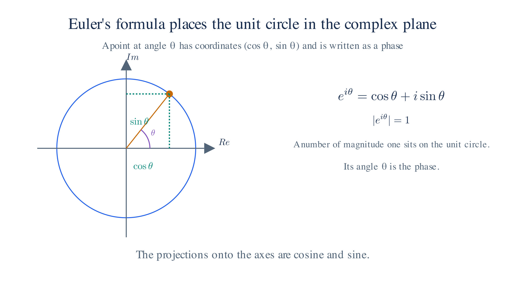

# Math Refresher: Complex Numbers

Quantum amplitudes carry a **phase**, an angle that affects how amplitudes combine. Complex numbers are the language for that angle. This page defines them and the one formula the rest of the site relies on most: Euler's formula.

## 1. Complex numbers

A **complex number** pairs two real numbers,

$$z=a+ib,$$

where $i^2=-1$. The number $a$ is the **real part** and $b$ the **imaginary part**. We add and multiply by the usual rules, treating $i$ as an object whose square is $-1$.

The **complex conjugate** flips the sign of the imaginary part, $z^*=a-ib$. Multiplying a number by its conjugate gives a nonnegative real number:

$$|z|^2=z^*z=(a-ib)(a+ib)=a^2+b^2.$$

We call $|z|$ the **magnitude** of $z$. In quantum mechanics, a probability density is built this way: $|\psi|^2=\psi^*\psi$ on [First Quantization](first-quantization.md).

## 2. The complex plane and Euler's formula

Plot $a$ horizontally and $b$ vertically. Then $z=a+ib$ is a point in a plane, and $|z|$ is its distance from the origin. The direction of that point from the origin is its **phase**, an angle $\theta$.

A point at distance $1$ from the origin sits on the unit circle. The coordinates of such a point are $(\cos\theta,\sin\theta)$, so

$$e^{i\theta}=\cos\theta+i\sin\theta.$$

This is **Euler's formula**. It connects the angle $\theta$ to the exponential $e^{i\theta}$, and it is the single most-used identity on this site. In particular $e^{i\pi}=-1$ and $e^{i\pi/2}=i$.

Because $\cos^2\theta+\sin^2\theta=1$, every number $e^{i\theta}$ has magnitude exactly $1$. A complex number of general magnitude $r$ and phase $\theta$ is $re^{i\theta}$.

*A point at angle θ on the unit circle has coordinates (cos θ, sin θ), so it is written as the phase e^{iθ}.*

## 3. Multiplying adds phases

Multiplying two numbers multiplies their magnitudes and adds their phases:

$$(r_1 e^{i\theta_1})(r_2 e^{i\theta_2})=(r_1r_2)\,e^{i(\theta_1+\theta_2)}.$$

This follows from Euler's formula and the usual addition rules for sine and cosine. Two consequences matter throughout the site:

- Multiplying by $e^{i\alpha}$ rotates a point by the angle $\alpha$ without changing its magnitude. This is the phase rotation used for the [U(1) symmetry](qed.md) of QED.
- Adding two complex numbers of similar phase reinforces them, while adding numbers of opposite phase cancels them. This is the [interference](feynman-rules.md#feynman-rules-and-amplitudes) between amplitudes.

The conjugate of $e^{i\theta}$ is $e^{-i\theta}$, the same rotation in the opposite direction.

## 4. Waves and the Fourier transform

A **plane wave** writes an oscillation as a complex exponential,

$$e^{i(\mathbf p\cdot\mathbf x-Et)/\hbar}=\cos\!\left(\frac{\mathbf p\cdot\mathbf x-Et}{\hbar}\right)+i\sin\!\left(\frac{\mathbf p\cdot\mathbf x-Et}{\hbar}\right).$$

The real part is a cosine wave; the complex form is easier to differentiate because the derivative of $e^{i\theta}$ is $ie^{i\theta}$. This wave appears first on [Relativistic QM](relativistic-qm.md#_1-plane-wave) and drives every field expansion afterward.

A general function can be written as a sum (or integral) of such waves with different momenta. Reconstructing the function from its momentum components is the **Fourier transform**. It is the step that connects the position and momentum representations in [First Quantization](first-quantization.md) and that decomposes a field into momentum modes in [Field Quantization](field-quantization.md). Roughly: a sharply localized position wave is a broad sum of momentum waves, and vice versa, which is the mathematical content of the [uncertainty relation](first-quantization.md#_10-uncertainty-principle).

## 5. Conjugation and the adjoint

In quantum mechanics, complex conjugation of a number becomes the **adjoint** (†) of an operator. Replacing each amplitude $a(p)$ by its conjugate $a^*(p)$ is the step that, after quantization, becomes $a(p)\to a^\dagger(p)$ on [Field Quantization](field-quantization.md#second-quantization). The two operations play the same bookkeeping role: they reverse the sign of every phase and swap creation with annihilation.

---

Previous: [Calculus](appendix-math-calculus.md)

Next: [Linear Algebra](appendix-math-linear-algebra.md)
