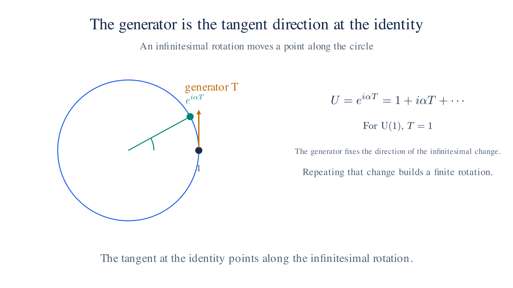

# Math Refresher: Groups and Symmetry

Gauge theories — QED and the weak interaction — are built from **symmetry transformations**. This page introduces the vocabulary: what a group is, what a generator is, and why some groups are called non-Abelian. It covers the two groups the site actually uses, U(1) and SU(2).

## 1. What a group is

A **group** is a set of transformations together with a rule for combining them. Four properties hold:

- **Closure**: combining two transformations gives another transformation in the set.
- **Identity**: there is a transformation that changes nothing.
- **Inverse**: every transformation can be undone by another in the set.
- **Associativity**: the order of grouping does not matter, $(ab)c=a(bc)$.

Rotations of a plane form a group: two rotations combine into one, the zero rotation is the identity, and every rotation has an opposite. What makes a group interesting here is not this bookkeeping but the structure of the transformations themselves.

## 2. U(1) and phases

Multiplying a complex number by $e^{i\alpha}$, with $\alpha$ a real angle, rotates it by $\alpha$ while preserving its magnitude. The set of all such factors forms the group **U(1)**. Each factor is a $1\times1$ unitary matrix — a complex number of magnitude one — so the name reads "unitary, dimension one."

U(1) is the symmetry of [QED](qed.md): multiplying the electron field by a common phase $e^{i\alpha}$ leaves every probability unchanged, because the phase cancels against its conjugate.

## 3. Generators

A continuous group has transformations arbitrarily close to the identity. Near the identity, any transformation is $1+i\alpha T$ for small $\alpha$, where $T$ is a fixed object called a **generator**. The generator produces the infinitesimal change; repeating (exponentiating) it builds a finite transformation,

$$e^{i\alpha T}=1+i\alpha T+\tfrac{(i\alpha T)^2}{2!}+\cdots$$

The factor $i$ keeps the transformation on the unit circle: $e^{i\alpha}$ has magnitude one for every real $\alpha$, so the transformation preserves lengths.

For U(1), $T$ is just the number $1$, so the exponential reproduces $e^{i\alpha}$. To see what a generator does, apply an infinitesimal transformation and keep the first-order term. For U(1) this acts on a complex number as

$$z\;\mapsto\;e^{i\alpha}z\approx z+i\alpha z,$$

a small step sideways, along the tangent to the circle. The generator fixes that tangent direction — the arrow at the identity in the diagram below — and the exponential walks along it through the full angle. For larger groups the generators are matrices, and the same logic applies component by component, as used for spinors on [The Dirac Equation](dirac-equation.md#_5-spinors-transformations).

*A rotation group is a circle; the tangent at the identity is the generator that fixes the direction of the infinitesimal change.*

## 4. SU(2) and the Pauli matrices

**SU(2)** is the group of $2\times2$ unitary matrices with determinant $1$. Its three generators are the **Pauli matrices** divided by two:

$$T^1=\tfrac12\begin{pmatrix}0&1\\1&0\end{pmatrix},\qquad T^2=\tfrac12\begin{pmatrix}0&-i\\i&0\end{pmatrix},\qquad T^3=\tfrac12\begin{pmatrix}1&0\\0&-1\end{pmatrix}.$$

These are the same Pauli matrices that describe spin, but on the [weak-interaction page](weak-interaction.md) they act on a doublet of particle *species* (an electron and its neutrino), not on spatial spin. The superscripts $1,2,3$ label the three generators.

To see one at work, take $T^1$ and a small angle $\alpha$. An infinitesimal SU(2) transformation is

$$U\approx 1+i\alpha T^1=\begin{pmatrix}1&i\alpha/2\\i\alpha/2&1\end{pmatrix},$$

and it acts on a two-component vector — a **doublet** — by mixing its entries:

$$\begin{pmatrix}a\\b\end{pmatrix}\;\mapsto\;\begin{pmatrix}a+\tfrac{i\alpha}{2}b\\[2pt]b+\tfrac{i\alpha}{2}a\end{pmatrix}.$$

Each generator reshuffles the two entries in a different way: $T^1$ mixes them with a real off-diagonal, $T^2$ with an imaginary one, and $T^3$ rescales the two entries with opposite signs without mixing them. Exponentiating a generator builds the corresponding finite rotation of the doublet.

## 5. Non-Abelian and structure constants

In a group like U(1), the order of two transformations does not matter: multiplying two phases gives the same product either way. Such a group is **Abelian**. In SU(2), order matters, because its generator matrices do not commute. The generators obey

$$[T^a,T^b]=i\epsilon^{abc}T^c,$$

where $\epsilon^{abc}$ equals $+1$ for $(1,2,3)$ and its even permutations, $-1$ for odd permutations, and $0$ when two indices repeat. A group whose generators fail to commute is **non-Abelian**.

This single fact changes the physics. The field strength of a non-Abelian gauge theory gains an extra term — $W_{\mu\nu}^a=\partial_\mu W_\nu^a-\partial_\nu W_\mu^a-g\epsilon^{abc}W_\mu^bW_\nu^c$ on [Weak Interaction](weak-interaction.md#yang-mills-fields-and-self-interactions) — which makes the gauge bosons interact directly with one another, something the photon never does. The names **Yang–Mills theory** and **structure constants** both refer to this construction: a gauge theory built from a non-Abelian group, and the numbers $\epsilon^{abc}$ that fix how its generators combine.

---

Previous: [Index Notation and Tensors](appendix-math-tensors.md)
