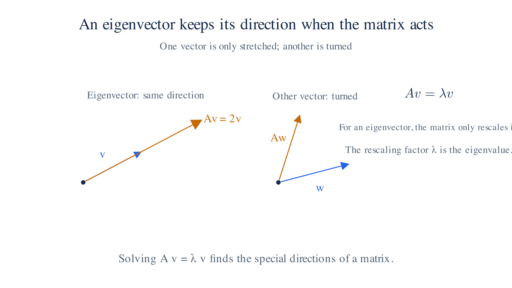

# Math Refresher: Linear Algebra

Quantum states live in a vector space, and observables act on them as matrices. This page defines the pieces: vectors, matrix multiplication, the adjoint, eigenvalues, and the bra-ket notation that carries them.

## 1. Vectors

A **vector** is an ordered list of numbers. A column vector with two entries is

$$\mathbf v=\begin{pmatrix}v_1\\v_2\end{pmatrix}.$$

The entries are its **components** in some basis. Adding two vectors adds component by component, and multiplying by a number scales every component. These two operations are what "vector space" means, so a quantum state — a vector in [Hilbert space](first-quantization.md) — can be added to another and scaled, exactly like an arrow.

The entries are complex numbers in general, because quantum amplitudes carry a phase. Real vectors are the special case in which every imaginary part is zero; throughout these pages, components such as $v_1$ and $v_2$ are complex unless stated otherwise. That is what makes the conjugation in [§3](#_3-transpose-conjugate-transpose-and-the-adjoint) and [§5](#_5-inner-products-and-bra-ket-notation) necessary.

Vectors are **independent** if none of them is a combination of the others. A **basis** is an independent set that spans the space, meaning every vector is a unique combination of the basis vectors, and the **dimension** is the number of vectors in a basis. The plane has dimension two because every vector is $v_1\mathbf e_1+v_2\mathbf e_2$ with exactly two basis vectors.

A space need not be finite-dimensional. The set of functions on an interval is a vector space, because two functions can be added and a function can be scaled by a number. Its basis is infinite — the sine and cosine waves of a Fourier expansion, for example — so it is **infinite-dimensional**. The version used in quantum mechanics is $L^2$, the space of square-integrable functions, whose inner product ([§5](#_5-inner-products-and-bra-ket-notation)) is an integral. A quantum state $\lvert\psi\rangle$ is a vector in this infinite-dimensional space, which is why the [wave function](first-quantization.md) $\psi(x)$ carries a value at every point instead of a finite list of components.

## 2. Operators and matrix multiplication

An **operator**, also called a **linear map**, is a rule $A$ that turns a vector into another vector and obeys two conditions:

$$A(\mathbf u+\mathbf v)=A\mathbf u+A\mathbf v, \qquad A(c\,\mathbf v)=c\,A\mathbf v.$$

The first condition says $A$ respects addition; the second says it respects scaling. Together they are what "linear" means: an operator acts on a sum by acting on each term, and it passes through a scalar. In quantum mechanics, observables and symmetry transformations are operators acting on states, as [First Quantization](first-quantization.md) explains.

Linearity also makes an operator finite to specify. An arbitrary rule from vectors to vectors would need a value for every possible input; a linear operator needs only its value on a basis. In an $n$-dimensional space there are $n$ basis vectors, so $n$ output vectors determine the operator completely, and everything else follows from the two conditions above. That is why a matrix, with one column per basis vector, is enough to record an operator.

A **matrix** is the concrete form of an operator once a basis is chosen. Its meaning comes from how it acts on the basis vectors.

Write a vector as a combination of the basis vectors $\mathbf e_1=\begin{pmatrix}1\\0\end{pmatrix}$ and $\mathbf e_2=\begin{pmatrix}0\\1\end{pmatrix}$:

$$\mathbf v=v_1\mathbf e_1+v_2\mathbf e_2.$$

A matrix acts linearly — it acts on a sum by acting on each term — so

$$A\mathbf v=v_1\,A\mathbf e_1+v_2\,A\mathbf e_2.$$

The columns of $A$ are exactly the images of the basis vectors. If

$$A=\begin{pmatrix}a&b\\c&d\end{pmatrix},$$

then $A\mathbf e_1=\begin{pmatrix}a\\c\end{pmatrix}$ and $A\mathbf e_2=\begin{pmatrix}b\\d\end{pmatrix}$. Multiplying by $\mathbf v$ therefore mixes the columns with the components of $\mathbf v$:

$$A\mathbf v=v_1\begin{pmatrix}a\\c\end{pmatrix}+v_2\begin{pmatrix}b\\d\end{pmatrix}=\begin{pmatrix}av_1+bv_2\\cv_1+dv_2\end{pmatrix}.$$

This is the whole multiplication rule. Each entry of the output is a row of the matrix dotted against $\mathbf v$, but that dot product is not a separate convention: it falls out of expanding $\mathbf v$ in the basis and letting $A$ act on each basis vector. Multiplying two matrices applies the two transformations in sequence, and the order matters because $AB$ and $BA$ generally differ. This failure to commute is exactly what the [commutator](first-quantization.md#_8-commutators) $[\hat A,\hat B]=\hat A\hat B-\hat B\hat A$ measures.

## 3. Transpose, conjugate transpose, and the adjoint

The **transpose** $A^T$ flips rows and columns. The **conjugate transpose** also conjugates every entry:

$$A^\dagger=(A^*)^T.$$

**Example.** The transpose of

$$A=\begin{pmatrix}1&2&3\\4&5&6\end{pmatrix}$$

is

$$A^T=\begin{pmatrix}1&4\\2&5\\3&6\end{pmatrix},$$

so a $2\times3$ matrix becomes a $3\times2$ one: the first row $(1,2,3)$ becomes the first column. With complex entries, conjugate first and then transpose. For

$$B=\begin{pmatrix}1&i\\-i&2\end{pmatrix},$$

conjugation gives $B^*=\begin{pmatrix}1&-i\\i&2\end{pmatrix}$, and transposing that returns

$$B^\dagger=\begin{pmatrix}1&i\\-i&2\end{pmatrix}=B.$$

Here $B=B^\dagger$, so $B$ is **Hermitian** — a property that will matter for observables in [§6](#_6-hermitian-and-unitary-operators-trace).

The dagger $^\dagger$ reads "adjoint." For a column vector, $\mathbf v^\dagger$ is the corresponding row with conjugated entries.

The adjoint matters because it tells us how an operator acts on the *other* side of an inner product. It is the operator version of complex conjugation, as [Complex Numbers](appendix-math-complex.md#_5-conjugation-and-the-adjoint) notes.

## 4. Eigenvalues and eigenvectors

When a matrix acts on a vector and only rescales it,

$$\hat A\mathbf v=\lambda\mathbf v,$$

the vector $\mathbf v$ is an **eigenvector** and the number $\lambda$ is its **eigenvalue**. Solving this equation for a matrix $\hat A$ finds its special directions. In quantum mechanics the eigenvalues of an observable are the possible measurement outcomes, as [First Quantization](first-quantization.md#_7-eigenvectors-and-eigenvalues) explains.

**Example.** The matrix $\begin{pmatrix}0&1\\1&0\end{pmatrix}$ has eigenvectors $\begin{pmatrix}1\\1\end{pmatrix}$ and $\begin{pmatrix}1\\-1\end{pmatrix}$ with eigenvalues $+1$ and $-1$.

*A matrix stretches an eigenvector without turning it, but turns an arbitrary vector.*

## 5. Inner products and bra-ket notation

An **inner product** assigns a number to two vectors, measuring how much they overlap. For column vectors, it is the dot product with a conjugate:

$$\langle\mathbf u|\mathbf v\rangle=u_1^*v_1+u_2^*v_2.$$

Its value is $\lVert\mathbf v\rVert^2=\langle\mathbf v|\mathbf v\rangle$, the squared length, which is never negative.

Quantum mechanics abbreviates this with **bra-ket notation**. A **ket** $|\psi\rangle$ is a state vector; the matching **bra** $\langle\phi|$ is the conjugate-transpose of a state vector, ready to form an inner product. The bracket $\langle\phi|\psi\rangle$ is therefore the overlap of the two states. Inserting an operator between them,

$$\langle\phi|\hat A|\psi\rangle,$$

means the overlap of $\phi$ with the vector $\hat A|\psi\rangle$. The adjoint is defined so that moving an operator from one side to the other conjugates it:

$$\langle\phi|\hat A^\dagger\psi\rangle=\langle\hat A\phi|\psi\rangle.$$

This notation first appears on [First Quantization](first-quantization.md) and is used from then on. A ket written as $|0\rangle$ is a named state (the ground state or the vacuum), not the number zero.

## 6. Hermitian and unitary operators; trace

Two kinds of operator do most of the work:

- A **Hermitian** operator satisfies $\hat A=\hat A^\dagger$. Its eigenvalues are real, which is why observables are Hermitian. Eigenvectors with distinct eigenvalues are orthogonal.
- A **unitary** operator satisfies $\hat U^\dagger\hat U=\hat U\hat U^\dagger=1$. It preserves every inner product, so it maps normalized states to normalized states and describes time evolution and symmetry transformations.

For a Hermitian matrix we can always find a complete set of orthogonal eigenvectors. This is the **spectral theorem**: a state can be expanded in the eigenbasis of an observable, and the squared magnitudes of the expansion coefficients give outcome probabilities ([First Quantization](first-quantization.md#_7-eigenvectors-and-eigenvalues)).

The **trace** of a square matrix is the sum of its diagonal entries, $\operatorname{tr}A=\sum_i A_{ii}$. It appears when a [closed fermion loop](feynman-rules.md#tree-level-and-loop-diagrams) is evaluated, where the sum over the spinor index of a closed chain is a trace.

## 7. Changing basis

The components of a vector depend on the basis, but the vector itself does not. The same arrow has different coordinates when measured against a rotated pair of axes, yet it is still the same arrow.

The choice of basis is usually arbitrary, which is why it matters physically. An observer, or a reference frame, effectively picks a basis: two observers in relative motion pick different bases, but they describe the same particle. A law written in one basis must therefore hold in every other, because no observer's choice of coordinates is privileged.

That requirement sorts quantities into two kinds. A **scalar** has the same value in every basis, so it is an invariant, like the [spacetime interval](special-relativity.md#_4-spacetime-and-the-invariant-interval) of relativity. A **vector** or **tensor** changes its components in a fixed, compensating way, and that rule is what makes quantities built from them come out invariant even while each component changes. [Index notation and tensors](appendix-math-tensors.md) develops these transformation rules, and [Special Relativity](special-relativity.md) is where they first become physical, because there the basis is a moving observer's frame.

---

Previous: [Complex Numbers](appendix-math-complex.md)

Next: [Index Notation and Tensors](appendix-math-tensors.md)
