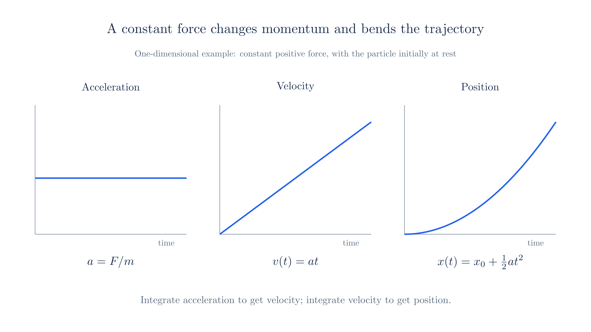
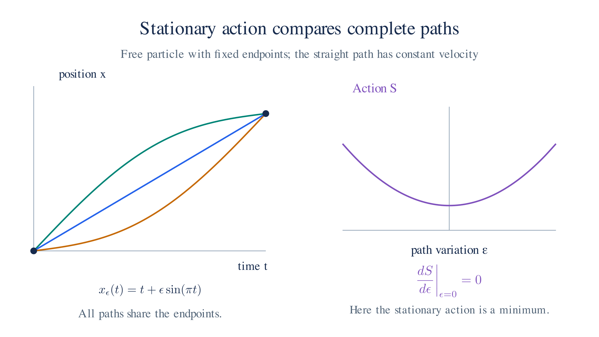
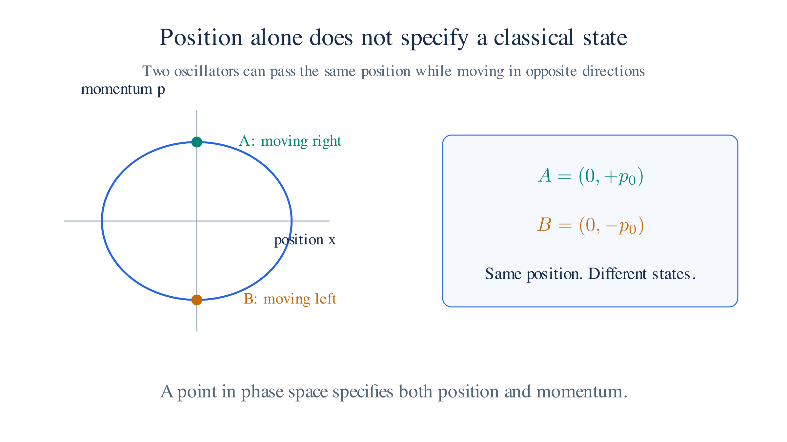

# Classical Mechanics

To predict a moving body’s position, we need a law of motion and an initial state. Newton’s law supplies a direct calculation when the forces are known. We will recast that calculation in terms of action and energy, so the same method can later describe quantum particles and fields.

Generalized coordinates account for constraints, the Lagrangian gives equations of motion, and the Hamiltonian expresses evolution in terms of position and momentum. These are different descriptions of the same classical motion.

## 1. Newtonian Formulation

Newton's second law, $F = ma$, relates a particle's acceleration to the force on it. Given its initial position and velocity, we can solve for its later motion. For ordinary well-posed force laws, those initial conditions determine a unique trajectory.

The equation is second order in position. Integrating once gives the velocity; integrating again gives the position. For constrained motion, such as a bead on a wire, we must also account for the forces that keep the particle on its allowed path. Generalized coordinates make these constraints easier to handle.

*For constant force, acceleration is constant, velocity changes linearly, and position changes quadratically.*

## 2. Lagrangian and the Euler–Lagrange Derivation

For a pendulum, an angle describes the motion more directly than three Cartesian coordinates. The Lagrangian method works with such **generalized coordinates** $q$, which specify the allowed configurations of the system.

For the usual kinetic and potential energies, define $L = T - V$. The **action** is the integral of the Lagrangian along a proposed path:

$$S = \int L(q, \dot q, t)\, dt$$

The principle of **stationary action** states that the physical path makes the first-order change in $S$ vanish when we vary the path while keeping its endpoints fixed. Stationary does not necessarily mean a minimum.

To obtain an equation we can solve, perturb $q(t)$ by a small function that vanishes at the endpoints. Expand $S$ to first order, then integrate the term containing the velocity variation by parts. The boundary term vanishes. Requiring the remaining integral to vanish for every allowed variation gives the **Euler–Lagrange equation**,

$$\frac{d}{dt}\left(\frac{\partial L}{\partial \dot q}\right) - \frac{\partial L}{\partial q} = 0$$

with one equation for each generalized coordinate. For $L = \tfrac12m\dot q^2-V(q)$, it gives $m\ddot q=-\partial V/\partial q$, Newton's second law. The same procedure works for angular coordinates and, later, for fields.

From stationary action to the equation of motion

Write a nearby path as $q_\epsilon(t)=q(t)+\epsilon\eta(t)$, where $\eta(t_i)=\eta(t_f)=0$. The parameter $\epsilon$ measures the size of the change. Stationarity means

$$0=\left.\frac{dS[q_\epsilon]}{d\epsilon}\right|_{\epsilon=0}
=\int_{t_i}^{t_f}\left(\frac{\partial L}{\partial q}\eta+\frac{\partial L}{\partial\dot q}\dot\eta\right)dt.$$

Integrate the second term by parts:

$$0=\left[\frac{\partial L}{\partial\dot q}\eta\right]_{t_i}^{t_f}
+\int_{t_i}^{t_f}\left[\frac{\partial L}{\partial q}-\frac{d}{dt}\frac{\partial L}{\partial\dot q}\right]\eta\,dt.$$

The endpoint condition removes the boundary term. Since we can vary $\eta$ within any part of the interval, the coefficient multiplying it must vanish throughout the path. This gives the Euler–Lagrange equation.

For a pendulum of length $\ell$, choose $q=\theta$, measured from the downward vertical. Its speed is $\ell\dot\theta$ and its height above the lowest point is $\ell(1-\cos\theta)$, so

$$L=\tfrac12m\ell^2\dot\theta^2-mg\ell(1-\cos\theta).$$

Then $\partial L/\partial\dot\theta=m\ell^2\dot\theta$ and $\partial L/\partial\theta=-mg\ell\sin\theta$. The equation of motion is

$$m\ell^2\ddot\theta+mg\ell\sin\theta=0.$$

The string's tension does not appear: the angular coordinate already restricts the bob to its circular path.

*Vary a free-particle path while fixing its endpoints. The physical path makes the first-order action variation vanish.*

## 3. Hamiltonian and State Space

A pendulum can pass through the same angle in either direction. Its position alone does not specify what happens next. To describe its state using position and momentum, define the **conjugate momentum** $p = \partial L/\partial \dot q$. Then form the Hamiltonian $H(q,p) = p\dot q - L$, expressing $\dot q$ in terms of $q$ and $p$. This change of variables is a **Legendre transform**.

When we can solve the momentum definition for the velocity, the second-order Euler–Lagrange equation becomes two first-order **Hamilton equations**:

$$\dot q = \frac{\partial H}{\partial p}, \qquad \dot p = -\frac{\partial H}{\partial q}$$

For the usual kinetic energy and a velocity-independent potential, $H$ is the total energy $T+V$. Its independent variables are position and momentum.

Changing from velocity to momentum

For one coordinate, the differential of $H=p\dot q-L$ is

$$dH=\dot q\,dp+p\,d\dot q-\frac{\partial L}{\partial q}dq-\frac{\partial L}{\partial\dot q}d\dot q-\frac{\partial L}{\partial t}dt.$$

The two $d\dot q$ terms cancel because $p=\partial L/\partial\dot q$. The Euler–Lagrange equation gives $\partial L/\partial q=\dot p$, leaving

$$dH=\dot q\,dp-\dot p\,dq-\frac{\partial L}{\partial t}dt.$$

Compare the coefficients with $dH=(\partial H/\partial q)dq+(\partial H/\partial p)dp+(\partial H/\partial t)dt$. The first two give Hamilton's equations. The last gives $\partial H/\partial t=-\partial L/\partial t$; explicit time dependence is possible in either description.

For $L=\tfrac12m\dot q^2-V(q)$, we have $p=m\dot q$. Substitution gives $H=p^2/(2m)+V(q)$, and Hamilton's equations become $\dot q=p/m$ and $\dot p=-\partial V/\partial q$. Together they reproduce Newton's law.

The pair $(q,p)$ specifies a point in **phase space**, the space of classical states. Position alone specifies the configuration; momentum also specifies how it is moving. Hamilton's equations determine a trajectory through phase space, and uniqueness prevents distinct trajectories from crossing at the same time.

Choosing position and momentum is useful beyond mechanics. Quantum mechanics keeps the idea of a state evolving under a Hamiltonian. We will replace phase-space points with vectors in Hilbert space and replace the classical Hamiltonian with an operator.

*Two states can have the same position and opposite momenta. Phase space distinguishes them.*

## 4. The Poisson Bracket

Once we know the state, we may want the rate of change of energy, position, or another quantity without solving the whole trajectory. The Poisson bracket expresses this calculation directly in terms of the Hamiltonian. For two quantities $f(q,p)$ and $g(q,p)$, define their **Poisson bracket**:

$$\{f, g\} = \frac{\partial f}{\partial q}\frac{\partial g}{\partial p} - \frac{\partial f}{\partial p}\frac{\partial g}{\partial q}$$

Properties of the bracket

For several coordinates, sum this expression over each conjugate pair. The bracket is bilinear, meaning linear in either argument, and antisymmetric: exchanging $f$ and $g$ reverses its sign. It also satisfies the Jacobi identity, a consistency relation between nested brackets.

For a quantity with no explicit time dependence, the chain rule and Hamilton's equations give

$$\frac{df}{dt}=\frac{\partial f}{\partial q}\dot q+\frac{\partial f}{\partial p}\dot p
=\frac{\partial f}{\partial q}\frac{\partial H}{\partial p}-\frac{\partial f}{\partial p}\frac{\partial H}{\partial q}=\{f,H\}.$$

Thus $\{f,H\}=0$ means that $f$ is conserved. For a time-independent Hamiltonian, energy conservation follows from $\{H,H\}=0$. If $f$ also depends explicitly on time, add $\partial f/\partial t$ to its evolution equation.

In particular, $\{q,p\}=1$: the derivatives of $q$ and $p$ with respect to themselves are one, and the cross derivatives vanish.

We have expressed motion through an evolution law and an algebra of observables. Canonical quantization uses $\{\cdot,\cdot\} \to \frac{1}{i\hbar}[\cdot,\cdot]$. The classical relation $\{q,p\}=1$ becomes the quantum relation $[\hat q,\hat p]=i\hbar$. This is a starting prescription; operator ordering can complicate the correspondence for more general quantities.

---

Next: [First Quantization](./first-quantization.md)
