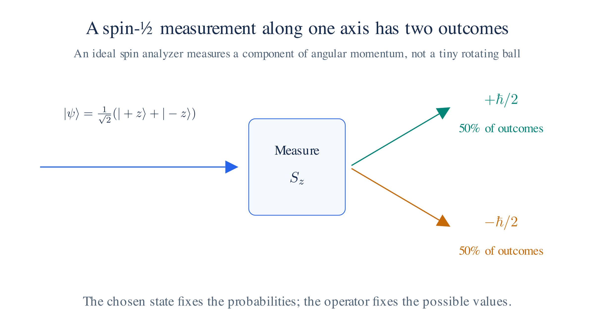
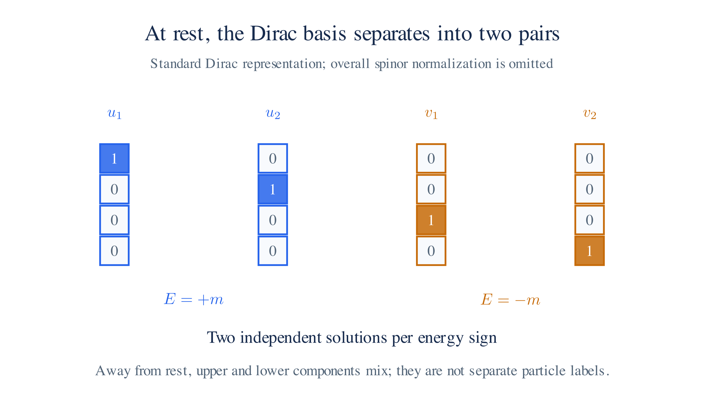
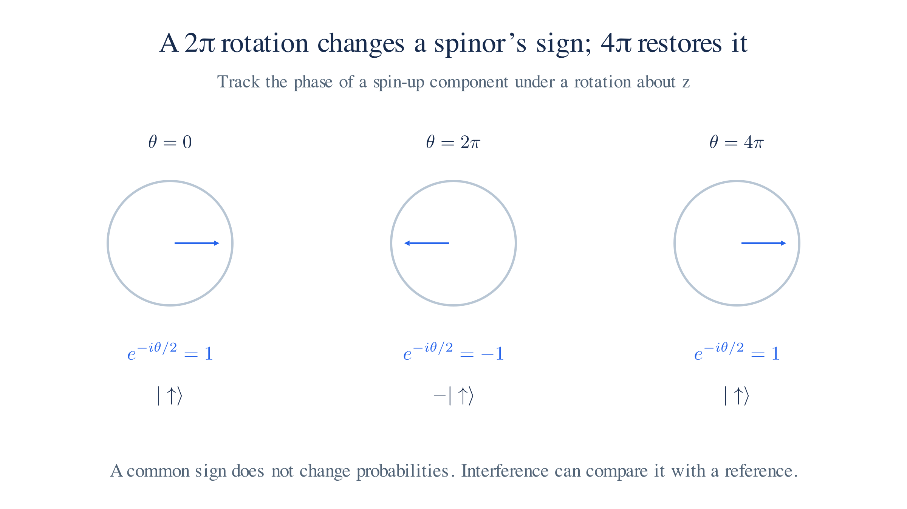

# The Dirac Equation

[Relativistic QM §4](relativistic-qm.md#_4-dirac-equation) introduced $(i\hbar\gamma^\mu\partial_\mu-m)\psi=0$. Its wave function has four components and both energy signs. We now derive the spin carried by those components, solve the two energy branches, and explain why antiparticles require a field theory.

## 1. Spin

To interpret the extra components from [Relativistic QM §4](relativistic-qm.md#_4-dirac-equation), start with angular momentum. A particle's total angular momentum can include both orbital motion and intrinsic spin:

$$\mathbf J = \mathbf L + \mathbf S, \qquad \mathbf L = \mathbf r \times \mathbf p,$$

Here $\mathbf L$ describes orbital motion and $\mathbf S$ describes intrinsic angular momentum. For the free Dirac Hamiltonian $H=\boldsymbol\alpha\cdot\hat{\mathbf p}+\beta m$, calculate

$$[H, L_i] = -i\hbar\,(\boldsymbol\alpha \times \hat{\mathbf p})_i \neq 0,$$

This nonzero commutator means orbital angular momentum alone is not conserved. The relevant rule is the Heisenberg equation, derived in [§2](#_2-conservation-and-commutators): for an observable with no explicit time dependence,

$$\frac{d\mathbf A}{dt} = \frac{i}{\hbar}[H, \mathbf A],$$

Thus $[H,\mathbf A]=0$ means $\mathbf A$ is conserved. To obtain conserved total angular momentum, we need $\mathbf S$ to cancel the commutator of $\mathbf L$.

The matrices $\boldsymbol\alpha$ act on the spinor components, whereas $\mathbf L$ acts on the spatial dependence. We therefore look for a spin operator acting on those components.

It must satisfy two conditions: cancel $[H,L_i]$ and obey the angular-momentum commutation relations. The first condition is

$$[H, S_i] = -[H, L_i] = i\hbar\,(\boldsymbol\alpha \times \hat{\mathbf p})_i.$$

The Pauli matrices provide a candidate. In [Relativistic QM §4](relativistic-qm.md#_4-dirac-equation), $\alpha_j=\begin{pmatrix}0&\sigma_j\\\sigma_j&0\end{pmatrix}$, so $\alpha_j\alpha_k=\mathrm{diag}(\sigma_j\sigma_k,\sigma_j\sigma_k)$. Using $[\sigma_j,\sigma_k]=2i\varepsilon_{jkl}\sigma_l$ gives

$$[\alpha_j, \alpha_k] = 2i\varepsilon_{jkl}\begin{pmatrix} \sigma_l & \mathbf 0 \\ \mathbf 0 & \sigma_l \end{pmatrix},$$

Define the repeated Pauli blocks as

$$\boldsymbol\Sigma = \begin{pmatrix} \boldsymbol\sigma & \mathbf 0 \\ \mathbf 0 & \boldsymbol\sigma \end{pmatrix}.$$

Use $[\alpha_j,\Sigma_i]=-2i\varepsilon_{ijk}\alpha_k$ to compute its Hamiltonian commutator:

$$[H, \Sigma_i] = 2i\,(\boldsymbol\alpha \times \hat{\mathbf p})_i.$$

Comparing with the required $i\hbar(\boldsymbol\alpha\times\hat{\mathbf p})_i$, multiply $\boldsymbol\Sigma$ by $\hbar/2$. This gives

$$\mathbf S = \frac{\hbar}{2}\boldsymbol\Sigma.$$

The factor $\hbar$ originates in $[x_j,p_k]=i\hbar\delta_{jk}$; the factor $2$ comes from the Pauli commutator. Check the cancellation directly:

$$[H, S_i] = \frac{\hbar}{2}\,[H, \Sigma_i] = \frac{\hbar}{2}\cdot 2i\,(\boldsymbol\alpha \times \hat{\mathbf p})_i = i\hbar\,(\boldsymbol\alpha \times \hat{\mathbf p})_i = -[H, L_i],$$

Therefore $[H,\mathbf J]=0$ for $\mathbf J=\mathbf L+\mathbf S$. Spin and orbital angular momentum are generally not separately conserved, but their sum is.

We must also check that $\mathbf S$ has the algebra of angular momentum. The Pauli commutators give

$$[S_i, S_j] = i\hbar\,\varepsilon_{ijk} S_k,$$

These are the **angular-momentum commutation relations**. For example, $[S_x,S_y]=i\hbar S_z$, with cyclic versions for the other components. They describe the infinitesimal effect of rotations about different axes.

Since $\Sigma_z$ has eigenvalues $\pm1$, $S_z$ has eigenvalues $\pm\hbar/2$. The Dirac field therefore describes spin-½ particles. In each pair of components, the two basis states are spin up and spin down.

**The magnetic moment follows from electromagnetic coupling.** For charge $q$, use **minimal substitution**: $\hat{\mathbf p}\to\hat{\mathbf p}-q\mathbf A$, or covariantly $\partial_\mu\to\partial_\mu+\tfrac{iq}{\hbar}A_\mu$. This couples the wave function to the electromagnetic potential and reproduces the classical Lorentz force in the appropriate limit.

For an electron, $q=-e$. Taking the nonrelativistic limit gives the Pauli equation and

$$\boldsymbol\mu = -\frac{e}{m}\,\mathbf S, \qquad g = 2,$$

The dimensionless **gyromagnetic factor** is $g=2$ for the Dirac equation with minimal coupling. This answers the spin question from [Relativistic QM §4](relativistic-qm.md#_4-dirac-equation). We examine how the spin components transform in [§5](#_5-spinors-transformations).

*An ideal measurement of spin along z has outcomes plus or minus hbar over two. The displayed equal superposition gives equal probabilities.*

## 2. Conservation and Commutators

To justify the conservation test used in [§1](#_1-spin), derive the **Heisenberg equation of motion**. For an operator with no explicit time dependence,

$$\frac{d\mathbf A}{dt} = \frac{i}{\hbar}[H, \mathbf A],$$

For a time-independent Hamiltonian, define the Heisenberg operator by moving the state-evolution factors onto it:

$$\mathbf A_H(t) = e^{iHt/\hbar}\,\mathbf A\,e^{-iHt/\hbar},$$

At $t=0$, $\mathbf A_H(0)=\mathbf A$. Differentiate both exponential factors using $\frac{d}{dt}e^{\pm iHt/\hbar}=\pm\frac{i}{\hbar}He^{\pm iHt/\hbar}$:

$$\frac{d\mathbf A_H}{dt} = \frac{i}{\hbar}\left(H e^{iHt/\hbar}\mathbf A e^{-iHt/\hbar} - e^{iHt/\hbar}\mathbf A e^{-iHt/\hbar} H\right) = \frac{i}{\hbar}[H, \mathbf A_H].$$

Taking an expectation value gives $d\langle\mathbf A\rangle/dt=\tfrac{i}{\hbar}\langle[H,\mathbf A]\rangle$. A vanishing commutator guarantees conservation in every state. A particular state's expectation value can remain constant even when the operator commutator is nonzero.

If $\mathbf A$ explicitly depends on time, add $\langle\partial\mathbf A/\partial t\rangle$. The angular momentum operators here have no such dependence.

Applying this to [§1](#_1-spin), $[H,\mathbf L]\ne0$ but $[H,\mathbf L+\mathbf S]=0$. This establishes the conservation of total angular momentum.

## 3. Antiparticles

To understand the negative-energy branch, solve the free equation. At rest, the four components separate; motion then mixes the upper and lower pairs.

**At rest ($\mathbf p=0$).** The Hamiltonian reduces to $H=\beta m$. Substitute $\psi=w e^{-iEt/\hbar}$, where $w$ is a constant four-component spinor:

$$E\,w = \beta m\,w.$$

In the representation of [Relativistic QM §4](relativistic-qm.md#_4-dirac-equation), $\beta=\mathrm{diag}(1,1,-1,-1)$. Writing $w=(w_1,w_2,w_3,w_4)$ gives four equations:

$$E\,w_1 = m\,w_1, \qquad E\,w_2 = m\,w_2, \qquad E\,w_3 = -m\,w_3, \qquad E\,w_4 = -m\,w_4.$$

For a nonzero state, at least one component must survive. An upper component requires $E=m$; a lower component requires $E=-m$. Assuming $m>0$, the possibilities are:

1. **$E\ne\pm m$:** all four components vanish, so there is no nonzero state.
2. **$E=m$:** $w_3=w_4=0$, while the two upper components are free.
3. **$E=-m$:** $w_1=w_2=0$, while the two lower components are free.

These are the two branches of $E^2=\mathbf p^2+m^2$ from [Relativistic QM §2](relativistic-qm.md#_2-klein-gordon), evaluated at rest. Squaring the Dirac Hamiltonian gives this dispersion relation because its matrices anticommute.

Each energy eigenspace has dimension two. A basis of the four independent rest solutions is

$$E = +m: \quad w = \begin{pmatrix} 1 \\ 0 \\ 0 \\ 0 \end{pmatrix}, \begin{pmatrix} 0 \\ 1 \\ 0 \\ 0 \end{pmatrix}; \qquad E = -m: \quad w = \begin{pmatrix} 0 \\ 0 \\ 1 \\ 0 \end{pmatrix}, \begin{pmatrix} 0 \\ 0 \\ 0 \\ 1 \end{pmatrix}.$$

The four-component size follows from the matrix algebra in [Relativistic QM §4](relativistic-qm.md#_4-dirac-equation). The Hamiltonian needs four mutually anticommuting matrices. The three Pauli matrices cannot accommodate a fourth in two dimensions; the smallest suitable complex representation is four-dimensional.

Choose the basis to diagonalize $S_z=\tfrac\hbar2\Sigma_z$. Label the rest solutions $w_+^{(1)},w_+^{(2)},w_-^{(1)},w_-^{(2)}$. Since $\Sigma_z=\mathrm{diag}(1,-1,1,-1)$,

$$S_z\,w^{(1)}_\pm = +\frac{\hbar}{2}\,w^{(1)}_\pm, \qquad S_z\,w^{(2)}_\pm = -\frac{\hbar}{2}\,w^{(2)}_\pm,$$

Each energy branch therefore has one spin-up and one spin-down basis state. The choice of $z$ is a basis choice; we could diagonalize spin along any axis.

**Moving ($\mathbf p\ne0$).** Substituting a plane wave $\psi=w(p)e^{-ip\cdot x/\hbar}$ turns the differential equation into

$$(E - \boldsymbol\alpha\cdot\mathbf p - \beta m)\,w = 0,$$

Write $w=(\phi,\chi)$ for the upper and lower two-component blocks, as in [Relativistic QM §4](relativistic-qm.md#_4-dirac-equation). Then

$$(E - m)\,\phi = \boldsymbol\sigma\cdot\mathbf p\,\chi, \qquad (E + m)\,\chi = \boldsymbol\sigma\cdot\mathbf p\,\phi.$$

For $E=E_p=\sqrt{\mathbf p^2+m^2}$, the second equation gives $\chi=\frac{\boldsymbol\sigma\cdot\mathbf p}{E_p+m}\phi$. Choose either upper spin state, $\chi_\uparrow=(1,0)^T$ or $\chi_\downarrow=(0,1)^T$. With standard normalization, the two positive-energy spinors are

$$u_s(p) = \begin{pmatrix} \sqrt{E_p + m}\;\chi_s \\ \dfrac{\boldsymbol\sigma\cdot\mathbf p}{\sqrt{E_p + m}}\;\chi_s \end{pmatrix} \qquad (E = +E_p),$$

At $\mathbf p=0$, these reduce to the positive-energy rest states up to normalization. For $E=-E_p$, the first equation instead gives $\phi=-\frac{\boldsymbol\sigma\cdot\mathbf p}{E_p+m}\chi$. At this same spatial momentum, the negative-energy spinors are

$$v_s(p) = \begin{pmatrix} -\dfrac{\boldsymbol\sigma\cdot\mathbf p}{\sqrt{E_p + m}}\;\chi_s \\ \sqrt{E_p + m}\;\chi_s \end{pmatrix} \qquad (E = -E_p),$$

Their lower blocks dominate at low momentum, as in [Relativistic QM §4](relativistic-qm.md#_4-dirac-equation).

**Charge conjugation relates the branches.** Complex-conjugate the equation and multiply by $\eta=i\gamma^2$ in the standard representation. Define

$$\psi_c = \eta\,\psi^*,$$

For plane waves this maps $\eta u_s(p)^*$ to a negative-energy solution $v_{s'}(-p)$, up to phase and the corresponding spin-label interchange. Here $-p$ denotes reversal of the spatial momentum in the fixed-momentum convention above.

To see why this changes charge, restore the electromagnetic coupling from [§1](#_1-spin): $\partial_\mu\to\partial_\mu+\tfrac{iq}{\hbar}A_\mu$. Complex conjugation reverses the sign of $i$, so $\psi_c$ obeys the equation with charge $-q$. It describes the **antiparticle**, with the same mass and opposite charge. In the full electromagnetic theory, charge conjugation also reverses $A_\mu$.

This connects to the Stückelberg–Feynman interpretation in [Relativistic QM §3](relativistic-qm.md#_3-negative-energy-and-probability). For electrons the antiparticle is the positron, discovered in 1932.

The free equation supplies both frequency branches. A precise particle interpretation requires a theory in which particles can be created and destroyed, which a fixed one-particle wave function cannot provide.

*At rest in the standard Dirac representation, two basis solutions occupy the upper pair and two the lower pair. A boost mixes the components.*

## 4. Negative Energy Solutions

The branches in [§3](#_3-antiparticles) both have nonnegative density $\psi^\dagger\psi$. We cannot reject the negative-energy branch on probability grounds. As [Relativistic QM §4](relativistic-qm.md#_4-dirac-equation) noted, treating it as ordinary electron states would leave energy unbounded below: an interacting electron could keep radiating into lower levels.

**Quantize the amplitudes.** The [QFT page](qft.md) replaces the coefficients of [§6](#_6-general-solution) by operators. Before reordering, one mode contributes $E_p(\hat a^\dagger\hat a-\hat b\hat b^\dagger)$ to the Hamiltonian.

Fermion operators obey $\hat b\hat b^\dagger=1-\hat b^\dagger\hat b$. Substitution gives $E_p(\hat a^\dagger\hat a+\hat b^\dagger\hat b)$ plus a vacuum constant. After subtracting that constant, electrons and positrons both contribute positive energy $E_p$.

Thus $\hat b^\dagger$ multiplies a negative-frequency solution but creates a positive-energy positron. This implements the reinterpretation in [Relativistic QM §3](relativistic-qm.md#_3-negative-energy-and-probability).

Dirac's earlier **hole theory** assumed every negative-energy electron state was occupied. The exclusion principle then prevented another electron from falling into the filled sea. Removing one sea electron left a **hole** with positive energy and positive charge, interpreted as a positron.

Filling a hole described pair annihilation; exciting a sea electron out of it described pair creation. This picture anticipated the positron but assumed both a many-particle vacuum and fermion statistics. The [QFT](qft.md) construction expresses those processes directly with creation and annihilation operators.

## 5. Spinors

A spinor has its own Lorentz transformation law. When coordinates change by $x'=\Lambda x$, its four components transform through a matrix $S(\Lambda)$:

$$\psi'(x') = S(\Lambda)\,\psi(x), \qquad S(\Lambda) = \exp\!\left(-\frac{i}{4}\,\omega_{\mu\nu}\sigma^{\mu\nu}\right), \qquad \sigma^{\mu\nu} = \frac{i}{2}\,[\gamma^\mu, \gamma^\nu],$$

The real antisymmetric parameters $\omega_{\mu\nu}$ specify rotations and boosts. The matrices $\sigma^{\mu\nu}$ act on spinor components. Three properties distinguish this representation:

1. **Finite-dimensional.** $S$ acts on four components at each point. This component transformation is distinct from the transformation of the full function over space.
2. **Double-valued.** A $2\pi$ rotation gives $S=-\mathbb1$; a $4\pi$ rotation returns the spinor exactly. This is the spin-½ transformation law.
3. **Reducible.** In a chiral basis, the Dirac representation splits as $(\tfrac12,0)\oplus(0,\tfrac12)$. Its two **Weyl spinors** are the left- and right-handed components. They transform identically under rotations, with the generators from [§1](#_1-spin), and oppositely under boosts.

For rotations, $S=\exp(-\tfrac i2\boldsymbol\theta\cdot\boldsymbol\Sigma)$. The generator is $\mathbf S/\hbar$, using the spin operator from [§1](#_1-spin). The calculations below derive the general form and compare rotations with boosts.

*For a spin-up component, a rotation about z contributes the phase exp(-i theta/2). A 2 pi rotation changes its sign; a 4 pi rotation restores it.*

### Extra: Deriving the Spinor Transformation

This optional derivation checks that the spinor transformation preserves the Dirac equation. Later sections use the result without requiring these calculations.

**Impose covariance.** If $\psi$ solves $(i\hbar\gamma^\mu\partial_\mu-m)\psi=0$, require $\psi'(x')=S(\Lambda)\psi(x)$ to solve the primed equation. The derivative transforms as $\partial'_\mu=(\Lambda^{-1})^\nu{}_\mu\partial_\nu$. Substitute and multiply on the left by $S^{-1}$:

$$(i\hbar\,S^{-1}\gamma^\mu S\,(\Lambda^{-1})^\nu{}_\mu\,\partial_\nu - m)\,\psi = 0,$$

To recover the original equation, require

$$S^{-1}\gamma^\mu S = \Lambda^\mu{}_\nu\,\gamma^\nu.$$

First consider a small transformation, $\Lambda^\mu{}_\nu=\delta^\mu_\nu+\omega^\mu{}_\nu$, with $\omega_{\mu\nu}=-\omega_{\nu\mu}$. Write $S=1+\Omega$ and keep first-order terms. Since $S^{-1}\gamma^\mu S=\gamma^\mu-[\Omega,\gamma^\mu]$, covariance becomes

$$-[\Omega, \gamma^\mu] = \omega^\mu{}_\nu\,\gamma^\nu.$$

Test $\Omega=-\tfrac i4\omega_{\rho\sigma}\sigma^{\rho\sigma}$. Use the matrix identity $[AB,C]=A\{B,C\}-\{A,C\}B$ and the gamma-matrix anticommutator $\{\gamma^\mu,\gamma^\nu\}=2g^{\mu\nu}$:

$$[\gamma^\rho\gamma^\sigma, \gamma^\mu] = \gamma^\rho\,\{\gamma^\sigma, \gamma^\mu\} - \{\gamma^\rho, \gamma^\mu\}\,\gamma^\sigma = 2\,(g^{\mu\sigma}\gamma^\rho - g^{\mu\rho}\gamma^\sigma).$$

The definition $\sigma^{\rho\sigma}=\tfrac i2[\gamma^\rho,\gamma^\sigma]$ contains both orderings. Subtract them to obtain

$$[\sigma^{\rho\sigma}, \gamma^\mu] = \frac{i}{2}\,\big([\gamma^\rho\gamma^\sigma, \gamma^\mu] - [\gamma^\sigma\gamma^\rho, \gamma^\mu]\big) = 2i\,(g^{\mu\sigma}\gamma^\rho - g^{\mu\rho}\gamma^\sigma).$$

Insert this into the covariance condition:

$$-[\Omega, \gamma^\mu] = \frac{i}{4}\,\omega_{\rho\sigma}\cdot 2i\,(g^{\mu\sigma}\gamma^\rho - g^{\mu\rho}\gamma^\sigma) = -\frac{1}{2}\,\omega_{\rho\sigma}\,(g^{\mu\sigma}\gamma^\rho - g^{\mu\rho}\gamma^\sigma) = \omega^\mu{}_\nu\,\gamma^\nu,$$

In the last step, use $g^{\mu\sigma}\omega_{\rho\sigma}=-\omega^\mu{}_\rho$. The two contributions add, giving the required sign.

This verifies the infinitesimal transformation. Repeating a transformation along a fixed generator gives its finite exponential. Different generators generally do not commute, so composing arbitrary rotations and boosts requires matrix multiplication rather than adding their parameters.

### An even more detailed derivation

The following calculations apply the formula to a rotation and a boost. These transformations generate the Lorentz transformations connected to the identity.

**Matrix exponentials.** Write $S=e^\Omega$, where $\Omega=-\tfrac i4\sum_{\mu,\nu}\omega_{\mu\nu}\sigma^{\mu\nu}$. Define the exponential by $e^M=1+M+M^2/2!+\cdots$, with $1$ the identity matrix.

We will use two properties. Taking an adjoint gives $(e^M)^\dagger=e^{M^\dagger}$ because $(M^n)^\dagger=(M^\dagger)^n$. Also, $e^Me^{-M}=1$, so $e^{-M}$ is the inverse.

**Parameters and generators.** The $\omega_{\mu\nu}$ are numbers specifying the transformation. Near the identity, $\Lambda=1+\omega$. Lower the first index using $\omega_{\mu\nu}=g_{\mu\rho}\omega^\rho{}_\nu$, with metric $g=\mathrm{diag}(1,-1,-1,-1)$.

Expanding the Lorentz condition $\Lambda^Tg\Lambda=g$ to first order gives $\omega_{\mu\nu}=-\omega_{\nu\mu}$. There are six independent parameters. The pairs $(0,1),(0,2),(0,3)$ mix time and space and describe boosts. The spatial pairs $(1,2),(1,3),(2,3)$ describe rotations.

The $\sigma^{\mu\nu}=\tfrac i2[\gamma^\mu,\gamma^\nu]$ are fixed $4\times4$ matrices, called **generators** because they determine the infinitesimal change of the spinor. Multiplying them by the parameters and exponentiating gives a finite transformation.

They are also antisymmetric in their indices, so only six are independent. Their values do not depend on which transformation we choose.

In the double sum, reversing $(\mu,\nu)$ changes both signs, so each pair contributes twice. The diagonal terms vanish. Therefore

$$\Omega = -\frac{i}{4}\sum_{\mu,\nu}\omega_{\mu\nu}\sigma^{\mu\nu} = -\frac{i}{2}\sum_{\mu<\nu}\omega_{\mu\nu}\,\sigma^{\mu\nu}.$$

For each example, find the nonzero parameters, compute their generators, and exponentiate the resulting matrix.

**Rotation.** A spatial rotation leaves time unchanged, so $\omega_{0i}=0$. Only the three spatial pairs remain:

$$\Omega_{\text{rot}} = -\frac{i}{2}\left(\omega_{12}\,\sigma^{12} + \omega_{13}\,\sigma^{13} + \omega_{23}\,\sigma^{23}\right).$$

We need the generators $\sigma^{ij}=\tfrac i2(\gamma^i\gamma^j-\gamma^j\gamma^i)$. Compute the gamma-matrix products first.

Use the standard representation from [Relativistic QM §4](relativistic-qm.md#_4-dirac-equation): $\gamma^0=\beta$ and $\gamma^i=\beta\alpha_i$. The matrices from [§1](#_1-spin) have the following block form, with each entry a $2\times2$ block and $\sigma_i$ the [Pauli matrices](#_1-spin):

$$\beta = \begin{pmatrix}1 & 0 \\ 0 & -1\end{pmatrix}, \qquad \alpha_i = \begin{pmatrix}0 & \sigma_i \\ \sigma_i & 0\end{pmatrix}.$$

Multiply the blocks in row-by-column order, keeping their order within each product:

$$\gamma^i = \beta\alpha_i = \begin{pmatrix}1\cdot 0 + 0\cdot\sigma_i & 1\cdot\sigma_i + 0\cdot 0 \\ 0\cdot 0 + (-1)\cdot\sigma_i & 0\cdot\sigma_i + (-1)\cdot 0\end{pmatrix} = \begin{pmatrix}0 & \sigma_i \\ -\sigma_i & 0\end{pmatrix}.$$

For $i\ne j$, multiply two spatial gamma matrices. The off-diagonal blocks vanish:

$$\gamma^i\gamma^j = \begin{pmatrix}0\cdot 0 + \sigma_i\cdot(-\sigma_j) & 0\cdot\sigma_j + \sigma_i\cdot 0 \\ (-\sigma_i)\cdot 0 + 0\cdot(-\sigma_j) & (-\sigma_i)\cdot\sigma_j + 0\cdot 0\end{pmatrix} = \begin{pmatrix}-\sigma_i\sigma_j & 0 \\ 0 & -\sigma_i\sigma_j\end{pmatrix}.$$

Subtract the reverse product. Each diagonal block becomes the negative Pauli commutator:

$$[\gamma^i,\gamma^j] = \begin{pmatrix}-[\sigma_i,\sigma_j] & 0 \\ 0 & -[\sigma_i,\sigma_j]\end{pmatrix}.$$

From [§1](#_1-spin), $[\sigma_i,\sigma_j]=2i\varepsilon_{ijk}\sigma_k$. The symbol $\varepsilon_{ijk}$ is $+1$ for $(1,2,3)$, changes sign under an index exchange, and vanishes when indices repeat. Grouping the repeated blocks into [the spin matrix](#_1-spin) $\Sigma^k=\mathrm{diag}(\sigma_k,\sigma_k)$ gives

$$[\gamma^i,\gamma^j] = -2i\,\varepsilon_{ijk}\,\Sigma^k.$$

Multiply by $i/2$ to obtain the generator. Since $(i/2)(-2i)=1$,

$$\sigma^{ij} = \frac{i}{2}\,[\gamma^i,\gamma^j] = \varepsilon_{ijk}\,\Sigma^k.$$

Thus $\sigma^{12}=\Sigma^3$, $\sigma^{13}=-\Sigma^2$, and $\sigma^{23}=\Sigma^1$. Each generator corresponds to rotation about the axis perpendicular to its coordinate plane. All three are Hermitian because the Pauli matrices are Hermitian.

Substitute these generators into the exponent:

$$\Omega_{\text{rot}} = -\frac{i}{2}\left(\omega_{12}\,\Sigma^3 - \omega_{13}\,\Sigma^2 + \omega_{23}\,\Sigma^1\right).$$

The parameters are real, so the matrix in parentheses is Hermitian. Multiplication by $-i$ makes $\Omega_{\rm rot}$ **anti-Hermitian**, meaning $\Omega_{\rm rot}^\dagger=-\Omega_{\rm rot}$.

Consequently $S^\dagger=e^{-\Omega_{\rm rot}}=S^{-1}$. The rotation matrix is **unitary**.

Collect the angles into $\boldsymbol\theta=(\omega_{23},-\omega_{13},\omega_{12})$. Each entry specifies rotation about the corresponding axis. The exponent becomes a dot product:

$$S = \exp\!\left(-\frac{i}{2}\,\boldsymbol\theta\cdot\boldsymbol\Sigma\right),$$

This is the rotation formula used above.

For a rotation about $z$, set $\omega_{12}=\theta$ and the other angles to zero. Since $\Sigma^3=\mathrm{diag}(1,-1,1,-1)$, exponentiate each diagonal entry:

$$S = \mathrm{diag}\!\left(e^{-i\theta/2},\, e^{i\theta/2},\, e^{-i\theta/2},\, e^{i\theta/2}\right).$$

Spin up and spin down acquire opposite phases. At $\theta=2\pi$, every entry is $-1$, so the spinor changes sign. At $4\pi$ it returns exactly, confirming the property described in [§5](#_5-spinors-transformations).

**Boost along $x$.** A boost mixes time with one spatial coordinate. For motion along $x$, only the pair $(0,1)$ contributes. We first express its parameter in terms of the frame's velocity.

The coordinate transformation from [Special Relativity](special-relativity.md) is $t'=\gamma(t-vx)$ and $x'=\gamma(x-vt)$, using $c=1$. Define **rapidity** $\varphi$ by $v=\tanh\varphi$. Then $\gamma=\cosh\varphi$ and $\gamma v=\sinh\varphi$, giving

$$t' = t\cosh\varphi - x\sinh\varphi, \qquad x' = x\cosh\varphi - t\sinh\varphi.$$

For small $\varphi$, these become $t'\approx t-\varphi x$ and $x'\approx x-\varphi t$. Read the off-diagonal entries of $\Lambda=1+\omega$ from those coefficients:

$$\omega^0{}_1 = -\varphi, \qquad \omega^1{}_0 = -\varphi.$$

Lowering the first index uses $g_{00}=1$, so

$$\omega_{01} = g_{00}\,\omega^0{}_1 = -\varphi.$$

Only one pair remains in the reduced exponent:

$$\Omega_{\text{boost}} = -\frac{i}{2}\,\omega_{01}\,\sigma^{01}.$$

Compute $\sigma^{01}=\tfrac i2[\gamma^0,\gamma^1]$. Use $\gamma^0=\beta$ and the block form of $\gamma^1$ found above:

$$\gamma^0\gamma^1 = \begin{pmatrix}1\cdot 0 + 0\cdot(-\sigma_1) & 1\cdot\sigma_1 + 0\cdot 0 \\ 0\cdot 0 + (-1)\cdot(-\sigma_1) & 0\cdot\sigma_1 + (-1)\cdot 0\end{pmatrix} = \begin{pmatrix}0 & \sigma_1 \\ \sigma_1 & 0\end{pmatrix}.$$

This is $\alpha_1$ from [§1](#_1-spin), also written $\alpha^1$ here. Reversing the multiplication gives

$$\gamma^1\gamma^0 = \begin{pmatrix}0\cdot 1 + \sigma_1\cdot 0 & 0\cdot 0 + \sigma_1\cdot(-1) \\ (-\sigma_1)\cdot 1 + 0\cdot 0 & (-\sigma_1)\cdot 0 + 0\cdot(-1)\end{pmatrix} = \begin{pmatrix}0 & -\sigma_1 \\ -\sigma_1 & 0\end{pmatrix} = -\alpha^1,$$

The two gamma matrices anticommute, so

$$[\gamma^0,\gamma^1] = \gamma^0\gamma^1 - \gamma^1\gamma^0 = \alpha^1 - (-\alpha^1) = 2\alpha^1,$$

Substituting into the generator definition gives

$$\sigma^{01} = \frac{i}{2}\,[\gamma^0,\gamma^1] = i\,\alpha^1.$$

The matrix $\alpha^1$ is Hermitian. The factor $i$ therefore makes $\sigma^{01}$ anti-Hermitian:

$$(\sigma^{01})^\dagger = (i\alpha^1)^\dagger = -i\alpha^1 = -\sigma^{01}.$$

This differs from the Hermitian rotation generators.

Now insert the parameter and generator into the exponent:

$$\Omega_{\text{boost}} = -\frac{i}{2}\,\omega_{01}\,\sigma^{01} = -\frac{i}{2}\,(-\varphi)\,(i\alpha^1).$$

The scalar coefficient is $(-i/2)(-\varphi)i=-\varphi/2$. The two factors of $i$ produce a real exponent:

$$S = \exp\!\left(-\frac{\varphi}{2}\,\alpha^1\right).$$

Here the exponent is Hermitian, so $S^\dagger=S$. A nonzero boost is not unitary as a matrix acting on these four components: $S^\dagger S=e^{-\varphi\alpha^1}\ne1$. This does not imply that Lorentz transformations fail to preserve the physical Hilbert-space norm.

To evaluate the exponential, use $(\alpha^1)^2=1$. Even powers contribute the identity and odd powers contribute $\alpha^1$:

$$e^{-\varphi\alpha^1/2} = \underbrace{\Big[1 + \tfrac{(\varphi/2)^2}{2!} + \cdots\Big]}_{\cosh(\varphi/2)} \;-\; \alpha^1\underbrace{\Big[\tfrac{\varphi}{2} + \tfrac{(\varphi/2)^3}{3!} + \cdots\Big]}_{\sinh(\varphi/2)},$$

Thus $S=\cosh(\varphi/2)-\alpha^1\sinh(\varphi/2)$.

At small velocity, $S\approx1-\tfrac\varphi2\alpha^1$. Its off-diagonal blocks mix the upper and lower spinor components with relative size $\varphi/2\approx v/2$. Since $|\mathbf p|\approx m|v|$, this gives the small-component size $|\mathbf p|/(2m)$ obtained in [§3](#_3-antiparticles). It provides an independent check of [those moving solutions](#_3-antiparticles).

For a boost along a unit vector $\hat{\mathbf n}$, use $\omega_{0k}=-\varphi\hat n_k$ and $\sigma^{0k}=i\alpha^k$. Then $S=\exp[-\tfrac\varphi2\boldsymbol\alpha\cdot\hat{\mathbf n}]$.

In this representation, pure rotations give unitary component matrices and pure boosts give Hermitian component matrices. Their different factors of $i$ account for the different exponential forms.

## 6. General Solution

Because the free Dirac equation is linear, superpose its momentum modes. Each momentum has two spin labels and two frequency signs:

$$\psi(x) = \sum_{s=1}^{2} \int \frac{d^3p}{(2\pi\hbar)^3}\,\frac{1}{\sqrt{2E_p}}\left[a_s(p)\,u_s(p)\,e^{-ip\cdot x/\hbar} + b_s^*(p)\,v_s(p)\,e^{+ip\cdot x/\hbar}\right],$$

Here $p\cdot x=E_pt-\mathbf p\cdot\mathbf x$, with $E_p>0$. The coefficients $a_s(p)$ and $b_s^*(p)$ are numerical amplitudes fixed by initial conditions. On the [QFT page](qft.md), they become electron-annihilation and positron-creation operators.

For the negative-frequency phase written here, the spatial wave is $e^{-i\mathbf p\cdot\mathbf x/\hbar}$. Its classical momentum is therefore $-\mathbf p$. Replace $\mathbf p$ by $-\mathbf p$ in the negative-energy spinor of [§3](#_3-antiparticles). With $\chi_\uparrow=(1,0)^T$ and $\chi_\downarrow=(0,1)^T$, the spinors in this expansion are

$$u_s(p) = \begin{pmatrix} \sqrt{E_p + m}\;\chi_s \\ \dfrac{\boldsymbol\sigma\cdot\mathbf p}{\sqrt{E_p + m}}\;\chi_s \end{pmatrix}, \qquad v_s(p) = \begin{pmatrix} \dfrac{\boldsymbol\sigma\cdot\mathbf p}{\sqrt{E_p + m}}\;\chi_s \\ \sqrt{E_p + m}\;\chi_s \end{pmatrix},$$

The relabeling changes the sign of the upper block of $v$. The low-momentum structure remains the one found in [Relativistic QM §4](relativistic-qm.md#_4-dirac-equation): $u$ has a large upper block, while $v$ has a large lower block.

Both branches contain the spin structure from [§1](#_1-spin) and obey the transformation law of [§5](#_5-spinors-transformations). The $v$-branch will become the antiparticle contribution discussed in [§3](#_3-antiparticles) and [§4](#_4-negative-energy-solutions).

We write its coefficient as $b_s^*$ to prepare for quantization: complex conjugation becomes the adjoint, $b_s^*\to\hat b_s^\dagger$. The [QFT page](qft.md) turns this expansion into the electron field operator.
