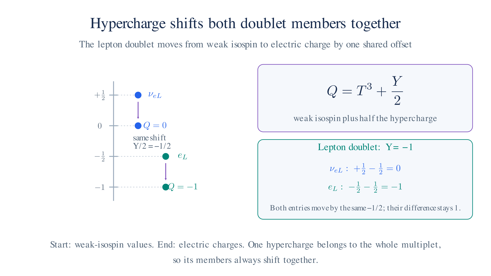

# Electroweak Unification

In [Weak Interaction](weak-interaction.md), local $SU(2)_L$ symmetry introduced three gauge fields. Two charged combinations, $W^\pm$, connect the currents in beta decay. The neutral field $W^3$ remains. We now ask how this construction fits with the photon and the electromagnetic interactions we already know.

The physical requirements constrain the extension. The photon couples to both chiral parts of an electron with the same electric charge, while a neutrino has no direct photon coupling. The weak interaction also includes neutral processes in which a neutrino scatters without becoming a charged lepton. We will construct couplings that account for all three features.

The steps are:

1. **Compare the neutral weak coupling with electromagnetism.** Their different action on neutrinos and right-handed electrons rules out identifying $W^3$ with the photon.
2. **Introduce a second charge and gauge field.** Hypercharge supplies the additional coupling needed to reproduce electric charges.
3. **Combine the neutral fields.** One combination has the photon coupling; the other has the $Z$ coupling.
4. **Read the physical interactions.** The photon preserves the electromagnetic coupling, while the $Z$ couples to neutral weak currents.
5. **Identify the remaining mass problem.** The next chapter explains why the photon is massless while the $W$ and $Z$ are massive.

We use $\hbar=c=1$, metric $(+,-,-,-)$, and the plus-sign convention for the covariant derivative used in QED and WI. Throughout, $e>0$ denotes the elementary charge; an electron has charge $-e$.

## The neutral weak field cannot be the photon

The [matrix expansion in WI](weak-interaction.md#reading-the-interaction-as-w-exchange) gave the neutral interaction

$$\mathcal L_{W^3}
=-\frac g2\left(\bar\nu_{eL}\gamma^\mu\nu_{eL}
-\bar e_L\gamma^\mu e_L\right)W_\mu^3.$$

This couples $W^3$ to the neutrino and the left-chiral electron. There is no right-chiral electron term because $e_R$ is an $SU(2)_L$ singlet. Compare those properties with the photon:

| Fermion component | Coupling to $W^3$ | Electric charge |
| --- | --- | --- |
| $\nu_{eL}$ | Nonzero | $0$ |
| $e_L$ | Nonzero | $-e$ |
| $e_R$ | Zero | $-e$ |

The $W^3$ field interacts with the left-chiral neutrino, but the photon does not. Conversely, $W^3$ does not interact with the right-chiral electron, but the photon does. Changing the strength $g$ cannot fix this pattern, so we cannot identify $W^3$ alone with the photon. We introduce another electrically neutral field, $B_\mu$, and form the photon from a combination of the two fields. In that combination, their neutrino couplings cancel, while $B_\mu$ supplies the coupling to the right-chiral electron.

This is a motivation for extending the model, not a proof that there is only one possible extension. We will use the $SU(2)_L\times U(1)_Y$ structure of the **Glashow–Salam–Weinberg electroweak theory**. Its charge assignments and predictions must agree with experiment.

## Left and right parts need different weak charges

The [chiral projectors](weak-interaction.md#selecting-the-chiral-part-of-a-field) split the electron field into $e_L=P_Le$ and $e_R=P_Re$. These are parts of the same electron field, not separate electron species. The charged weak interaction treats them differently, even though both have electric charge $-e$.

The left-chiral neutrino and electron form the doublet

$$L=\begin{pmatrix}\nu_{eL}\\e_L\end{pmatrix},\qquad
T^3=\frac12\begin{pmatrix}1&0\\0&-1\end{pmatrix}.$$

The upper entry has $T^3$ eigenvalue $+1/2$ and the lower entry $-1/2$. We write an individual component's eigenvalue as $t_3$. For a right-chiral singlet, all three $SU(2)_L$ generators act as zero, so $t_3=0$.

These values do not equal the electric charges. For the doublet, the desired charges in units of $e$ are $(0,-1)$, whereas the $t_3$ values are $(1/2,-1/2)$. Both entries need the same offset, $-1/2$. This suggests adding a generator that acts equally on both entries.

## Hypercharge supplies the additional charge

Introduce a $U(1)$ phase symmetry with charge **weak hypercharge**, denoted $Y$. We use the convention

$$\boxed{Q=T^3+\frac Y2.}$$

The factor $1/2$ is a normalization convention, not a physical requirement. We could instead define $\widetilde Y=Y/2$ and write $Q=T^3+\widetilde Y$. The lepton doublet would then have $\widetilde Y=-1/2$ instead of $Y=-1$. Using that definition consistently in the coupling to $B_\mu$ gives the same physics.

Here $Q$ is the dimensionless electric-charge operator; a component with eigenvalue $Q_f$ has charge $eQ_f$. Within a doublet, $Y$ multiplies the identity matrix. It therefore adds the same offset to both entries without mixing them.

For the lepton doublet, choose $Y_L=-1$. The upper and lower charges become $1/2-1/2=0$ and $-1/2-1/2=-1$. For the right-chiral electron, $t_3=0$, so $Y_{e_R}=-2$ gives the required charge $-1$.

We can also choose hypercharges to reproduce the observed charges of the up and down quarks. The table collects these assignments alongside the electron and its neutrino.[^generations][^neutrino-content]

| Fields | $SU(2)_L$ type | $t_3$ for each entry | $Y$ | $Q_f=t_3+Y/2$ |
| --- | --- | --- | --- | --- |
| $(\nu_{eL},e_L)$ | Doublet | $(+1/2,-1/2)$ | $-1$ | $(0,-1)$ |
| $e_R$ | Singlet | $0$ | $-2$ | $-1$ |
| $(u_L,d_L)$ | Doublet | $(+1/2,-1/2)$ | $+1/3$ | $(+2/3,-1/3)$ |
| $u_R$ | Singlet | $0$ | $+4/3$ | $+2/3$ |
| $d_R$ | Singlet | $0$ | $-2/3$ | $-1/3$ |

These assignments reproduce the known charges once we choose $Q=T^3+Y/2$. The gauge-group name alone does not determine them. Full quantum consistency also constrains the assignments across quarks and leptons; those checks are beyond this construction.[^charges]

**Hypercharge is not electric charge.** In particular, a neutrino can have nonzero $Y$ while $Q_f=0$. The cancellation between $t_3$ and $Y/2$ will also cancel its photon coupling.

## Making both symmetries local

First consider the hypercharge transformation on its own. For a field $F$ with fixed hypercharge $Y_F$, multiply by a phase:

$$F\longrightarrow e^{i\beta Y_F/2}F,\qquad
\bar F\longrightarrow\bar F e^{-i\beta Y_F/2}.$$

Here $\beta$ is the transformation parameter. The adjoint acquires the opposite phase because complex conjugation reverses the sign of $i$. For the lepton doublet, $Y_L=-1$, so both the neutrino and electron acquire the same factor $e^{-i\beta/2}$, without mixing.

For constant $\beta$, the phase passes through the derivative. The two factors then cancel in the free kinetic term:

$$i\bar F\gamma^\mu\partial_\mu F
\longrightarrow i\bar F e^{-i\beta Y_F/2}\gamma^\mu e^{i\beta Y_F/2}\partial_\mu F
=i\bar F\gamma^\mu\partial_\mu F.$$

If $\beta$ varies with spacetime position, the derivative also acts on the phase, producing an extra term. As in QED, we need a compensating gauge field to make the kinetic term invariant under this local transformation.

The product symbol in $SU(2)_L\times U(1)_Y$ means that we permit both types of transformation: an $SU(2)$ mixing and a hypercharge phase. They commute because the hypercharge is the same for both entries of a doublet. A field multiplet $F$ transforms as

$$F(x)\longrightarrow
e^{i\beta(x)Y_F/2}U(x)F(x).$$

Here $F$ can be a doublet or a singlet; for a singlet, $U$ acts as the identity. This is the same local-symmetry construction used in WI, now with one additional phase.

Local $SU(2)_L$ already supplied $W_\mu^1,W_\mu^2,W_\mu^3$. The extra $U(1)_Y$ supplies one more gauge field, called $B_\mu$, with coupling $g'$. This $B_\mu$ is a four-potential, not the magnetic field $\mathbf B$ from electromagnetism. The covariant derivative is

$$\boxed{D_\mu F=
\left(\partial_\mu+igT^aW_\mu^a
+ig'\frac{Y_F}{2}B_\mu\right)F.}$$

Substitution into $i\bar F\gamma^\mu D_\mu F$ gives the interaction terms. The charged $W^\pm$ terms stay as in WI. For a component of definite $t_3$ and $Y$, the neutral part is

$$\mathcal L_{\mathrm{neutral}}
=-\bar f\gamma^\mu f
\left(gt_3W_\mu^3+g'\frac Y2 B_\mu\right),$$

where $f$ denotes that chiral component. The two neutral fields couple to different charges. Neither, by itself, has the photon coupling for every fermion.

Checking the new phase compensation

Consider the hypercharge transformation alone, $F'=e^{i\beta Y_F/2}F$. Differentiating the phase produces $i(Y_F/2)(\partial_\mu\beta)F$. Choose

$$B'_\mu=B_\mu-\frac{1}{g'}\partial_\mu\beta.$$

Then the added term in the derivative contributes the opposite quantity:

$$\begin{aligned}
D'_\mu F'
&=e^{i\beta Y_F/2}\left[
D_\mu F+i\frac{Y_F}{2}(\partial_\mu\beta)F
-i\frac{Y_F}{2}(\partial_\mu\beta)F\right]\\
&=e^{i\beta Y_F/2}D_\mu F.
\end{aligned}$$

The $SU(2)$ contribution commutes with the phase. Under $SU(2)$ transformations, the $W$ fields transform as derived in WI, and $B_\mu$ is unchanged. Together, these rules make the kinetic term invariant under both local transformations.

## Identifying the photon combination

We need one neutral field whose coefficient is $eQ_f$ for every fermion. Try a rotation of the two neutral fields:

$$\begin{aligned}
A_\mu&=s_WW_\mu^3+c_WB_\mu,\\
Z_\mu&=c_WW_\mu^3-s_WB_\mu,
\end{aligned}\qquad
s_W=\sin\theta_W,\quad c_W=\cos\theta_W.$$

The angle $\theta_W$ is the **weak mixing angle**. This change of basis retains two independent neutral fields. We identify $A_\mu$ by demanding the electromagnetic coupling; the orthogonal combination is $Z_\mu$.

The coefficient of $A_\mu$ is $gs_Wt_3+g'c_WY/2$. To make it equal $e(t_3+Y/2)$, choose

$$\boxed{e=gs_W=g'c_W,\qquad \tan\theta_W=\frac{g'}g.}$$

These relations do not predict a numerical value for $\theta_W$. We must determine the weak mixing angle from experiment. Once $e$ and $\theta_W$ are known, they fix $g=e/\sin\theta_W$ and $g'=e/\cos\theta_W$. Thus we can describe the same two interaction strengths using either $(g,g')$ or $(e,\theta_W)$; the rotation relates these parameters rather than determining them without experimental input.

With that choice, the interaction is exactly $-eQ_f\bar f\gamma^\mu f A_\mu$. Both electron chiralities have $Q_f=-1$, so both couple with the same electric charge. The neutrino has $Q_f=0$, so its two contributions cancel.

This establishes the electromagnetic coupling pattern. **It does not yet prove that $A$ is massless or that $Z$ is massive.** We use the physical names in anticipation of the Higgs mechanism, which selects these combinations as the neutral mass eigenstates: fields with definite particle masses. The next chapter derives that selection. A field rotation alone cannot generate a mass.

Rotating the neutral interaction and checking the cancellation

Invert the rotation:

$$W_\mu^3=s_WA_\mu+c_WZ_\mu,\qquad
B_\mu=c_WA_\mu-s_WZ_\mu.$$

Substitution gives

$$\begin{aligned}
gt_3W_\mu^3+g'\frac Y2B_\mu
={}&\left(gs_Wt_3+g'c_W\frac Y2\right)A_\mu\\
&+\left(gc_Wt_3-g's_W\frac Y2\right)Z_\mu.
\end{aligned}$$

For $\nu_{eL}$, $t_3=1/2$ and $Y=-1$, so the photon coefficient is

$$\frac{gs_W}{2}-\frac{g'c_W}{2}=\frac e2-\frac e2=0.$$

For $e_L$, it is $-gs_W/2-g'c_W/2=-e$. For $e_R$, it is $-g'c_W=-e$. A single relation between couplings therefore reproduces all three entries in the opening table.

To simplify the $Z$ coefficient, use $Y/2=Q_f-t_3$ and $g'=gs_W/c_W$:

$$\begin{aligned}
gc_Wt_3-g's_W\frac Y2
&=gc_Wt_3-\frac{gs_W^2}{c_W}(Q_f-t_3)\\
&=\frac g{c_W}\left[(c_W^2+s_W^2)t_3-s_W^2Q_f\right]\\
&=\frac g{c_W}(t_3-s_W^2Q_f).
\end{aligned}$$

## The Z couples to neutral weak currents

After the rotation, each chiral component has the neutral interaction

$$\mathcal L_{\mathrm{neutral}}
=-eQ_f\bar f\gamma^\mu fA_\mu
-\frac g{c_W}(t_3-s_W^2Q_f)\bar f\gamma^\mu fZ_\mu.$$

The photon coefficient depends only on electric charge. The $Z$ coefficient also depends on $t_3$, so left and right components generally couple differently. A **neutral current** connects a fermion to the same species at a vertex; it need not be a current of electrically neutral particles.

For the electron and neutrino, remove the common $g/c_W$ factor to compare the remaining $Z$ coefficients:

| Component | $t_3$ | $Q_f$ | $t_3-s_W^2Q_f$ |
| --- | --- | --- | --- |
| $\nu_{eL}$ | $+1/2$ | $0$ | $+1/2$ |
| $e_L$ | $-1/2$ | $-1$ | $-1/2+s_W^2$ |
| $e_R$ | $0$ | $-1$ | $s_W^2$ |

The neutrino couples to $Z$ even though it does not couple directly to the photon. The right-chiral electron also couples to $Z$, through its hypercharge contribution. The statement that charged weak interactions select left-chiral fermion fields does not mean that every weak interaction excludes right-chiral charged fermions.

For a charged fermion represented by a full Dirac field, collect the two chiral terms as

$$\mathcal L_Z=-\frac g{c_W}
\bar f\gamma^\mu\left(g_L^fP_L+g_R^fP_R\right)fZ_\mu,$$

$$g_L^f=t_{3L}^f-s_W^2Q_f,\qquad
g_R^f=-s_W^2Q_f.$$

The symbols $g_L^f,g_R^f$ are dimensionless coefficients; they are not new independent gauge couplings. Once $g$ and $g'$ are fixed, the charge assignments determine them. This is a testable consequence of electroweak unification: photon, charged weak, and neutral weak couplings follow from the same two parameters.[^neutral]

## Assembling the electroweak Lagrangian

We can now collect the gauge and fermion terms used above. Before symmetry breaking, they have the form

$$\boxed{\mathcal L_{\mathrm{gauge+fermion}}
=-\frac14W_{\mu\nu}^aW^{a\mu\nu}
-\frac14B_{\mu\nu}B^{\mu\nu}
+\sum_F i\bar F\gamma^\mu D_\mu F.}$$

The sum runs over the left-chiral doublets and right-chiral singlets in all three generations. For quarks, it also includes their three colour components, whose strong interactions we defer to QCD. The derivative acts with the generators and hypercharge appropriate to each $F$; its $SU(2)$ term vanishes on a singlet.

The first two terms describe the gauge fields. The $SU(2)$ field strength includes gauge-boson self-interactions, as developed on the [Yang–Mills page](yang-mills.md). The Abelian field strength is $B_{\mu\nu}=\partial_\mu B_\nu-\partial_\nu B_\mu$, with the same derivative structure as Maxwell's. The fermion term includes both propagation and the couplings obtained by expanding $D_\mu$.

The full electroweak Lagrangian also contains a Higgs field, its potential, and its couplings to fermions. We have not supplied those terms yet. The expression above completes the gauge and fermion construction; it does not by itself describe the observed particle masses.

Unification here means a common gauge theory whose fields combine into the photon, $W^\pm$, and $Z$, with related couplings. It does not mean that $g$ and $g'$ are equal or that low-energy electromagnetic and weak processes have equal strengths.

The neutral-field construction introduced a useful technique: **changing the field basis**. We began with interactions written in terms of $W^3_\mu$ and $B_\mu$, then defined $A_\mu$ and $Z_\mu$ as two independent linear combinations of them. Substituting those definitions rewrote the same interaction as a photon term and a $Z$ term. We neither added nor removed a field; $W^3$ and $B$ remain expressible in terms of $A$ and $Z$. We chose this basis so that one combination couples to electric charge with coefficient $eQ_f$. The other has the neutral weak coupling derived above. The mixing angle requires experimental input, and the Higgs mechanism will explain why these combinations also describe particles with definite masses.

WI ended with $W^+,W^-,W^3$. Here we added the hypercharge field $B$, then combined the two neutral fields $W^3,B$ into $Z,A$. We therefore have four electroweak gauge fields:

| Fields | Interaction |
| --- | --- |
| $W^+,W^-$ | Charged weak interactions |
| $Z$ | Neutral weak interactions |
| $A$ (the photon) | Electromagnetic interactions |

The charged fields remain as in WI. The neutral-field rotation keeps the number of fields unchanged: two before the rotation and two after it.

## The mass problem leads to the Higgs field

The physical photon is massless, while the $W$ and $Z$ have masses. A direct mass term quadratic in the original gauge potentials changes under their local gauge transformations. Adding such terms by hand would abandon the gauge invariance we used to relate the interactions.

Fermion masses present a related problem. The ordinary electron mass term joins its two chiral parts:

$$-m_e\bar e e=-m_e\left(\bar e_Le_R+\bar e_Re_L\right).$$

But $e_L$ belongs to an $SU(2)_L$ doublet with $Y=-1$, whereas $e_R$ is a singlet with $Y=-2$. Their transformation factors do not cancel. The ordinary mass term is not invariant under the full electroweak group, even though it respects electromagnetic gauge symmetry.

Checking why the electron mass term fails the hypercharge transformation

Under a hypercharge transformation alone,

$$e_L\to e^{-i\beta/2}e_L,\qquad
\bar e_L\to\bar e_Le^{+i\beta/2},\qquad
e_R\to e^{-i\beta}e_R.$$

Therefore

$$\bar e_Le_R\longrightarrow e^{-i\beta/2}\bar e_Le_R,$$

which differs from the original term for a general $\beta(x)$. The conjugate term acquires the opposite phase, so their sum is not generally unchanged. An $SU(2)$ transformation also mixes $e_L$ with the neutrino component while leaving $e_R$ a singlet. An additional field with appropriate transformation properties is needed to build an invariant coupling between them.

The [Higgs mechanism](higgs-mechanism.md) supplies that field. Its vacuum configuration leaves electromagnetic charge unbroken while giving masses to the $W$ and $Z$; its fermion couplings produce charged-fermion masses. That chapter will derive these statements. Here we have established the coupling structure and identified the neutral weak couplings while preserving the photon interactions from QED.

[^neutrino-content]: As in WI, we treat neutrinos as massless and include no separate right-chiral neutrino field. If we added a right-chiral field $\nu_R$ as an $SU(2)_L$ singlet with $Y=0$, all its weak-isospin generators and its hypercharge would vanish. It would therefore have no direct coupling to the electroweak gauge fields. This optional extension is not needed for the charge construction here.

[^generations]: A **generation** is a set containing one charged lepton, its neutrino, one up-type quark, and one down-type quark. The particles in this table form the first generation. The second contains the muon, muon neutrino, charm quark, and strange quark; the third contains the tau, tau neutrino, top quark, and bottom quark. Corresponding particles have the same electric charges and electroweak assignments, although their masses differ. The charge construction below can be followed using only the particles in the table.

[^charges]: These are the usual electroweak assignments in the convention $Q=T^3+Y/2$. Some texts absorb the factor $1/2$ into the definition of hypercharge. For example, [Tong's electroweak notes, §5.1](https://davidtong.org/pdfs/teaching/standard-model/standardmodel5.pdf) use hypercharges half as large with the corresponding change in the covariant derivative. The physical products of coupling and charge are unchanged. A **gauge anomaly** is a quantum failure of the classical gauge symmetry; cancellation across the fermion content is an additional consistency check, not derived here.

[^neutral]: The [Particle Data Group's electroweak review, §10.1](https://pdg.lbl.gov/2025/reviews/rpp2025-rev-standard-model.pdf) gives the neutral-current couplings and weak mixing relations. It also discusses the radiative corrections needed for precision comparisons. Our formulas describe the tree-level structure.
