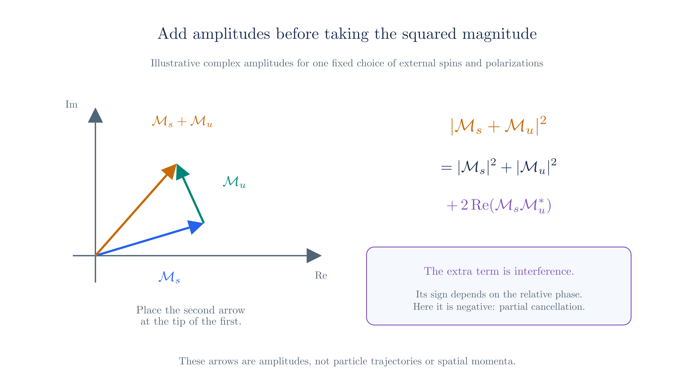
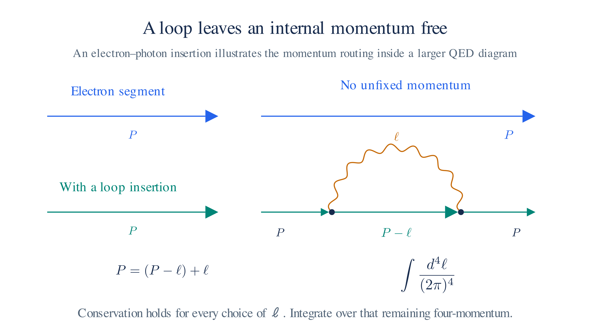

# Feynman Rules for QED

The chain from [Lagrangian to experiment](lagrangian-to-experiment.md) has two links still open: calculate an amplitude for a concrete process, then turn it into a number. This chapter completes both for one process, Compton scattering. The [Perturbation Theory page](perturbation-theory.md) derived the factors associated with vertices and propagators; here we assemble them into diagrams, evaluate the amplitude, and obtain a cross-section formula that a detector can test. We close with the loop diagrams that correct the leading result.

## The need for Feynman diagrams

The rules apply to the [QED Lagrangian](qed.md):

$$\mathcal{L}_\text{QED} = -\tfrac14 F_{\mu\nu}F^{\mu\nu} \;+\; \bar\psi\left(i\hbar\gamma^\mu\partial_\mu - m\right)\psi \;-\; q\,\bar\psi\gamma^\mu\psi\,A_\mu .$$

The first two terms describe free photons and electrons. The interaction $-q\bar\psi\gamma^\mu\psi A_\mu$ couples the photon field to the electron current.

Expanding in the charge $q$ organizes the calculation. Each interaction factor contributes one power of $q$. Keeping the lowest nonzero orders gives an approximation; higher orders supply corrections.

Each interaction factor contains two fermion fields and one photon field. To calculate an amplitude, attach fields to the external particles and pair the remaining fields with one another. The number of possible pairings grows with the order.

A **Feynman diagram** records one group of these terms. External lines attach to particle states, internal lines represent contractions, and vertices represent interaction factors. The **Feynman rules** turn each diagram into an amplitude contribution.

## Compton Scattering Example

In **Compton scattering**, the incoming and outgoing states each contain an electron and a photon:

$$e^-(p) + \gamma(k) \;\longrightarrow\; e^-(p') + \gamma(k').$$

The labels $p,k,p',k'$ are four-momenta, satisfying $p+k=p'+k'$. From here onward, use $\hbar=c=1$ and $g_{\mu\nu}=\operatorname{diag}(1,-1,-1,-1)$.

Counting the required vertices comes first. Each QED vertex has one photon leg. To attach both the incoming and outgoing photons, we need at least two vertices. At the lowest nonzero order, there are exactly two diagrams, each with two vertices joined by an internal electron line. They differ in how the photons attach.

Follow the electron arrow from the incoming electron to compare the attachments. Here “first” means first along that line.[^diagram-time] The photon labels identify incoming and outgoing states regardless of their positions on the page.

```feynman
\begin{tikzpicture}
\begin{feynman}
\vertex (i) at (-2,-1) {$e^-(p)$};
\vertex (a) at (0,0);
\vertex (b) at (2,0);
\vertex (f) at (4,-1) {$e^-(p')$};
\vertex (ki) at (-2,1) {incoming $\gamma(k)$};
\vertex (kf) at (4,1) {outgoing $\gamma(k')$};
\diagram* {
(i) -- [fermion] (a) -- [fermion, edge label={$p+k$}] (b) -- [fermion] (f),
(ki) -- [photon] (a),
(b) -- [photon] (kf),
};
\end{feynman}
\end{tikzpicture}
```

*s-channel diagram.*

The incoming photon attaches first. Calling the internal electron momentum $r_s$, momentum conservation at the two vertices gives

$$r_s=p+k,\qquad r_s=p'+k'.$$

This is the **s-channel**[^mandelstam], named for $s=(p+k)^2$.

```feynman
\begin{tikzpicture}
\begin{feynman}
\vertex (i) at (-2,-1) {$e^-(p)$};
\vertex (a) at (0,0);
\vertex (b) at (2,0);
\vertex (f) at (4,-1) {$e^-(p')$};
\vertex (kf) at (-2,1) {outgoing $\gamma(k')$};
\vertex (ki) at (4,1) {incoming $\gamma(k)$};
\diagram* {
(i) -- [fermion] (a) -- [fermion, edge label={$p-k'$}] (b) -- [fermion] (f),
(a) -- [photon] (kf),
(ki) -- [photon] (b),
};
\end{feynman}
\end{tikzpicture}
```

*u-channel diagram.*

The outgoing photon attaches first. Calling the internal electron momentum $r_u$, momentum conservation gives

$$p=r_u+k'\quad\Rightarrow\quad r_u=p-k',\qquad r_u+k=p'.$$

This is the **u-channel**, named for $u=(p-k')^2$.

Both diagrams contribute to the same measured transition. We must add their amplitudes before squaring.

## Building Blocks of Feynman Diagrams

A **fermion line** is straight and has an arrow. It represents the Dirac field, which describes electrons and positrons. The arrow follows fermion-number flow: along an electron's propagation and opposite a positron's. A **photon line** is wavy and has no fermion arrow.

A **vertex** joins two fermion ends and one photon line, corresponding to $-q\bar\psi\gamma^\mu\psi A_\mu$. Charge and four-momentum are conserved at each vertex. The QED Lagrangian has no elementary vertex made only of photons.

An **external line** connects to an incoming or outgoing particle. Its momentum is **on shell**: $p^2=m^2$ for an electron and $k^2=0$ for a photon.

An **internal line** connects two vertices and contributes a propagator. Its momentum can be **off shell**, meaning it need not satisfy the free-particle mass relation. The phrase **virtual particle** refers to this internal contribution. It is not a separately detected particle; energy and momentum remain conserved at the vertices.

Each Compton diagram has four external lines, two vertices, and one internal electron line. Changing the photon attachments changes the internal momentum and hence the propagator.

## Feynman Rules and Amplitudes

Interaction terms determine vertex factors, free terms determine propagators, and external particle states determine spinors or polarization vectors. The two Compton diagrams use four rules:

| Diagram element | Factor |
| --- | --- |
| Electron–photon vertex | $-iq\gamma^\mu$ |
| Internal electron with momentum $r$ | $\displaystyle \frac{i(\not r+m)}{r^2-m^2+i\epsilon}$ |
| Incoming / outgoing electron | $u(p)$ / $\bar u(p')$ |
| Incoming / outgoing photon | $\varepsilon_\mu(k)$ / $\varepsilon_\mu^*(k')$ |

The vertex factor is $-iq\gamma^\mu$, with $\gamma^\mu$ the matrices introduced on [The Dirac Equation page](dirac-equation.md). Removing the three fields from the interaction term leaves this factor, including the $i$ from the S-matrix expansion.

For the internal electron, $\not r$ abbreviates $\gamma^\mu r_\mu$. The numerator retains the field's spinor structure, while the denominator has its mass-shell poles. Quantizing the Dirac field by the method of [Field Quantization](field-quantization.md) gives this propagator. The $+i\epsilon$ specifies how to pass the poles in momentum integrals[^epsilon].

For an external electron, $u(p)$ is a positive-energy spinor solution from [The Dirac Equation page](dirac-equation.md), and $\bar u(p')=u(p')^\dagger\gamma^0$ is its adjoint. For a photon, $\varepsilon_\mu(k)$ is the polarization four-vector; an outgoing photon uses its complex conjugate[^polarization]. The additional photon-propagator and positron rules appear in a footnote[^rulebook].

To evaluate a product of factors, write the electron factors in matrix order. Start with $u(p)$ on the right and follow the electron arrow, adding each new factor to its left. Finish with $\bar u(p')$. Multiply by the photon polarization factors. For the first diagram this gives

$$
i\mathcal{M}_s = \bar u(p')(-iq\gamma^\nu)
\frac{i(\not p+\not k+m)}{(p+k)^2-m^2+i\epsilon}
(-iq\gamma^\mu)u(p)\,
\varepsilon_\mu(k)\varepsilon_\nu^*(k').
$$

Reverse the photon attachments for the second contribution:

$$
i\mathcal{M}_u = \bar u(p')(-iq\gamma^\mu)
\frac{i(\not p-\not k'+m)}{(p-k')^2-m^2+i\epsilon}
(-iq\gamma^\nu)u(p)\,
\varepsilon_\mu(k)\varepsilon_\nu^*(k').
$$

The labels refer to $s=(p+k)^2$ and $u=(p-k')^2$. We have suppressed spin labels. Keep the gamma matrices in the displayed order, because they generally do not commute.

The factors produce $i\mathcal M$, using the S-matrix convention in [From Lagrangian to Experiment](lagrangian-to-experiment.md).



*Complex amplitudes add as vectors. Their squared sum includes an interference term that depends on relative phase.*

At leading order the two contributions add before squaring, $\mathcal M_{\mathrm{tree}}=\mathcal M_s+\mathcal M_u$, so

$$|\mathcal{M}_{\mathrm{tree}}|^2
=|\mathcal{M}_s|^2+|\mathcal{M}_u|^2
+2\operatorname{Re}(\mathcal{M}_s\mathcal{M}_u^*).$$

The final term is the **interference** between the two contributions. For unpolarized incoming particles, average over two electron spins and two photon polarizations. Sum over unobserved final spins and polarizations, then insert the result into the cross-section phase-space integral.

## Completing the cross section

To turn $\lvert\mathcal M\rvert^2$ into a number, supply the spin sums and the phase-space measure. The external spinors and photon polarizations obey completeness relations that convert the sums into traces of gamma-matrix products, a step called **Casimir's trick**. Evaluating the traces is mechanical but lengthy. For unpolarized Compton scattering it gives the **Klein–Nishina formula**,

$$\frac{d\sigma}{d\Omega} = \frac{\alpha^2}{2m^2}\left(\frac{k'}{k}\right)^2\left[\frac{k'}{k}+\frac{k}{k'}-\sin^2\theta\right].$$

Here $\alpha=e^2/(4\pi)\approx1/137$ is the fine-structure constant, $m$ the electron mass, $k$ and $k'$ the initial and final photon energies in the electron's rest frame, and $\theta$ the scattering angle. The scattered energy follows from momentum conservation, $k'=k/\big[1+\tfrac{k}{m}(1-\cos\theta)\big]$. Inserting this formula into the phase-space measure of [From Lagrangian to Experiment](lagrangian-to-experiment.md) closes the chain $\mathcal L\to\mathcal M\to\sigma$: the Lagrangian has produced a number a detector can measure.

<details>
<summary>The spin and polarization sums</summary>

The external spinors obey the completeness relations

$$\sum_s u_s(p)\,\bar u_s(p) = \not p + m, \qquad \sum_s v_s(p)\,\bar v_s(p) = \not p - m,$$

where the sum runs over the two spin states. The physical photon polarizations obey

$$\sum_{\lambda}\varepsilon_\mu^{(\lambda)}(k)\,\varepsilon_\nu^{(\lambda)*}(k) = -g_{\mu\nu} + \frac{k_\mu \bar k_\nu + \bar k_\mu k_\nu}{k\cdot\bar k},$$

where $\bar k$ is a fixed reference four-vector. When a photon attaches to a conserved current, the $\bar k$ terms give zero, so inside a gauge-invariant amplitude the sum may be replaced by $-g_{\mu\nu}$.

Each external spinor pair $u\bar u$ becomes a factor $\not p+m$, each polarization pair becomes $-g_{\mu\nu}$, and multiplying everything together and taking the trace sums the internal spinor indices. The spin-averaged, polarization-summed square is therefore

$$\overline{\lvert\mathcal M\rvert^2} = \frac14\sum_{\text{spins, pols}}\lvert\mathcal M\rvert^2,$$

where the factor $\tfrac14$ averages over the two electron spins and two photon polarizations of the initial state.

</details>

## The Same Amplitude Without Diagrams

Diagrams organize an algebraic calculation. We can obtain the same Compton amplitude directly from the Dyson series and [Wick's theorem](perturbation-theory.md#wick-s-theorem), without drawing any lines. Working through the calculation once shows precisely what each diagram records: the external factors from the particle states, the contraction $S_F$ as the internal line, and the position integrals that fix the internal momentum.

<details>
<summary>Working through the Dyson-series calculation</summary>

Write the incoming and outgoing states as $|i\rangle=|e^-(p),\gamma(k)\rangle$ and $|f\rangle=|e^-(p'),\gamma(k')\rangle$, with spin and polarization labels suppressed. The interaction-picture S-matrix is

$$S=T\exp\!\left[-iq\int d^4x\,\bar\psi(x)\gamma^\mu\psi(x)A_\mu(x)\right].$$

The zeroth-order term describes no scattering. The first-order term has only one photon field and cannot attach to both external photons. The leading connected contribution therefore comes from

$$
\langle f|S^{(2)}|i\rangle_{\mathrm{conn}}
=\frac{(-iq)^2}{2!}\int d^4x\,d^4y\,
\langle f|T\!\left[
(\bar\psi\gamma^\mu\psi A_\mu)_x
(\bar\psi\gamma^\nu\psi A_\nu)_y
\right]|i\rangle_{\mathrm{conn}}.
$$

Here “connected” keeps the terms in which all four external particles participate in the same interaction process.

Attach the external states and contract the remaining fields. The free-field expansions give the external factors

$$
\begin{aligned}
\langle0|\psi(x)|e^-(p)\rangle&=u(p)e^{-ip\cdot x},
&\langle e^-(p')|\bar\psi(y)|0\rangle&=\bar u(p')e^{ip'\cdot y},\\
\langle0|A_\mu(x)|\gamma(k)\rangle&=\varepsilon_\mu(k)e^{-ik\cdot x},
&\langle\gamma(k')|A_\nu(y)|0\rangle&=\varepsilon_\nu^*(k')e^{ik'\cdot y}.
\end{aligned}
$$

Choose $x$ as the point where the incoming electron attaches and $y$ as the point where the outgoing electron attaches. The remaining fermion fields contract into

$$
S_F(y-x)\equiv\langle0|T\psi(y)\bar\psi(x)|0\rangle
=\int\frac{d^4r}{(2\pi)^4}\,
\frac{i(\not r+m)}{r^2-m^2+i\epsilon}\,e^{-ir\cdot(y-x)}.
$$

The other electron attachment exchanges the dummy integration variables $x$ and $y$ and gives an equal contribution, canceling the $2!$ in the Dyson expansion. There are still two distinct ways to attach the photons. Defining $\not\!\varepsilon=\gamma^\mu\varepsilon_\mu$, Wick's theorem gives

$$
\begin{aligned}
\langle f|S^{(2)}|i\rangle_{\mathrm{conn}}
=(-iq)^2\int d^4x\,d^4y\,\bar u(p')\Big[&
\not\!\varepsilon^{\,*}(k')S_F(y-x)\not\!\varepsilon(k)
e^{-i(p+k)\cdot x+i(p'+k')\cdot y}\\
{}+{}&\not\!\varepsilon(k)S_F(y-x)\not\!\varepsilon^{\,*}(k')
e^{-i(p-k')\cdot x+i(p'-k)\cdot y}
\Big]u(p).
\end{aligned}
$$

In the first term, the incoming photon attaches at $x$ and the outgoing photon at $y$. In the second, those attachments are reversed. The two terms have the same relative sign; exchanging these photon attachments introduces no fermionic exchange sign.

Now integrate over the interaction positions. Insert the Fourier expression for $S_F(y-x)$. For the first term, the $x$ and $y$ integrals give

$$
(2\pi)^4\delta^4(r-p-k)\,
(2\pi)^4\delta^4(p'+k'-r).
$$

The $r$ integral fixes $r=p+k$ and leaves the overall momentum-conservation delta function. For the second term, the same steps fix $r=p-k'$ and leave the same overall delta function.

</details>

The result is

$$
\langle f|S^{(2)}|i\rangle_{\mathrm{conn}}
=(2\pi)^4\delta^4(p'+k'-p-k)\,i\mathcal M_{\mathrm{tree}},
$$

with

$$
\begin{aligned}
\mathcal M_{\mathrm{tree}}=-q^2\bar u(p')\Bigg[&
\not\!\varepsilon^{\,*}(k')
\frac{\not p+\not k+m}{(p+k)^2-m^2+i\epsilon}
\not\!\varepsilon(k)\\
{}+{}&\not\!\varepsilon(k)
\frac{\not p-\not k'+m}{(p-k')^2-m^2+i\epsilon}
\not\!\varepsilon^{\,*}(k')
\Bigg]u(p).
\end{aligned}
$$

These are exactly $\mathcal M_s$ and $\mathcal M_u$ obtained above. Each diagram records one of the two contraction patterns: its external lines record the state factors, its internal line records $S_F$, and its vertices record the interaction factors and momentum constraints. The Feynman rules let us write the result without repeating this field-by-field calculation.

The optional [Path Integrals sequence](path-integrals.md) develops another derivation of this bookkeeping, starting with particle histories and building toward field integrals, fermions, gauge fixing, and renormalization.

## Tree-level and Loop Diagrams

A **tree diagram** has no closed cycle of internal lines. Momentum conservation fixes every internal momentum once the external momenta are given.

Both Compton diagrams are trees with two vertices. Each vertex contributes one $q$, so their amplitudes have order $q^2$ and their squared sum has order $q^4$.

A loop introduces an unfixed momentum. For example, connect two points on the electron line with an additional internal photon. That photon and the electron segment form a closed cycle. Conservation leaves a four-momentum $\ell$ free, so the amplitude includes

$$\int\frac{d^4\ell}{(2\pi)^4}$$

for each independent loop. The cycle need not be a closed fermion line: this electron–photon cycle is already a loop. When a loop does consist of a closed fermion line, also include a minus sign and a trace over spinor indices.

Compton one-loop contributions contain four QED vertices and have order $q^4$ in the amplitude. Interference with the order-$q^2$ tree amplitude therefore changes the squared amplitude at order $q^6$:

$$|\mathcal{M}|^2
=|\mathcal{M}_{\mathrm{tree}}|^2
+2\operatorname{Re}\!\left(\mathcal{M}_{\mathrm{tree}}^*
\mathcal{M}_{\mathrm{one\ loop}}\right)+\cdots.$$

At a chosen order, include the full set of diagrams and counterterms. A single selected loop diagram generally gives only part of the physical correction.



*An electron–photon loop can carry photon momentum ℓ and electron momentum P − ℓ. Conservation fixes their sum but leaves ℓ to be integrated.*

## Infinities in Loop Diagrams

For an explanation of how loop corrections and counterterms relate to physical inputs, see [Renormalization at One Loop](path-integrals-renormalization.md).

A loop integral includes arbitrarily large momenta. If its integrand falls too slowly there, the result has an **ultraviolet divergence**. For example, the large-momentum behavior $\int d^4\ell/(\ell^2)^2$ gives a logarithmic divergence. Some loop integrals are finite.

The first step is to regulate the integral. A **regulator** temporarily modifies the calculation so we can identify its divergent part. In dimensional regularization, continue the integral to $d=4-2\delta$ dimensions. Ultraviolet divergences then appear as poles in $1/\delta$.

The second step relates the parameters to measurements. Write the original masses, charges, and field normalizations as renormalized quantities plus **counterterms**. Choose the counterterms to cancel the regulated ultraviolet divergences, order by order. Specify measurement conditions for the renormalized parameters and remove the regulator from predictions.

This procedure is **renormalization**. In QED, counterterms have the same forms as terms already in the Lagrangian. A finite set of parameter and field redefinitions therefore suffices at every perturbative order. [Forshaw's QED and QCD lectures](https://users.hep.manchester.ac.uk/u/jforshaw/NorthWest/QED.pdf) develop this construction.

Small photon momenta cause a different divergence. An **infrared divergence** can arise when a massless loop photon's momentum approaches zero. Ultraviolet renormalization does not remove it.

A detector cannot resolve a photon below its energy threshold. Its measured Compton rate therefore includes events with sufficiently soft extra photons. Adding this unresolved real emission to the virtual loop corrections cancels the soft divergences in the inclusive observable.

Compton scattering has now taken us from the QED Lagrangian to a measured number, and the loop discussion shows how that number receives corrections order by order in the charge. Throughout, one interaction and one force carrier did the work: the photon couples to a charged field without changing its species. The next chapter examines beta decay, where the interaction turns a neutron's down quark into an up quark and creates an electron–antineutrino pair. The same diagram methods apply, with new vertices and a new symmetry organizing their couplings.

[^diagram-time]: **Left and right are not a time axis.** These covariant Feynman diagrams do not specify which vertex occurs earlier in time. Incoming and outgoing particles are identified by the process equation and labels, not by their positions on the page. Moving vertices or bending lines leaves the amplitude unchanged as long as the connections, arrows, labels, and incoming/outgoing assignments are preserved.

[^mandelstam]: **Mandelstam variables** are Lorentz-invariant combinations of the external momenta: $s=(p+k)^2=(p'+k')^2$, $t=(p-p')^2$, and $u=(p-k')^2$. The channel name identifies the momentum combination in the exchanged propagator. Here the internal electron carries $p+k$ in the s-channel and $p-k'$ in the u-channel. A tree-level t-channel would require a two-photon vertex on one end of the exchanged line, which elementary QED does not have. For Compton scattering, $s+t+u=2m^2$; the relation $s+t+u=0$ applies when all four external particles are massless.

[^epsilon]: The electron denominator vanishes at $r^2=m^2$. The infinitesimal $+i\epsilon$ displaces its poles to implement Feynman time ordering and fixes their treatment in momentum integrals. For ordinary Compton tree kinematics with nonzero photon energies, the internal momentum is fixed away from the poles. In loop integrals, the prescription remains essential.

[^polarization]: A photon has two physical transverse polarizations, equivalently two helicities. Its polarization four-vector satisfies $k^\mu\varepsilon_\mu(k)=0$, with vectors that differ by a multiple of $k_\mu$ describing the same physical polarization. In a transverse gauge, its spatial part specifies the electric-field oscillation direction. The outgoing factor is $\varepsilon_\mu^*(k')$.

[^rulebook]: An internal photon contributes $-ig_{\mu\nu}/(r^2+i\epsilon)$ in Feynman gauge, derived on the [QED page](qed.md#quantizing-the-photon-field). Incoming and outgoing positrons contribute $\bar v(p)$ and $v(p')$, respectively, using the negative-frequency solutions in the Dirac equation's [general solution](dirac-equation.md). These conventions agree with [David Tong's QED notes](https://www.damtp.cam.ac.uk/user/tong/qft/qfthtml/S6.html).
