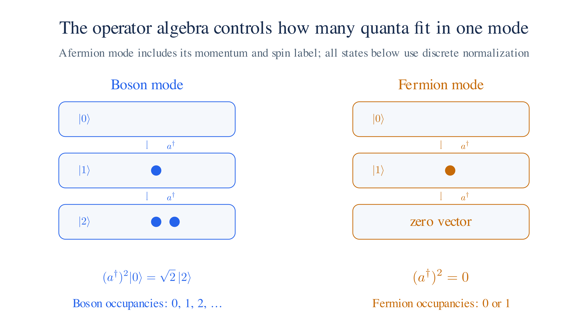

# Quantum Field Theory: Field Quantization

We now quantize the fields introduced in [Action and Lagrangians](qft-action.md).

## Outline

**The main idea is to quantize each momentum mode as a harmonic oscillator.** The [Harmonic Oscillator](harmonic-oscillator.md) page already gives its energy levels and ladder operators.

We first decompose a real scalar field into modes, promote its amplitudes to operators, and derive their commutators. Each oscillator quantum then has the energy and momentum of a particle. Finally, we repeat the construction for the Dirac field, where anticommutators give electrons, positrons, and the Pauli exclusion principle.

### The scalar field in modes

The real scalar $\phi(x)$ obeys the Klein–Gordon equation

$$\left(\Box + \frac{m^2}{\hbar^2}\right)\phi = 0.$$

Plane waves $e^{-ip\cdot x/\hbar}$ solve it when energy satisfies the dispersion relation

$$E_p = \sqrt{\mathbf p^2 + m^2}.$$

Since $\phi$ is real, the general solution pairs each wave with its conjugate, one amplitude per momentum:

$$\phi(x) = \int \frac{d^3p}{(2\pi\hbar)^3}\frac{\hbar}{\sqrt{2E_p}}\left[a(p)e^{-ip\cdot x/\hbar} + a^*(p)e^{+ip\cdot x/\hbar}\right].$$

To compute the Hamiltonian, expand in *spatial* Fourier modes with time-dependent coefficients, $\pi_p = \dot\phi_p$:

$$\phi(t,\mathbf x) = \int \frac{d^3p}{(2\pi\hbar)^3}\phi_p(t)e^{i\mathbf p\cdot\mathbf x/\hbar}.$$

Substituting into $H = \int d^3x\left(\tfrac12\pi^2 + \tfrac12(\nabla\phi)^2 + \tfrac{m^2}{2\hbar^2}\phi^2\right)$ and using plane-wave orthogonality $\int d^3x\,e^{i(\mathbf p+\mathbf q)\cdot\mathbf x/\hbar}=(2\pi\hbar)^3\delta^3(\mathbf p+\mathbf q)$ collapses the cross terms, leaving

$$H = \int \frac{d^3p}{(2\pi\hbar)^3}\left[\tfrac12|\pi_p|^2 + \tfrac12\omega_p^2|\phi_p|^2\right],\qquad \omega_p^2 = \frac{E_p^2}{\hbar^2}.$$

Each term has the harmonic oscillator form, with frequency $E_p/\hbar$. For a real field, the $p$ and $-p$ Fourier amplitudes are complex conjugates; independent sine and cosine coordinates give independent real oscillators.

### Second quantization

Replace the numerical amplitudes by operators:

$$a(p)\to\hat a(p),\qquad a^*(p)\to\hat a^\dagger(p),\qquad {}^*\to{}^\dagger,$$

so that the field operator reads

$$\hat\phi(x) = \int \frac{d^3p}{(2\pi\hbar)^3}\frac{\hbar}{\sqrt{2E_p}}\left[\hat a(p)e^{-ip\cdot x/\hbar} + \hat a^\dagger(p)e^{+ip\cdot x/\hbar}\right],$$

with $\hat\pi = \dot{\hat\phi}$. The field is Hermitian, $\hat\phi^\dagger = \hat\phi$. Strictly, it is an operator-valued distribution: integrate it against a suitable smooth function to obtain an operator.

### The canonical commutator

Impose the field counterpart of $[\hat x,\hat p]=i\hbar$. At equal times,

$$[\hat\phi(t,\mathbf x),\hat\pi(t,\mathbf x')] = i\hbar\,\delta^3(\mathbf x-\mathbf x'),\qquad [\hat\phi,\hat\phi]=0,\qquad [\hat\pi,\hat\pi]=0.$$

This equal-time condition is imposed, not derived. It is the quantization postulate (equivalently, $\{\cdot,\cdot\}\to\tfrac{1}{i\hbar}[\cdot,\cdot]$ on the Poisson bracket $\{\phi,\pi\}=\delta^3$).

### Ladder commutators

Set $t=0$ so the temporal phases equal $1$:

$$\hat\phi(\mathbf x) = \int \frac{d^3p}{(2\pi\hbar)^3}\frac{\hbar}{\sqrt{2E_p}}\left[\hat a(p)e^{i\mathbf p\cdot\mathbf x/\hbar} + \hat a^\dagger(p)e^{-i\mathbf p\cdot\mathbf x/\hbar}\right],$$

$$\hat\pi(\mathbf x) = \int \frac{d^3p}{(2\pi\hbar)^3}\frac{\hbar}{\sqrt{2E_p}}\frac{-iE_p}{\hbar}\left[\hat a(p)e^{i\mathbf p\cdot\mathbf x/\hbar} - \hat a^\dagger(p)e^{-i\mathbf p\cdot\mathbf x/\hbar}\right].$$

The expansion can be inverted. Multiplying $E_p\hat\phi + i\hbar\hat\pi$ by $e^{-i\mathbf p\cdot\mathbf x/\hbar}$ and integrating isolates $\hat a(p)$ (the $\hat a^\dagger$ half cancels because $E_{-p}=E_p$). Substituting this into $[\hat a(p),\hat a^\dagger(p')]$, only the $[\hat\phi,\hat\pi]$ term survives, and the plane-wave orthogonality leaves

$$[\hat a(p),\hat a^\dagger(p')] = (2\pi\hbar)^3\,\delta^3(p-p'),\qquad [\hat a,\hat a]=0,\qquad [\hat a^\dagger,\hat a^\dagger]=0.$$

Distinct momentum modes commute. For discrete box modes, rescale the operators to obtain $[\hat a,\hat a^\dagger]=1$.

### One oscillator per momentum

For one mode, use the [Harmonic Oscillator page](harmonic-oscillator.md). Combine its coordinate and momentum, with $[\hat q,\hat p]=i\hbar$, into ladder operators:

$$\hat a = \sqrt{\frac{\omega}{2\hbar}}\hat q + \frac{i}{\sqrt{2\hbar\omega}}\hat p,\qquad \hat a^\dagger = \sqrt{\frac{\omega}{2\hbar}}\hat q - \frac{i}{\sqrt{2\hbar\omega}}\hat p,$$

so $[\hat a,\hat a^\dagger]=1$. The Hamiltonian becomes

$$\hat H = \hbar\omega\left(\hat a^\dagger\hat a + \tfrac12\right).$$

With $\hat N=\hat a^\dagger\hat a$, the commutators $[\hat N,\hat a]=-\hat a$, $[\hat N,\hat a^\dagger]=\hat a^\dagger$ show $\hat a$ lowers and $\hat a^\dagger$ raises by one. Nonnegativity of $\hat N$ forces a lowest state $\lvert 0\rangle$ with $\hat a\lvert 0\rangle=0$. Repeated raising gives $\lvert n\rangle\propto(\hat a^\dagger)^n\lvert 0\rangle$ with energies $\hbar\omega(n+\tfrac12)$.

Returning to the field and substituting the mode expansions, each momentum contributes one oscillator of frequency $E_p/\hbar$:

$$\hat H = \int \frac{d^3p}{(2\pi\hbar)^3}E_p\,\hat a^\dagger(p)\hat a(p) + \text{const.}$$

The constant is the formally infinite sum of zero-point energies. In this free theory without gravity, subtract it and measure energy relative to the vacuum. Each mode carries levels $E_p n_p$, with $\hat a^\dagger(p)$ adding exactly $E_p$.

### Creation of particles

The mode's quantum is a particle. One quantum of momentum $\mathbf p$ carries $(E_p,\mathbf p)$, exactly a relativistic particle of mass $m$. The state space is the product of mode spaces. The vacuum $\lvert 0\rangle$ is annihilated by every $\hat a(p)$ and has zero energy. General states are labeled by occupation numbers:

$$\hat H\,\lvert\{n_p\}\rangle = \left(\sum_p E_p n_p\right)\lvert\{n_p\}\rangle.$$

Because the creation operators commute, particles are identical bosons, matching the integer-spin scalar row. Energy is bounded below since every $E_p>0$ and $n_p\ge0$, so the negative-energy problem of the Klein–Gordon single-particle reading disappears. The negative-frequency term now carries $\hat a^\dagger$ and *adds* energy, and an empty mode cannot be lowered further. Particle number $\hat N=\int\frac{d^3p}{(2\pi\hbar)^3}\hat a^\dagger\hat a$ is conserved because $[\hat H,\hat N]=0$.

The real scalar therefore has one family of particle operators. Its quanta are their own antiparticles. We impose the canonical field commutator and derive the mode commutators from it.

### The spinor field

The Dirac field has two operator families: $\hat a_s(p)$ for positive-frequency modes and $\hat b_s^\dagger(p)$ for negative-frequency modes. Before reordering, each mode contributes $E_p(\hat a^\dagger\hat a-\hat b\hat b^\dagger)$ to the Hamiltonian.

Ordinary commutators would make the antiparticle energy negative and unbounded below. With **anticommutators**, $\hat b\hat b^\dagger=1-\hat b^\dagger\hat b$, so both species have positive energy after subtracting the vacuum constant.

The same algebra gives $(\hat a^\dagger)^2=0$: each momentum-and-spin mode holds at most one fermion. Exchanging two creation operators changes the state's sign. The second family creates antiparticles of the same mass and opposite charge.

> The outline gives the main argument. The sections below work through the expansions and calculations in detail.

## The scalar field in modes

Start with the real scalar field from [The Action and Lagrangians page](qft-action.md). Its Lagrangian density is $\mathcal L=\tfrac12(\partial_\mu\phi)(\partial^\mu\phi)-\tfrac{m^2}{2\hbar^2}\phi^2$. Applying the Euler–Lagrange equation gives

$$\left(\Box + \frac{m^2}{\hbar^2}\right)\phi = 0,$$

Here $\Box=\partial_t^2-\nabla^2$ is the **d'Alembertian**, the relativistic wave operator. Substitute a plane wave $e^{-ip\cdot x/\hbar}$, where $p\cdot x=E_pt-\mathbf p\cdot\mathbf x$. It solves the equation when

$$E_p = \sqrt{\mathbf p^2 + m^2}.$$

We choose real initial values for $\phi$ and $\dot\phi$. Because the equation has real coefficients, the field remains real during evolution.

To keep the plane-wave expansion real, pair each term with its complex conjugate. The general solution is

$$\phi(x) = \int \frac{d^3p}{(2\pi\hbar)^3}\,\frac{\hbar}{\sqrt{2E_p}}\left[a(p)\,e^{-ip\cdot x/\hbar} + a^*(p)\,e^{+ip\cdot x/\hbar}\right].$$

The star denotes complex conjugation. One complex function $a(p)$ therefore specifies both frequency halves and encodes the initial field and its time derivative. We include $\hbar/\sqrt{2E_p}$ so that the canonical commutator gives $[\hat a(p),\hat a^\dagger(p')]=(2\pi\hbar)^3\delta^3(p-p')$ and the Hamiltonian counts each quantum with energy $E_p$. From [Action and Lagrangians](qft-action.md), the conjugate momentum is $\pi=\partial\mathcal L/\partial\dot\phi=\dot\phi$.

**Separate the momentum modes.** To evaluate the Hamiltonian, Fourier-expand the field and momentum on a spatial slice. In this form, the coefficients depend on time:

$$\phi(t, \mathbf x) = \int \frac{d^3p}{(2\pi\hbar)^3}\; \phi_p(t)\, e^{i\mathbf p\cdot\mathbf x/\hbar}, \qquad \pi(t, \mathbf x) = \int \frac{d^3p}{(2\pi\hbar)^3}\; \pi_p(t)\, e^{i\mathbf p\cdot\mathbf x/\hbar},$$

Since $\pi=\dot\phi$, we have $\pi_p=\dot\phi_p$. Unlike the constant $a(p)$ above, $\phi_p(t)$ contains the mode's time dependence. This form specifies the field and momentum at an instant without first solving their evolution.

Substitute these expansions into [the Action page's Hamiltonian](qft-action.md#the-geometry-of-h), $H=\int d^3x\,\big(\tfrac12\pi^2+\tfrac12(\nabla\phi)^2+\tfrac{m^2}{2\hbar^2}\phi^2\big)$. Each gradient contributes $i\mathbf p/\hbar$.

The spatial integral uses $\int d^3x\,e^{i(\mathbf p+\mathbf q)\cdot\mathbf x/\hbar}=(2\pi\hbar)^3\delta^3(\mathbf p+\mathbf q)$, leaving only pairs with $\mathbf q=-\mathbf p$. Reality gives $\phi_{-p}=\phi_p^*$ and $\pi_{-p}=\pi_p^*$, so

$$H = \int \frac{d^3p}{(2\pi\hbar)^3}\left[\tfrac12|\pi_p|^2 + \tfrac12\,\omega_p^2\,|\phi_p|^2\right], \qquad \omega_p^2 = \frac{\mathbf p^2 + m^2}{\hbar^2} = \frac{E_p^2}{\hbar^2}.$$

Each contribution has the form of a harmonic oscillator Hamiltonian, with frequency $\omega_p=E_p/\hbar$. The Fourier amplitudes at $p$ and $-p$ obey the reality relation; the independent real coordinates can equivalently be written as sine and cosine modes.

The coefficients $a(p)$ describe the amplitudes and phases once the modes evolve on shell[^on-shell]. This is the oscillator whose phase-space motion appeared on the [Action page](qft-action.md).

*A field profile decomposes into spatial modes. Each mode evolves as an oscillator with frequency E divided by hbar.*

## Second quantization

We can quantize either the mode amplitudes or the field and conjugate momentum. These are two descriptions of the same step.

For the mode description, replace each amplitude and its complex conjugate by a pair of adjoint operators:

$$a(p) \to \hat a(p), \qquad a^*(p) \to \hat a^\dagger(p),$$

The adjoint $\dagger$ replaces complex conjugation. This is the step used for the Dirac field on the [Fields and Quanta page](qft.md#the-promotion).

[First quantization](first-quantization.md) quantized a classical particle. Here we quantize a classical field, so “second quantization” does not mean quantizing the same object twice. A real scalar has one independent operator family. A charged field has a separate antiparticle family, like the $b$-operators in the [Fields and Quanta promotion](qft.md#the-promotion).

Equivalently, promote the canonical variables at every point: $\phi(\mathbf x)\to\hat\phi(\mathbf x)$ and $\pi(\mathbf x)\to\hat\pi(\mathbf x)$. The field becomes

$$\hat\phi(x) = \int \frac{d^3p}{(2\pi\hbar)^3}\,\frac{\hbar}{\sqrt{2E_p}}\left[\hat a(p)\,e^{-ip\cdot x/\hbar} + \hat a^\dagger(p)\,e^{+ip\cdot x/\hbar}\right],$$

The conjugate momentum is $\hat\pi=\dot{\hat\phi}$. Taking the adjoint swaps the two terms, so $\hat\phi^\dagger=\hat\phi$, the operator counterpart of a real field.

Strictly, $\hat\phi(x)$ is an operator-valued distribution. Integrating it against a suitable smooth function gives a well-defined operator, as explained in [Fields and Quanta](qft.md#second-quantization).

## The canonical commutator

For a particle, canonical quantization imposes $[\hat x,\hat p]=i\hbar$. For a field, we impose the corresponding relation at every pair of spatial points:

$$[\hat\phi(t, \mathbf x), \hat\pi(t, \mathbf x')] = i\hbar\,\delta^3(\mathbf x - \mathbf x'), \qquad [\hat\phi, \hat\phi] = 0, \qquad [\hat\pi, \hat\pi] = 0.$$

Both operators refer to the same time. This is the **equal-time canonical commutator**. The delta function is the continuous counterpart of a Kronecker delta: field and momentum variables at distinct points commute.

[Heisenberg evolution](qft.md#choosing-a-picture) determines commutators at other times; we do not impose this same formula for arbitrary pairs of times.

This commutator is a quantization postulate. Following the [Action page](qft-action.md), we can also obtain it by applying the correspondence rule $\{\cdot,\cdot\}\to\tfrac1{i\hbar}[\cdot,\cdot]$ to the classical Poisson bracket $\{\phi(\mathbf x),\pi(\mathbf x')\}=\delta^3(\mathbf x-\mathbf x')$. Once we impose it, the mode-operator commutators follow.

## Ladder commutators

To derive the mode algebra, evaluate the field and momentum at $t=0$. The temporal phases become $1$, leaving

$$\hat\phi(\mathbf x) = \int \frac{d^3p}{(2\pi\hbar)^3}\,\frac{\hbar}{\sqrt{2E_p}}\left[\hat a(p)\,e^{i\mathbf p\cdot\mathbf x/\hbar} + \hat a^\dagger(p)\,e^{-i\mathbf p\cdot\mathbf x/\hbar}\right],$$

$$\hat\pi(\mathbf x) = \int \frac{d^3p}{(2\pi\hbar)^3}\,\frac{\hbar}{\sqrt{2E_p}}\,\frac{-iE_p}{\hbar}\left[\hat a(p)\,e^{i\mathbf p\cdot\mathbf x/\hbar} - \hat a^\dagger(p)\,e^{-i\mathbf p\cdot\mathbf x/\hbar}\right].$$

**Isolate one annihilation operator.** Multiply $E_p\hat\phi(\mathbf x)+i\hbar\hat\pi(\mathbf x)$ by $e^{-i\mathbf p\cdot\mathbf x/\hbar}$ and integrate over space.

Fourier orthogonality selects the annihilation term at momentum $p$. Its two contributions add because $i\hbar\hat\pi$ contributes $+E_p$. The creation term is selected at $-p$, but its contributions cancel because $i\hbar\hat\pi$ contributes $-E_{-p}$ and $E_{-p}=E_p$. Thus

$$\hat a(p) \;\propto\; \int d^3x\,e^{-i\mathbf p\cdot\mathbf x/\hbar}\left(E_p\,\hat\phi(\mathbf x) + i\hbar\,\hat\pi(\mathbf x)\right),$$

Taking the adjoint gives the corresponding expression for $\hat a^\dagger$. This is the field version of expressing oscillator ladder operators in terms of coordinate and momentum.

Substitute both integrals into $[\hat a(p),\hat a^\dagger(p')]$. The field–field and momentum–momentum commutators vanish. The mixed terms give a spatial delta function, and Fourier orthogonality then gives a momentum delta function:

$$[\hat a(p), \hat a^\dagger(p')] = (2\pi\hbar)^3\,\delta^3(p - p'), \qquad [\hat a(p), \hat a(p')] = 0, \qquad [\hat a^\dagger(p), \hat a^\dagger(p')] = 0,$$

The factor $(2\pi\hbar)^3$ matches the momentum integration measure. The momentum delta means different modes commute; a mode has a nonzero commutator only with its own adjoint.

In a finite box, momenta are discrete. Rescale each discrete mode operator so that $[\hat a,\hat a^\dagger]=1$. This is the independent-oscillator algebra previewed on the [Action page](qft-action.md). We derived it from the canonical field commutator, rather than imposing a second algebra independently.

## One oscillator per momentum

Each discrete momentum mode now has the algebra of the [Harmonic Oscillator](harmonic-oscillator.md). For one oscillator of frequency $\omega$, $[\hat a,\hat a^\dagger]=1$ gives

$$\hat H = \hbar\omega\left(\hat a^\dagger\hat a + \tfrac12\right),$$

Its levels are $\hbar\omega(n+\tfrac12)$. The creation operator $\hat a^\dagger$ raises $n$ by one; $\hat a$ lowers it by one.

To identify the field's mode energies, start with its Hamiltonian:

$$\hat H = \int d^3x\left[\tfrac12\hat\pi^2 + \tfrac12(\nabla\hat\phi)^2 + \frac{m^2}{2\hbar^2}\hat\phi^2\right],$$

Substitute the field and momentum expansions. Spatial orthogonality removes the coupling between different modes. Each mode has frequency $E_p/\hbar$, so the result has the form

$$\hat H = \int \frac{d^3p}{(2\pi\hbar)^3}\,E_p\,\hat a^\dagger(p)\hat a(p) \;+\; \text{const.}$$

Each oscillator contributes a vacuum energy $\tfrac12E_p$. Summing over infinitely many modes gives a formally divergent constant. In this free theory without gravity, we subtract that constant and measure energies relative to the vacuum.

With this mode normalization, the remaining energy is $E_p$ times the occupation number of each mode.

A state $|n_p\rangle$ with $n_p$ quanta in one mode has energy $E_pn_p$ above the vacuum. Applying $\hat a^\dagger(p)$ adds $E_p$; applying $\hat a(p)$ removes it. This verifies the creation and annihilation interpretation introduced in [Fields and Quanta](qft.md#the-promotion).

## Creation of particles

One quantum in momentum mode $\mathbf p$ has momentum $\mathbf p$ and energy $E_p=\sqrt{\mathbf p^2+m^2}$. These are the energy and momentum of a relativistic particle of mass $m$. We therefore identify $\hat a^\dagger(p)|0\rangle$ as a one-particle momentum state.

In box normalization, label states by the **occupation numbers** $\{n_p\}$: the number of quanta in each discrete momentum mode. The **vacuum** has every occupation zero and satisfies $\hat a(p)|0\rangle=0$ for all $p$. After subtracting its energy,

$$\hat H\,\lvert \{n_p\}\rangle = \left(\sum_p E_p\, n_p\right)\lvert \{n_p\}\rangle.$$

Applying $\hat a^\dagger(p_1)\hat a^\dagger(p_2)$ to the vacuum creates particles in those two modes. Repeating one creation operator puts several particles in the same mode.

Each operator changes only its own occupation number, with the normalization factors derived for the [Harmonic Oscillator](harmonic-oscillator.md):

$$\hat a(p)\,\lvert n_p\rangle = \sqrt{n_p}\;\lvert n_p-1\rangle, \qquad \hat a^\dagger(p)\,\lvert n_p\rangle = \sqrt{n_p+1}\;\lvert n_p+1\rangle,$$

Every other mode remains unchanged. Since the creation operators commute, exchanging their order leaves the state unchanged. The particles are therefore **bosons**, with symmetric multiparticle states. This matches the scalar entry in the [field table](qft.md#fields). We will use anticommutators for the spinor field below.

### Building states one quantum at a time

The image shows how repeated creation changes occupation numbers. Each horizontal position labels a momentum mode, and each filled dot represents one quantum:

The left panel shows $\hat a^\dagger(p)|0\rangle$, one particle at $p$. The middle shows $(\hat a^\dagger(p))^2|0\rangle$, two particles in the same mode. The right applies $\hat a^\dagger(q)$ as well, adding one particle at a larger momentum $q$.

These expressions specify the occupations. Repeated creation also produces normalization factors, as in the ladder formulas above.

**The energy has a lower bound.** Every $E_p$ is nonnegative and every $n_p$ is a nonnegative integer. An annihilation operator cannot lower an empty mode further.

This resolves the negative-energy problem in the [single-particle Klein–Gordon interpretation](relativistic-qm.md#_2-klein-gordon). We retain the negative-frequency term $e^{+ip\cdot x/\hbar}$, but its coefficient is now $\hat a^\dagger$: it creates a particle with positive energy. The [Dirac equation page](dirac-equation.md) previewed the corresponding reinterpretation for antiparticles.

The real scalar has one operator family and particles that are their own antiparticles. In the free theory, the number operator $\hat N=\int\frac{d^3p}{(2\pi\hbar)^3}\hat a^\dagger(p)\hat a(p)$ commutes with $\hat H$, so particle number is conserved. The construction gives the oscillator algebra previewed on the [Action page](qft-action.md).

## The spinor field

The [Fields and Quanta page](qft.md#the-promotion) introduced two Dirac-field operator families, $\hat a_s(p)$ and $\hat b_s(p)$, with spin label $s=1,2$. To quantize them, we must choose their algebra. The free Hamiltonian makes the consequence of that choice explicit.

The [general Dirac solution](dirac-equation.md#_6-general-solution) has two positive-frequency spinors $u_s(p)$ and two negative-frequency spinors $v_s(p)$ per momentum. Replace their coefficients by operators:

$$\hat\psi(x) = \int \frac{d^3p}{(2\pi\hbar)^3}\,\frac{1}{\sqrt{2E_p}} \sum_{s=1}^{2}\left[\hat a_s(p)\,u_s(p)\,e^{-ip\cdot x/\hbar} \;+\; \hat b_s^\dagger(p)\,v_s(p)\,e^{+ip\cdot x/\hbar}\right],$$

The Dirac adjoint is $\hat{\bar\psi}=\hat\psi^\dagger\gamma^0$. Unlike a real scalar, this field is not Hermitian; it has distinct particle and antiparticle operator families.

The negative-frequency term contains $\hat b^\dagger$. As the [mode analysis in Fields and Quanta](qft.md#fields) explains, this term raises the state's energy by $E_p$. It implements the [negative-energy solutions](dirac-equation.md#_4-negative-energy-solutions).

Substitute the expansion into the free Dirac Hamiltonian. Integrate the plane waves and use the spinor orthogonality relations. Before reordering the operators, the result is

$$\hat H = \int \frac{d^3p}{(2\pi\hbar)^3}\,\sum_{s=1}^{2} E_p\left(\hat a_s^\dagger \hat a_s \;-\; \hat b_s \hat b_s^\dagger\right).$$

The antiparticle term has a minus sign. If we used bosonic commutators, $\hat b\hat b^\dagger=\hat b^\dagger\hat b+1$, it would become $-E_p\hat b^\dagger\hat b$ plus a constant. Repeated creation would then lower the energy indefinitely. There would be no lowest-energy vacuum.

Instead impose **anticommutators**, defined by $\{A,B\}=AB+BA$. With the momentum measure used above, they take the form

$$\{\hat a_s(p), \hat a_{s'}^\dagger(p')\} = (2\pi\hbar)^3\,\delta_{ss'}\,\delta^3(p-p'), \qquad \{\hat b_s(p), \hat b_{s'}^\dagger(p')\} = (2\pi\hbar)^3\,\delta_{ss'}\,\delta^3(p-p'),$$

All other anticommutators within and between the two families vanish. This is a quantization postulate, analogous to the scalar's canonical commutator.

For a normalized discrete mode, $\hat b\hat b^\dagger=1-\hat b^\dagger\hat b$. Substituting this relation reverses the sign of the antiparticle number term:

$$\hat H = \int \frac{d^3p}{(2\pi\hbar)^3}\,\sum_{s=1}^{2} E_p\left(\hat a_s^\dagger \hat a_s + \hat b_s^\dagger \hat b_s\right) + \text{const},$$

Both number terms now have positive coefficients. Choose a vacuum that every $\hat a_s(p)$ and $\hat b_s(p)$ annihilates, and subtract its constant energy as in the scalar theory. Exciting either species increases the energy.

The anticommutators also determine occupancy, exchange symmetry, and the antiparticle interpretation.

**One fermion per mode.** From $\{\hat a^\dagger,\hat a^\dagger\}=0$ we get $(\hat a_s^\dagger(p))^2=0$. Creating a second identical fermion in the same mode gives the zero vector. Thus $n_{p,s}$ can only be $0$ or $1$.

This is the **Pauli exclusion principle**. A mode includes both momentum and spin, so two electrons can share a momentum if they occupy different spin states.

**Antisymmetric states.** Interchanging two creation operators gives $\hat a^\dagger(p)\hat a^\dagger(q)|0\rangle=-\hat a^\dagger(q)\hat a^\dagger(p)|0\rangle$. The multiparticle state changes sign under exchange, giving Fermi–Dirac statistics.

For scalars, commuting operators gave symmetric states. For spinors, anticommuting operators give antisymmetric states. These examples illustrate the spin–statistics relation in the [field table](qft.md#fields); a proof for general relativistic fields also uses locality and other assumptions.

*Commuting creation operators allow repeated boson occupation. Anticommuting fermion creation operators square to zero, giving at most one quantum per momentum-and-spin mode.*

**Antiparticles.** The independent operator $\hat b^\dagger$ creates a particle of energy $E_p$ with the same mass as the $\hat a^\dagger$ particle. The two species carry opposite charge. Their charge operator has the form $\hat Q\propto\int\frac{d^3p}{(2\pi\hbar)^3}\sum_s(\hat a_s^\dagger\hat a_s-\hat b_s^\dagger\hat b_s)$.

The [QED page](qed.md) derives this charge from U(1) symmetry. For the electron field, the species are electron and positron. A real scalar instead has no distinct antiparticle species.

We can also compute the time-ordered vacuum expectation value $\langle0|T\hat\psi(x)\hat{\bar\psi}(y)|0\rangle$. This is the spinor propagator used in Wick contractions. In momentum space, using natural units $\hbar=c=1$, it is the inverse Dirac kinetic operator, $i(\not r+m)/(r^2-m^2+i\epsilon)$, as used on the [Perturbation Theory page](perturbation-theory.md).

We have now quantized scalar and spinor fields. The vector field has an additional gauge redundancy, so its quantization includes gauge fixing. The [QED page](qed.md) develops that step.

[^on-shell]: **On shell** means satisfying the relativistic energy–momentum relation. For a positive-energy mode, $E=\sqrt{\mathbf p^2+m^2}$; these four-momenta lie on the **mass shell**. A spatial Fourier expansion describes initial field data without specifying its time dependence. Free evolution then gives each mode frequency $E_p/\hbar$. The Hamiltonian acts on arbitrary initial field and momentum data, so evaluating it does not require first substituting an on-shell solution.
