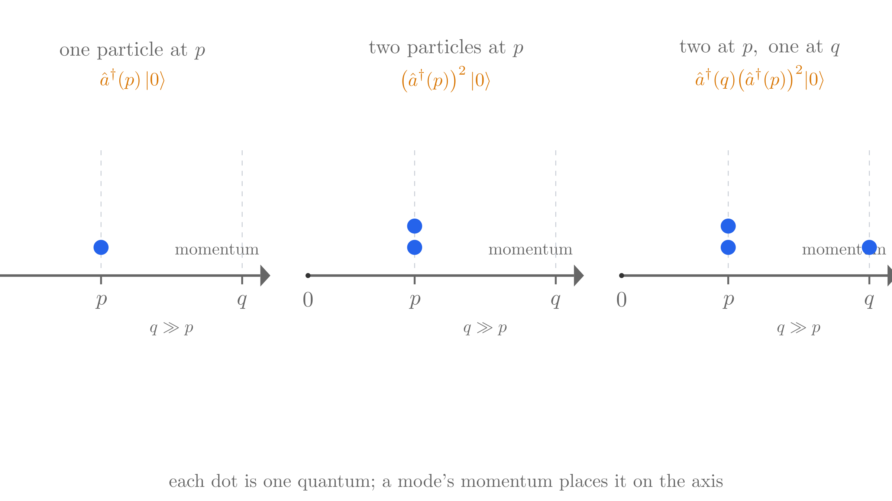

# Quantum Field Theory: Field Quantization

This page continues from [Action and Lagrangians](qft-action.md).

## Outline

**Setup.** The page quantizes the free real scalar field, closing the scalar row of the field table. Its logic is one reduction: a free field is a stack of independent harmonic oscillators, and quantizing one oscillator is already carried out on the [Harmonic Oscillator](harmonic-oscillator.md) page. So the page (1) shows the field decouples into oscillators, (2) promotes the field to operators, (3) derives the ladder algebra from the equal-time commutator, (4) quantizes one oscillator, and (5) names its quantum a particle.

### The scalar field in modes

The real scalar $\phi(x)$ obeys the Klein–Gordon equation
$$\left(\Box + \frac{m^2}{\hbar^2}\right)\phi = 0.$$
Plane waves $e^{-ip\cdot x/\hbar}$ solve it when energy satisfies the dispersion relation
$$E_p = \sqrt{\mathbf p^2 + m^2}.$$
Since $\phi$ is real, the general solution pairs each wave with its conjugate, one amplitude per momentum:
$$\phi(x) = \int \frac{d^3p}{(2\pi\hbar)^3}\frac{1}{\sqrt{2E_p}}\left[a(p)e^{-ip\cdot x/\hbar} + a^*(p)e^{+ip\cdot x/\hbar}\right].$$
To reach the Hamiltonian, the field is instead decomposed into *spatial* Fourier modes with time-dependent coefficients, $\pi_p = \dot\phi_p$:
$$\phi(t,\mathbf x) = \int \frac{d^3p}{(2\pi\hbar)^3}\phi_p(t)e^{i\mathbf p\cdot\mathbf x/\hbar}.$$
Substituting into $H = \int d^3x\left(\tfrac12\pi^2 + \tfrac12(\nabla\phi)^2 + \tfrac{m^2}{2\hbar^2}\phi^2\right)$ and using plane-wave orthogonality $\int d^3x\,e^{i(\mathbf p+\mathbf q)\cdot\mathbf x/\hbar}=(2\pi\hbar)^3\delta^3(\mathbf p+\mathbf q)$ collapses the cross terms, leaving
$$H = \int \frac{d^3p}{(2\pi\hbar)^3}\left[\tfrac12|\pi_p|^2 + \tfrac12\omega_p^2|\phi_p|^2\right],\qquad \omega_p^2 = \frac{E_p^2}{\hbar^2}.$$
The bracket is a harmonic oscillator's Hamiltonian in $\phi_p,\pi_p$, one independent copy per momentum with frequency $E_p/\hbar$. This decoupling makes the oscillator picture exact, not an analogy.

### Second quantization

Promotion acts on the coefficients or, equivalently, on the field:
$$a(p)\to\hat a(p),\qquad a^*(p)\to\hat a^\dagger(p),\qquad {}^*\to{}^\dagger,$$
so that the field operator reads
$$\hat\phi(x) = \int \frac{d^3p}{(2\pi\hbar)^3}\frac{1}{\sqrt{2E_p}}\left[\hat a(p)e^{-ip\cdot x/\hbar} + \hat a^\dagger(p)e^{+ip\cdot x/\hbar}\right],$$
with $\hat\pi = \dot{\hat\phi}$. The operator is Hermitian ($\hat\phi^\dagger = \hat\phi$) and strictly operator-valued (only integrals are well defined).

### The canonical commutator

First Quantization's $[\hat x,\hat p]=i\hbar$ repeats one level up, at each point of space, with a delta function keeping distinct oscillators independent:
$$[\hat\phi(t,\mathbf x),\hat\pi(t,\mathbf x')] = i\hbar\,\delta^3(\mathbf x-\mathbf x'),\qquad [\hat\phi,\hat\phi]=0,\qquad [\hat\pi,\hat\pi]=0.$$
This equal-time condition is imposed, not derived; it is the quantization postulate (equivalently, $\{\cdot,\cdot\}\to\tfrac{1}{i\hbar}[\cdot,\cdot]$ on the Poisson bracket $\{\phi,\pi\}=\delta^3$).

### Ladder commutators

Evaluating the expansions at $t=0$ gives, up to time factors,
$$\hat\phi(\mathbf x) = \int \frac{d^3p}{(2\pi\hbar)^3}\frac{1}{\sqrt{2E_p}}\left[\hat a(p)e^{i\mathbf p\cdot\mathbf x/\hbar} + \hat a^\dagger(p)e^{-i\mathbf p\cdot\mathbf x/\hbar}\right],$$
$$\hat\pi(\mathbf x) = \int \frac{d^3p}{(2\pi\hbar)^3}\frac{1}{\sqrt{2E_p}}\frac{-iE_p}{\hbar}\left[\hat a(p)e^{i\mathbf p\cdot\mathbf x/\hbar} - \hat a^\dagger(p)e^{-i\mathbf p\cdot\mathbf x/\hbar}\right].$$
The expansion can be inverted: multiplying $E_p\hat\phi + i\hbar\hat\pi$ by $e^{-i\mathbf p\cdot\mathbf x/\hbar}$ and integrating isolates $\hat a(p)$ (the $\hat a^\dagger$ half cancels because $E_{-p}=E_p$). Substituting this into $[\hat a(p),\hat a^\dagger(p')]$, only the $[\hat\phi,\hat\pi]$ term survives, and the plane-wave orthogonality leaves
$$[\hat a(p),\hat a^\dagger(p')] = C\,\delta^3(p-p'),\qquad [\hat a,\hat a]=0,\qquad [\hat a^\dagger,\hat a^\dagger]=0.$$
A mode commutes with every mode except its own adjoint, the signature of independent oscillators. In box normalization the constant $C$ is set to $1$, yielding $[\hat a,\hat a^\dagger]=1$.

### One oscillator per momentum

Quantizing one oscillator of frequency $\omega$ with $[\hat q,\hat p]=i\hbar$ is done on the [Harmonic Oscillator page](harmonic-oscillator.md); here fold the pair into ladders
$$\hat a = \sqrt{\frac{\omega}{2\hbar}}\hat q + \frac{i}{\sqrt{2\hbar\omega}}\hat p,\qquad \hat a^\dagger = \sqrt{\frac{\omega}{2\hbar}}\hat q - \frac{i}{\sqrt{2\hbar\omega}}\hat p,$$
so $[\hat a,\hat a^\dagger]=1$. The Hamiltonian becomes
$$\hat H = \hbar\omega\left(\hat a^\dagger\hat a + \tfrac12\right).$$
With $\hat N=\hat a^\dagger\hat a$, the commutators $[\hat N,\hat a]=-\hat a$, $[\hat N,\hat a^\dagger]=\hat a^\dagger$ show $\hat a$ lowers and $\hat a^\dagger$ raises by one. Nonnegativity of $\hat N$ forces a lowest state $\lvert 0\rangle$ with $\hat a\lvert 0\rangle=0$; repeated raising gives $\lvert n\rangle\propto(\hat a^\dagger)^n\lvert 0\rangle$ with energies $\hbar\omega(n+\tfrac12)$.

Returning to the field and substituting the mode expansions, each momentum contributes one oscillator of frequency $E_p/\hbar$:
$$\hat H = \int \frac{d^3p}{(2\pi\hbar)^3}E_p\,\hat a^\dagger(p)\hat a(p) + \text{const.}$$
The constant collects all zero-point energies and is formally infinite; it joins the vacuum zero and drops from all physical differences. Each mode carries levels $E_p n_p$, with $\hat a^\dagger(p)$ adding exactly $E_p$.

### Creation of particles

The mode's quantum is a particle: one quantum of momentum $\mathbf p$ carries $(E_p,\mathbf p)$, exactly a relativistic particle of mass $m$. The state space is the product of mode spaces. The vacuum $\lvert 0\rangle$ is annihilated by every $\hat a(p)$ and has zero energy; general states are labeled by occupation numbers:
$$\hat H\,\lvert\{n_p\}\rangle = \left(\sum_p E_p n_p\right)\lvert\{n_p\}\rangle.$$
Because the creation operators commute, particles are identical bosons, matching the integer-spin scalar row. Energy is bounded below since every $E_p>0$ and $n_p\ge0$, so the negative-energy problem of the Klein–Gordon single-particle reading disappears: the negative-frequency term now carries $\hat a^\dagger$ and *adds* energy, and an empty mode cannot be lowered further. Particle number $\hat N=\int\frac{d^3p}{(2\pi\hbar)^3}\hat a^\dagger\hat a$ is conserved because $[\hat H,\hat N]=0$.

That completes the construction: one real field, one oscillator family, quanta that are their own antiparticles, energy bounded below, with commutators derived from the field's mode structure rather than imposed.

> Skip the sections below on a first reading — the storyboard above carries the argument, and what follows spells out each step with the detailed explanation and calculations.

## The scalar field in modes

[The Action and Lagrangians page](qft-action.md) built the simplest relativistic field in its Klein–Gordon section: a real scalar $\phi(x)$ with the density $\mathcal{L} = \tfrac12(\partial_\mu\phi)(\partial^\mu\phi) - \tfrac{m^2}{2\hbar^2}\phi^2$, whose Euler–Lagrange equation is the Klein–Gordon equation,

$$\left(\Box + \frac{m^2}{\hbar^2}\right)\phi = 0,$$

with $\Box = \partial_t^2 - \nabla^2$ the d'Alembertian. Recall the objects this equation admits, because quantization will act on them. The plane wave $e^{-ip\cdot x/\hbar}$, with $p\cdot x = E_p t - \mathbf p\cdot\mathbf x$, solves the equation when its energy obeys the relativistic dispersion relation of a particle of mass $m$,

$$E_p = \sqrt{\mathbf p^2 + m^2}.$$

Choosing $\phi$ real is consistent because the equation contains only real terms: the d'Alembertian and the mass term carry real coefficients $1$ and $m^2/\hbar^2$ and never mix $\phi$ with $\phi^*$. A real equation maps real functions to real functions, so real data at one time evolve into a real field at every time. Since $\phi$ is real, the general solution carries each plane wave together with its complex conjugate, one complex amplitude $a(p)$ per momentum:

$$\phi(x) = \int \frac{d^3p}{(2\pi\hbar)^3}\,\frac{1}{\sqrt{2E_p}}\left[a(p)\,e^{-ip\cdot x/\hbar} + a^*(p)\,e^{+ip\cdot x/\hbar}\right].$$

The star marks the complex conjugate, and the term it conjugates is the same plane wave with the sign of the phase reversed. So the field's data at one time is the function $a(p)$ over momenta, and the conjugate momentum of [Action and Lagrangians](qft-action.md) is $\pi = \partial\mathcal{L}/\partial\dot\phi = \dot\phi$.

The free theory decouples by momentum, which is what makes the oscillator picture exact rather than an analogy. To see it, decompose the field and its conjugate momentum in space only, at each instant, into spatial Fourier modes with time-dependent amplitudes,

$$\phi(t, \mathbf x) = \int \frac{d^3p}{(2\pi\hbar)^3}\; \phi_p(t)\, e^{i\mathbf p\cdot\mathbf x/\hbar}, \qquad \pi(t, \mathbf x) = \int \frac{d^3p}{(2\pi\hbar)^3}\; \pi_p(t)\, e^{i\mathbf p\cdot\mathbf x/\hbar},$$

where the momentum mode is the time derivative of the field mode, $\pi_p = \dot\phi_p$, because $\pi = \dot\phi$. The basis wave $e^{i\mathbf p\cdot\mathbf x/\hbar}$ is spatial only, so the time dependence lives entirely in the coefficients $\phi_p(t)$, $\pi_p(t)$. That is the complement of the general solution above, whose waves $e^{\mp ip\cdot x/\hbar}$ are full spacetime waves with $E_p t$ in the exponent and constant coefficients $a(p)$, $a^*(p)$: there the time dependence sits in the wave, and here it sits in the coefficient. The mode form suits the Hamiltonian, because classically the Hamiltonian is a function on phase space: feed it any state $(\phi, \pi)$ at one instant and it returns that state's energy as a number. It needs the field as data at that instant, not as a solution whose time dependence is already determined. Eigenstates play no part in this reading; they enter only after the promotion, when $\hat H$ becomes an operator and only the occupation-number states of the construction below carry definite energies. Substitute into the Hamiltonian of [the Action page](qft-action.md#the-geometry-of-h), $H = \int d^3x\,\big(\tfrac12\pi^2 + \tfrac12(\nabla\phi)^2 + \tfrac{m^2}{2\hbar^2}\phi^2\big)$. The gradient pulls down $i\mathbf p/\hbar$, so $\tfrac12(\nabla\phi)^2$ contributes $\tfrac12(p^2/\hbar^2)|\phi_p|^2$ and the mass term contributes $\tfrac12(m^2/\hbar^2)|\phi_p|^2$. Cross terms between different momenta integrate away by orthogonality of the plane waves, $\int d^3x\, e^{i(\mathbf p+\mathbf q)\cdot\mathbf x/\hbar} = (2\pi\hbar)^3\delta^3(\mathbf p+\mathbf q)$, which vanishes unless $\mathbf q = -\mathbf p$. What remains is

$$H = \int \frac{d^3p}{(2\pi\hbar)^3}\left[\tfrac12|\pi_p|^2 + \tfrac12\,\omega_p^2\,|\phi_p|^2\right], \qquad \omega_p^2 = \frac{\mathbf p^2 + m^2}{\hbar^2} = \frac{E_p^2}{\hbar^2}.$$

The bracket is one harmonic oscillator's Hamiltonian: half a kinetic energy plus half a frequency-squared times a coordinate squared, with $\phi_p$ the oscillator's coordinate and $\pi_p = \dot\phi_p$ its momentum. Each momentum carries an independent copy of it, with natural frequency $E_p/\hbar$ set by the energy of the dispersion relation. The coefficients $a(p)$, $a^*(p)$ of the general solution are this oscillator written on shell[^on-shell]: when the mode oscillates as $e^{\mp iE_p t/\hbar}$, they encode its amplitude and phase, and the field is the infinite family of these oscillators, one per momentum. The picture on the [Action page](qft-action.md) of Hamiltonian flow in one mode's $(\phi,\pi)$ plane is exactly this oscillator viewed from one mode.

## Second quantization

Second quantization promotes the family of oscillators to operators, and the promotion has two equivalent readings, one per description of the field.

Read from the mode amplitudes, the promotion turns each coefficient into an operator. The amplitude $a(p)$ and its conjugate $a^*(p)$ become a pair of adjoint operators,

$$a(p) \to \hat a(p), \qquad a^*(p) \to \hat a^\dagger(p),$$

with the complex conjugate replaced by the Hermitian adjoint, ${}^* \to {}^\dagger$, because the objects are no longer numbers but operators. This is the same promotion the [Fields and Quanta page](qft.md#the-promotion) ran on the Dirac field's coefficients, and the name second quantization counts the steps: [first quantization](first-quantization.md) turned a particle's $x$ and $p$ into operators, and this second step turns the field's own amplitudes into operators. Nothing is quantized twice; the object quantized here is the field. The real scalar carries one independent operator family per mode, and its quanta serve as their own antiparticles. A charged field would carry a second, independent family whose creation operators build the antiparticles; that is the role the $b$-coefficients played in the [Fields and Quanta promotion](qft.md#the-promotion).

Written in the field variables rather than the coefficients, the same promotion acts on the canonical pair: at every point of space the field value and its conjugate momentum become operators, $\phi(\mathbf x) \to \hat\phi(\mathbf x)$ and $\pi(\mathbf x) \to \hat\pi(\mathbf x)$, and the expansion reads

$$\hat\phi(x) = \int \frac{d^3p}{(2\pi\hbar)^3}\,\frac{1}{\sqrt{2E_p}}\left[\hat a(p)\,e^{-ip\cdot x/\hbar} + \hat a^\dagger(p)\,e^{+ip\cdot x/\hbar}\right],$$

with the conjugate momentum operator the time derivative of the field operator, $\hat\pi = \dot{\hat\phi}$. The two readings agree term by term: promoting the coefficient in front of each plane wave and promoting the field are the same move. The operator $\hat\phi(x)$ is Hermitian, $\hat\phi^\dagger = \hat\phi$, because the expansion pairs each operator with its adjoint, and it is strictly an operator-valued distribution, since only integrals of it are well defined; the [Fields and Quanta page](qft.md#second-quantization) flagged that qualification.
## The canonical commutator

The single-particle stage of the sequence left one algebraic fact: position and momentum do not commute, $[\hat x, \hat p] = i\hbar$, and every other quantum behavior descends from it. The promotion that produced that pair runs again here, one level up. The oscillator at each point of space has a coordinate, the field value $\phi(\mathbf x)$, and a momentum, its conjugate $\pi(\mathbf x)$; promoting the field promotes the coordinate to $\hat\phi(\mathbf x)$ and the momentum to $\hat\pi(\mathbf x)$ at that point. Distinct points are distinct oscillators, so the single commutator of the particle becomes a commutator at every point, with the delta function enforcing that distinct oscillators stay independent,

$$[\hat\phi(t, \mathbf x), \hat\pi(t, \mathbf x')] = i\hbar\,\delta^3(\mathbf x - \mathbf x'), \qquad [\hat\phi, \hat\phi] = 0, \qquad [\hat\pi, \hat\pi] = 0.$$

This is the equal-time commutator, and the qualifier matters. The operators stand in the Heisenberg picture, where time dependence lives on the operators, so the commutator of fields at two different times would be a derived quantity, governed by the evolution $\hat\phi(t) = e^{i\hat H t/\hbar}\,\hat\phi(0)\,e^{-i\hat H t/\hbar}$ of the [Fields and Quanta page](qft.md#choosing-a-picture). The quantization condition is imposed at one instant only, and evolution then decides everything else.

The equal-time commutator is imposed in exactly the sense that $[\hat x, \hat p] = i\hbar$ was imposed: it is the promotion's quantization condition, not something derived from within the theory. The [Action page](qft-action.md) presented the same line by running the correspondence rule $\{\cdot,\cdot\} \to \tfrac{1}{i\hbar}[\cdot,\cdot]$ on the field's Poisson bracket, and the two routes agree, since the field's Poisson bracket $\{\phi(\mathbf x), \pi(\mathbf x')\} = \delta^3(\mathbf x-\mathbf x')$ is the classical image of the same fact. What the equal-time commutator forces the mode operators to do is derived in the next step; there the field's own structure, not a new postulate, supplies the answer.

## Ladder commutators

The equal-time commutator was imposed on the field; the commutators the mode operators obey are consequences, and deriving them answers the algebra question that the earlier pages left open. Evaluate the expansions at one instant, $t = 0$, where the time factors are $1$ and the plane wave $e^{-ip\cdot x/\hbar}$ reduces to the spatial wave $e^{+i\mathbf p\cdot\mathbf x/\hbar}$ while $e^{+ip\cdot x/\hbar}$ reduces to $e^{-i\mathbf p\cdot\mathbf x/\hbar}$:

$$\hat\phi(\mathbf x) = \int \frac{d^3p}{(2\pi\hbar)^3}\,\frac{1}{\sqrt{2E_p}}\left[\hat a(p)\,e^{i\mathbf p\cdot\mathbf x/\hbar} + \hat a^\dagger(p)\,e^{-i\mathbf p\cdot\mathbf x/\hbar}\right],$$

$$\hat\pi(\mathbf x) = \int \frac{d^3p}{(2\pi\hbar)^3}\,\frac{1}{\sqrt{2E_p}}\,\frac{-iE_p}{\hbar}\left[\hat a(p)\,e^{i\mathbf p\cdot\mathbf x/\hbar} - \hat a^\dagger(p)\,e^{-i\mathbf p\cdot\mathbf x/\hbar}\right].$$

The point of the mode expansion is that it can be undone. Multiply $E_p\,\hat\phi(\mathbf x) + i\hbar\,\hat\pi(\mathbf x)$ by $e^{-i\mathbf p'\cdot\mathbf x/\hbar}$ and integrate over space, using the plane-wave orthogonality $\int d^3x\, e^{i(\mathbf p - \mathbf p')\cdot\mathbf x/\hbar} = (2\pi\hbar)^3\,\delta^3(\mathbf p - \mathbf p')$. The annihilation operator $\hat a(k)$ survives only at $k = p'$, and there the field and the momentum operator contribute with the same sign: $\hat\pi = \dot{\hat\phi}$ brings down $-iE_k/\hbar$, and the $i\hbar$ in the combination flips it back to $+E_k$, so the two add to $2E_{p'}$. The creation operator $\hat a^\dagger(k)$ can survive only at $k = -p'$, and there the field contributes $+E_{p'}$ while the momentum operator contributes $-E_{p'}$: the creation half of $\hat\pi$ carries $+iE_k/\hbar$, which the $i\hbar$ leaves with the sign flipped. The two cancel, because $E_{-p'} = E_{p'}$. Only the annihilation operator remains,

$$\hat a(p) \;\propto\; \int d^3x\,e^{-i\mathbf p\cdot\mathbf x/\hbar}\left(E_p\,\hat\phi(\mathbf x) + i\hbar\,\hat\pi(\mathbf x)\right),$$

and its adjoint comes from conjugating the formula. This is the field analogue of expressing a harmonic oscillator's lowering operator in terms of its position and momentum, which is exactly what the mode is.
Now substitute these integrals into $[\hat a(p), \hat a^\dagger(p')]$. The only nonzero input is the equal-time commutator $[\hat\phi, \hat\pi] = i\hbar\delta^3$; the $[\hat\phi,\hat\phi]$ and $[\hat\pi,\hat\pi]$ terms drop out. The double integral collapses by the delta function, and the plane-wave orthogonality leaves one momentum delta on the right,

$$[\hat a(p), \hat a^\dagger(p')] = C\,\delta^3(p - p'), \qquad [\hat a(p), \hat a(p')] = 0, \qquad [\hat a^\dagger(p), \hat a^\dagger(p')] = 0,$$

with $C$ a constant fixed by the normalization of the plane-wave expansion. The structure carries the physics: the commutator is a delta in momentum, so a mode commutes with every other mode and only with its own adjoint, which is the signature of independent oscillators. The magnitude of $C$ is a convention, since rescaling $\hat a(p)$ and the plane-wave coefficient together changes it without touching any observable. In the box normalization, where we confine the field to a large box so that momenta become a discrete grid and the delta $\delta^3(p-p')$ becomes a Kronecker delta, the constant is chosen so that each single mode obeys $[\hat a, \hat a^\dagger] = 1$, which is the oscillator algebra the [Action page](qft-action.md) previewed. That page presented the algebra as the correspondence rule's output; here it comes out of the field's own mode structure, and the construction did not choose it.

## One oscillator per momentum

Every momentum mode shares the same ladder algebra, because each mode is a copy of one system, the harmonic oscillator. The [Harmonic Oscillator page](harmonic-oscillator.md) quantizes that system once — promoting the coordinate and momentum, folding them into ladder operators, and reading the spectrum — so here we recall the answer rather than redo the work. A single oscillator of frequency $\omega$ has ladder operators obeying $[\hat a, \hat a^\dagger] = 1$, Hamiltonian

$$\hat H = \hbar\omega\left(\hat a^\dagger\hat a + \tfrac12\right),$$

and levels $\hbar\omega(n + \tfrac12)$ spaced by $\hbar\omega$: $\hat a^\dagger$ adds one quantum and $\hat a$ removes one.

Now return to the field. Its operator Hamiltonian,

$$\hat H = \int d^3x\left[\tfrac12\hat\pi^2 + \tfrac12(\nabla\hat\phi)^2 + \frac{m^2}{2\hbar^2}\hat\phi^2\right],$$

is the integral of the classical density with $\phi$ and $\pi$ promoted. Substitute the mode expansions. The orthogonality of the plane waves kills the cross terms between different momenta, and each momentum contributes one copy of the oscillator just solved, with frequency $E_p/\hbar$,

$$\hat H = \int \frac{d^3p}{(2\pi\hbar)^3}\,E_p\,\hat a^\dagger(p)\hat a(p) \;+\; \text{const.}$$

The additive constant collects the ground-state energies of all the modes. A single oscillator with frequency $E_p/\hbar$ has zero-point energy $\tfrac12 E_p$, and the free field holds one such oscillator per momentum, so the constant is formally infinite, a divergence of the sum rather than of any one mode. Only energy differences are physical, so the constant joins the vacuum's zero of energy and drops out of every prediction. What remains is a clean statement: the field's energy is the sum, over momenta, of $E_p$ times the occupation of that momentum.

With the zero point absorbed, each mode is the solved oscillator with its levels relabeled: the state $\lvert n_p\rangle$ of $n_p$ quanta in momentum mode $\mathbf p$ carries energy $E_p n_p$, and $\hat a^\dagger(p)$ raises that energy by exactly $E_p$ while $\hat a(p)$ lowers it by the same amount. The [Fields and Quanta page](qft.md#the-promotion) assigned $\hat a^\dagger$ to the positive-frequency coefficients and called it a creator; the oscillator spectrum now shows what it creates: one quantum of the mode, which the next section names a particle.

## Creation of particles

The mode's quantum is a particle, and the identification closes the construction. A quantum of the mode with momentum $\mathbf p$ carries energy $E_p = \sqrt{\mathbf p^2 + m^2}$ and momentum $\mathbf p$, which is precisely the relation a relativistic particle of mass $m$ obeys. The state $\hat a^\dagger(p)\lvert 0\rangle$, one quantum in that mode and none elsewhere, is a particle of momentum $\mathbf p$. Nothing new was added to the theory to hold a particle; the field already contained the oscillators, and each oscillator's excitation levels turned out to be the possible particle numbers.

The state space is the product of all the mode spaces, and the occupation-number picture uses the box normalization, where the momenta form a discrete grid. The **vacuum** $\lvert 0\rangle$ has every mode empty and is annihilated by every $\hat a(p)$, $\hat a(p)\lvert 0\rangle = 0$; after the constant is absorbed it carries energy zero. A general state is labeled by the **occupation numbers** $\{n_p\}$, how many quanta sit in each momentum mode, with energy

$$\hat H\,\lvert \{n_p\}\rangle = \left(\sum_p E_p\, n_p\right)\lvert \{n_p\}\rangle.$$

Each creation operator adds one particle of its momentum, $\hat a^\dagger(p_1)\hat a^\dagger(p_2)\lvert 0\rangle$ holds a particle at $\mathbf p_1$ and one at $\mathbf p_2$, and a string of $\hat a^\dagger(p)$'s stacks several particles into one mode. Each mode is its own oscillator, so the operators act on the occupation number $n_p$ of mode $\mathbf p$ with the same $\sqrt{\,}$ factors as the single [Harmonic Oscillator](harmonic-oscillator.md):

$$\hat a(p)\,\lvert n_p\rangle = \sqrt{n_p}\;\lvert n_p-1\rangle, \qquad \hat a^\dagger(p)\,\lvert n_p\rangle = \sqrt{n_p+1}\;\lvert n_p+1\rangle,$$

leaving every other mode untouched. Because the creation operators commute, $[\hat a^\dagger(p), \hat a^\dagger(p')] = 0$, the order of the factors never matters and a two-particle state is unchanged when the two particles are swapped. Particles built this way are identical and bosonic, which matches the integer-spin assignment of the scalar row in the [field table](qft.md#fields); the half-integer rows will rerun the whole construction with anticommutators, which is where the spin-statistics correlation is settled.

### Building states one quantum at a time

The states above come from applying creation operators to the vacuum, and a picture keeps them straight. Lay a momentum axis down so each mode gets a position along it, and draw one filled dot per quantum, stacked above the momentum it occupies:

The left panel is $\hat a^\dagger(p)\lvert 0\rangle$, one particle at $p$. The middle is $\big(\hat a^\dagger(p)\big)^2\lvert 0\rangle$: the same operator applied twice stacks a second dot onto the same column, so the mode now holds two quanta. The right panel applies $\hat a^\dagger(q)$ as well, with $q \gg p$, adding a dot in a fresh column and so a particle at a much larger momentum. Each column is one mode's occupation number $n_p$, and each application of a creation operator grows its column by exactly one dot.

The energy comes out bounded below. Every $E_p$ is positive and every occupation number is a nonnegative integer, so every energy eigenvalue is a sum of positive terms and the vacuum is the lowest state. This is the resolution the earlier pages advertised. The Klein–Gordon equation was [rejected as a single-particle equation](relativistic-qm.md#_2-klein-gordon) because it admitted negative energies; those solutions do not reappear here, because no mode can drop below empty. The second term of the expansion, $e^{+ip\cdot x/\hbar}$, was the negative-frequency term of the single-particle reading; here it carries $\hat a^\dagger$, which adds rather than subtracts energy, so the term that looked dangerous in the old reading is now the operator that creates a positive-energy particle. An annihilation operator removes quanta, and once a mode is empty it can do nothing more; no state carries negative energy. The negative-energy problem was not solved by discarding solutions but by reinterpreting them, exactly the move the [Dirac equation page](dirac-equation.md) made for its negative-frequency half.

The scalar row of the field table now stands on its own: one real field, one family of oscillators, quanta that are their own antiparticles, energy bounded below, and particle number conserved because $\hat H$ and $\hat N = \int \frac{d^3p}{(2\pi\hbar)^3}\,\hat a^\dagger(p)\hat a(p)$ commute. The construction ran entirely on the field's mode structure, and the commutators it produced match the [Action page's](qft-action.md) preview rather than being imposed to fit it.

[^on-shell]: **On shell** is the field theorist's name for obeying the relativistic energy–momentum relation. The four-momenta $p$ with $E = \sqrt{\mathbf p^2 + m^2}$ form a surface in energy–momentum space, the **mass shell**, and a particle or plane wave whose energy is tied to its momentum that way sits on the shell. A single spatial snapshot $\phi(\mathbf x)$ does not yet tie its Fourier amplitudes to any energies; only when the field is a solution of the free equation does each momentum mode acquire its fixed frequency $E_p/\hbar$, and the general solution above packages those on-shell modes into the oscillating waves $e^{\mp iE_p t/\hbar}$. The Hamiltonian computation on this page deliberately stays off shell: it treats $\phi_p$ and $\pi_p$ as arbitrary phase-space data at one instant and lets $\hat H$ generate the evolution that puts them on the shell.
