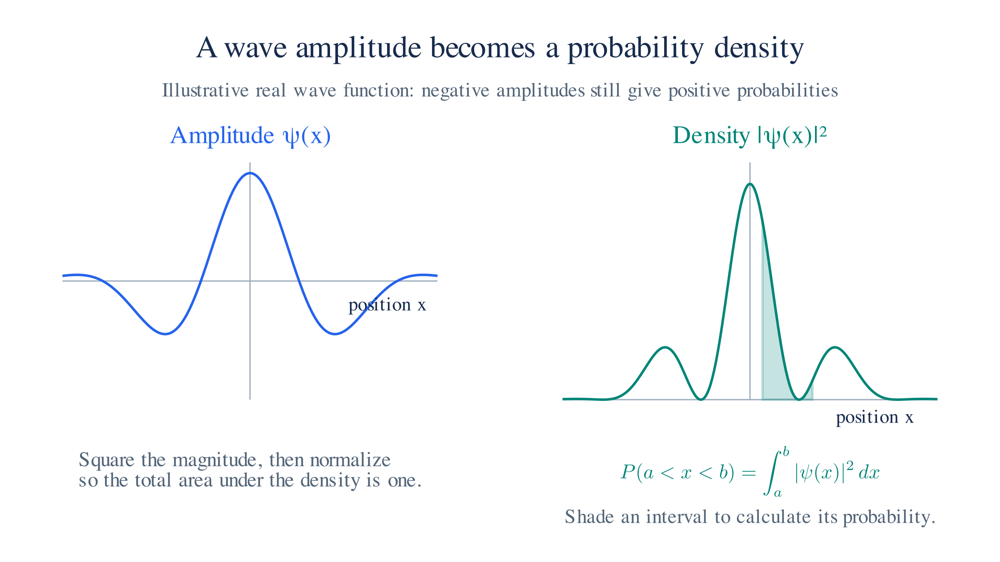
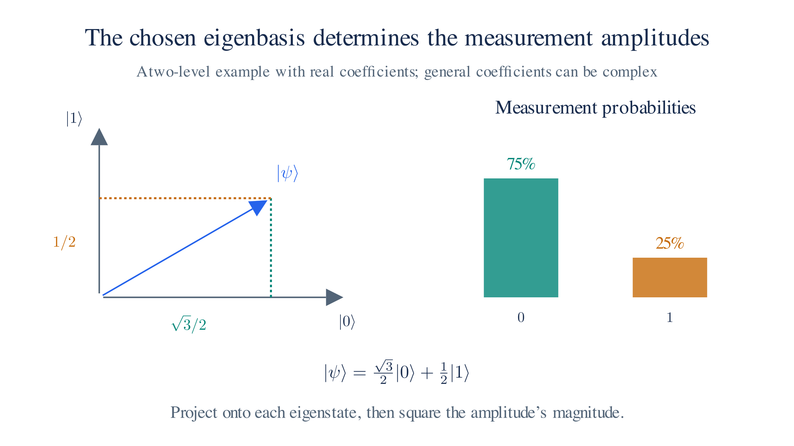
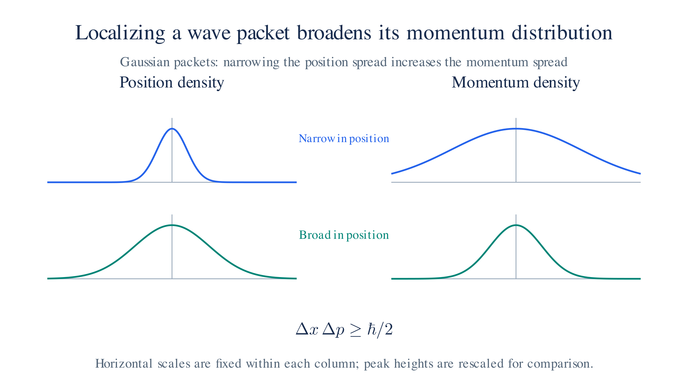

# First Quantization

Quantum calculations predict distributions of measurement outcomes. We therefore need both a rule for evolving a state and a rule for extracting probabilities from it. This chapter introduces those rules, then explains how operators describe the measurements. The harmonic oscillator will provide our first calculation of discrete energy levels.

## 1. From Classical to Quantum State Space

In classical mechanics, a state specifies position and momentum $(q,p)$. In quantum mechanics, we describe a state by a vector in **Hilbert space**, a vector space with an inner product for calculating probabilities.

**First quantization** is a prescription, rather than a deduction from Newton’s law: it replaces classical quantities with operators acting on these vectors. The canonical prescription replaces Poisson brackets with commutators, $\{\cdot,\cdot\}\to\frac{1}{i\hbar}[\cdot,\cdot]$. A quantum state generally predicts several possible measurement outcomes, rather than definite values of every quantity at once.

## 2. The Schrödinger Equation

An initial state is not enough to predict later measurements; we also need its evolution. The Hamiltonian operator $\hat H$ determines how the state changes through the **Schrödinger equation**, $i\hbar\,\partial\Psi/\partial t=\hat H\Psi$. For an isolated system, this evolution is unitary: it preserves inner products and hence the total probability.

For a time-independent Hamiltonian, we can separate the time dependence and solve $\hat H\Psi=E\Psi$ for the spatial states of definite energy. These are stationary states: $\Psi(x,t)=\psi_E(x)e^{-iEt/\hbar}$ changes only by an overall phase, so its position probability density remains $|\psi_E(x)|^2$.

For a particle of mass $m$ moving in one dimension with potential energy $V(x)$, the time-dependent equation is

$$i\hbar \frac{\partial \Psi(x,t)}{\partial t} = \left[-\frac{\hbar^2}{2m}\frac{\partial^2}{\partial x^2} + V(x)\right]\Psi(x,t)$$

## 3. Wave Amplitude

Evolving the state is the first part of a prediction. To compare it with measured positions, write it in the position representation. The state is then a complex function $\Psi(x,t)$ called the **wave function** or probability amplitude. The Born rule converts it into a measurable probability density: $|\Psi(x,t)|^2$.

Integrating this density over a region gives the probability of finding the particle there. A normalized state satisfies $\int|\Psi|^2\,dx=1$. An overall phase does not affect probabilities, but relative phases between contributions affect their sum and produce interference.

*The squared magnitude of the wave function gives a nonnegative density. Integrating a normalized density over an interval gives a probability.*

## 4. Copenhagen Interpretation

The probability and evolution rules support calculations before we settle their interpretation. The account below gives one interpretation and the ideal measurement update; the following sections explain the operators used to identify measurement outcomes.

Interpretation and the ideal measurement rule

The **Copenhagen interpretation**, associated with Bohr and his collaborators, treats the Born probabilities as fundamental. It does not assign an unmeasured observable a definite value unless the state is an eigenstate of that observable.

In the ideal measurement rule, an outcome projects the state into its corresponding eigenspace. This is called **collapse**. Bohr's **complementarity** emphasizes that different experimental arrangements reveal different aspects of a system. For example, we cannot measure position and momentum with arbitrarily sharp precision in the same state.

## 5. Operators

Position, momentum, and energy are different measurements on the same state. We represent each by an operator, which acts on a state vector to produce another vector. **Linear** means that it acts on a sum by acting on each term separately.

In the position representation[^pos-rep], $\hat x$ multiplies a wave function by $x$, while $\hat p=-i\hbar\,\partial/\partial x$ differentiates it. Unlike multiplication by ordinary numbers, applying two operators in different orders can give different results.

## 6. Observables

A measurable quantity is an **observable**. We represent energy, position, momentum, and spin by Hermitian operators[^linalg], whose eigenvalues are real. Those eigenvalues are the possible measurement outcomes.

Before continuing, fix the notation used from here on. A state vector is written $\lvert\psi\rangle$, and the matching $\langle\phi\rvert$ (a "bra") forms inner products with it. The overlap $\langle\phi\vert\psi\rangle$ is the inner product of the two states, and $\langle\phi\vert\hat A\vert\psi\rangle$ is that overlap with $\hat A$ acting on the ket. The [Math Refresher](appendix-math-linear-algebra.md) develops this notation and the rule that moves an operator from one side to the other.

The Hamiltonian $\hat H$ is the energy observable. Solving its eigenvalue equation gives the allowed energies.

## 7. Eigenvectors and Eigenvalues

If $\hat A\psi=a\psi$, applying $\hat A$ changes only the vector's scale. We call $\psi$ an **eigenstate** and $a$ its **eigenvalue**. Measuring $\hat A$ in that state gives $a$ with certainty.

For a Hermitian matrix, we can choose a complete orthonormal basis of eigenvectors. Expanding a state in that basis gives its measurement amplitudes. Observables with continuous spectra, such as position, use the corresponding generalized eigenstates and integrals.

*Resolve a state into the measurement eigenbasis. Squared coefficient magnitudes give the outcome probabilities.*

## 8. Commutators

The position and momentum operators do not commute. To quantify the difference between the two orders of operation, subtract them: $[\hat A,\hat B]=\hat A\hat B-\hat B\hat A$. This is the **commutator**, the quantum counterpart of the Poisson bracket.

Position and momentum obey the canonical relation $[\hat x,\hat p]=i\hbar$. Their nonzero commutator leads to the uncertainty relation below. Commuting observables can have a common basis of eigenstates, in which both values are definite.

Checking the position–momentum commutator

Apply both orders to a differentiable wave function. The product rule gives

$$[\hat x,\hat p]\psi=x(-i\hbar\partial_x\psi)+i\hbar\partial_x(x\psi)
=-i\hbar x\partial_x\psi+i\hbar(\psi+x\partial_x\psi)=i\hbar\psi.$$

Thus $[\hat x,\hat p]=i\hbar\hat I$, with the identity operator usually implicit. The nonzero term comes from differentiating the factor $x$ as well as the wave function.

## 9. Superposition

Linearity means that a combination $\psi=c_1\psi_1+c_2\psi_2+\dots$ evolves as the same combination of the individual solutions. After normalization, it is another valid state.

If the $\psi_i$ form an orthonormal eigenbasis with distinct outcomes $a_i$, measurement gives $a_i$ with probability $|c_i|^2$. An ideal measurement leaves the state in the corresponding eigenstate. Before measurement, the relative phases of the coefficients can affect other observables, so the superposition carries more information than a list of classical probabilities.

## 10. Uncertainty Principle

No state has both exactly definite position and exactly definite momentum. Their nonzero commutator gives the **Heisenberg uncertainty relation**,

$$\Delta x \, \Delta p \geq \frac{\hbar}{2}$$

where $\Delta x$ and $\Delta p$ are the standard deviations of measurement outcomes in the same state. Reducing one spread therefore places a lower bound on the other.

For general observables, $\Delta A\,\Delta B\geq\tfrac12|\langle[\hat A,\hat B]\rangle|$. The brackets $\langle\cdot\rangle$ denote the expectation value in that state: the average over repeated measurements on identically prepared systems. For a normalized state, $\langle A\rangle=\langle\psi|\hat A|\psi\rangle$ and $(\Delta A)^2=\langle A^2\rangle-\langle A\rangle^2$.

Why the commutator bounds the measurement spreads

Define $|u\rangle=(\hat A-\langle A\rangle)|\psi\rangle$ and $|v\rangle=(\hat B-\langle B\rangle)|\psi\rangle$. Their squared norms are the variances. The Cauchy–Schwarz inequality for inner products gives

$$(\Delta A)^2(\Delta B)^2\geq|\langle u|v\rangle|^2\geq\big(\operatorname{Im}\langle u|v\rangle\big)^2.$$

Hermiticity gives $\langle v|u\rangle=\langle u|v\rangle^*$. Subtract the two inner products:

$$2i\operatorname{Im}\langle u|v\rangle=\langle u|v\rangle-\langle v|u\rangle=\langle[\hat A,\hat B]\rangle.$$

Taking square roots gives the stated bound. For position and momentum, insert $[\hat x,\hat p]=i\hbar\hat I$ to obtain $\Delta x\Delta p\geq\hbar/2$. This concerns the spreads within a state, independent of any additional disturbance caused by a measuring device.

*For Gaussian wave packets, a narrower position distribution accompanies a wider momentum distribution.*

We now have the ingredients for an energy-level calculation: a state, a Hamiltonian, and the rule that its eigenvalues are the possible measured energies. The next chapter applies them to an oscillator, where the commutator determines the spacing of the levels.

---

Previous: [Lesson 01a — Classical Mechanics](./classical-mechanics.md)

Next: [The Harmonic Oscillator](./harmonic-oscillator.md)

[^linalg]: Two classes of operators appear repeatedly: Hermitian operators describe observables, and unitary operators preserve inner products.

    A **Hermitian** operator satisfies $\hat A=\hat A^\dagger$. The adjoint is defined by $\langle\phi\vert\hat A^\dagger\psi\rangle=\langle\hat A\phi\vert\psi\rangle$. For matrices, $\hat A^\dagger=(\hat A^*)^T$: conjugate the entries, then transpose.

    Its eigenvalues are real. If $\hat A\psi=\lambda\psi$, then $\lambda=\langle\psi\vert\hat A\psi\rangle/\langle\psi\vert\psi\rangle$, and Hermiticity makes this ratio equal to its complex conjugate. Eigenvectors with distinct eigenvalues are orthogonal because $(\lambda_1-\lambda_2)\langle\psi_2\vert\psi_1\rangle=0$.

    The spectral theorem gives a complete orthonormal eigenbasis for a Hermitian matrix. In infinite-dimensional Hilbert spaces, self-adjointness also involves the operator's domain, and a continuous spectrum requires generalized eigenstates. These are the mathematical qualifications behind expansions in position or momentum states.

    A **unitary** operator satisfies $\hat U^\dagger\hat U=\hat U\hat U^\dagger=\hat I$, or equivalently $\hat U^\dagger=\hat U^{-1}$. Its matrix rows and columns form orthonormal sets. It preserves inner products because $\langle\hat U\phi\vert\hat U\psi\rangle=\langle\phi\vert\hat U^\dagger\hat U\psi\rangle=\langle\phi\vert\psi\rangle$.

    In particular, it preserves the norm $\lVert\psi\rVert^2=\langle\psi\vert\psi\rangle$, so a normalized state stays normalized. For a time-independent Hermitian Hamiltonian, $\hat U(t)=e^{-i\hat Ht/\hbar}$ is unitary and solves the Schrödinger equation.

    Conditioning on a particular measurement outcome instead projects onto an eigenspace and renormalizes. This state update is not unitary and generally loses information about the original state.

    Exponentiating a Hermitian operator gives a unitary operator: $e^{i\hat A}$. Conversely, a unitary transformation near the identity has a Hermitian generator. The Hamiltonian generates time translations, momentum generates spatial translations, and angular momentum generates rotations. The generator is an observable; the finite transformation preserves probability.

## 11. Personal Notes

Personal interpretation and analogies

For me, the key change is what we mean by a **state**. In classical mechanics, positions and velocities specify the motion. In quantum mechanics, we use a state from which we calculate probabilities for position and other measurements.

Those probabilities are not necessarily broad or uniform. A wave function can make some outcomes very likely and others negligible. It is tempting to interpret the remaining uncertainty as missing information about hidden variables, but Bell's inequality[^bell] places strong limits on that explanation.

I prefer to learn the mathematical rules before choosing an interpretation. We can calculate predictions without resolving every philosophical question, much as we can use thermodynamics without tracking individual molecules. That comparison concerns how I use a theory; it does not settle whether quantum probabilities have a deeper explanation.

The uncertainty relation makes the limitation precise. A narrower position distribution requires a broader momentum distribution. An ideal position eigenstate has no finite momentum spread. This does not imply motion faster than light: large momentum and superluminal speed are different claims.

Probability is familiar from games such as poker, but quantum calculations require an extra ingredient.

We add **probability amplitudes** before taking their squared magnitude. Adding ordinary probabilities would miss interference. For position measurements,

$$P(x, t) = |\Psi(x, t)|^2 = \Psi^*(x, t)\,\Psi(x, t).$$

The complex amplitude includes a phase. Relative phases affect the probability when contributions combine, as in [§3](#_3-wave-amplitude).

My useful analogy is a video game. The game stores an internal state, updates it using its rules, and then draws a visible scene. The stored state and the displayed image serve different purposes.

Likewise, we evolve the wave function with the Schrödinger equation and apply operators to calculate observables. The state is the input to those calculations; the observable probabilities are the output.

The evolution is linear. We can decompose a state into simpler parts, evolve each part, and recombine the amplitudes. This is why superposition is useful for solving complicated problems.

Complex numbers make the phase information explicit. We can visualize a complex number as a point in a plane. A complex number of magnitude one lies on the unit circle and can be written $e^{i\theta}=\cos\theta+i\sin\theta$, with the angle $\theta$ as its phase. A full quantum state may still be harder to picture. Relativity uses a similar mathematical habit: we calculate with spacetime geometry even when a four-dimensional picture is difficult to imagine. Its interval differs from ordinary Euclidean distance, so we must use the appropriate geometry.

I find it easier to keep the calculation and its interpretation separate: evolve the state, then calculate the probabilities of the outcomes we can observe.

[^pos-rep]: A state vector $\psi$ is an abstract Hilbert-space vector. A **representation** chooses a basis for writing its components. In the position representation, the components are amplitudes $\psi(x)$ for position eigenstates. Then $\hat x$ multiplies by $x$ and $\hat p$ acts as $-i\hbar\,\partial/\partial x$. In the momentum representation, $\hat p$ multiplies by $p$ and $\hat x$ acts as $i\hbar\,d/dp$. A Fourier transform relates these representations. The derivative formula for momentum is therefore its form in the position basis, rather than a basis-independent definition.

[^bell]: A **hidden-variable theory** supplements the quantum state with additional variables. Bell's theorem (J. S. Bell, *On the Einstein–Podolsky–Rosen paradox*, Physics 1, 195 (1964)) derives inequalities for theories satisfying specific locality and independence assumptions. Quantum mechanics predicts violations. Experiments by Clauser and Freedman (1972), Aspect (1982), and later experiments closing major loopholes observed such violations. The 2022 Nobel Prize recognized Aspect, Clauser, and Zeilinger for work on entanglement and Bell inequalities. These results exclude local hidden-variable explanations under Bell's assumptions; they do not exclude every hidden-variable theory. Nonlocal theories and proposals that relax other assumptions remain part of the interpretation debate.

