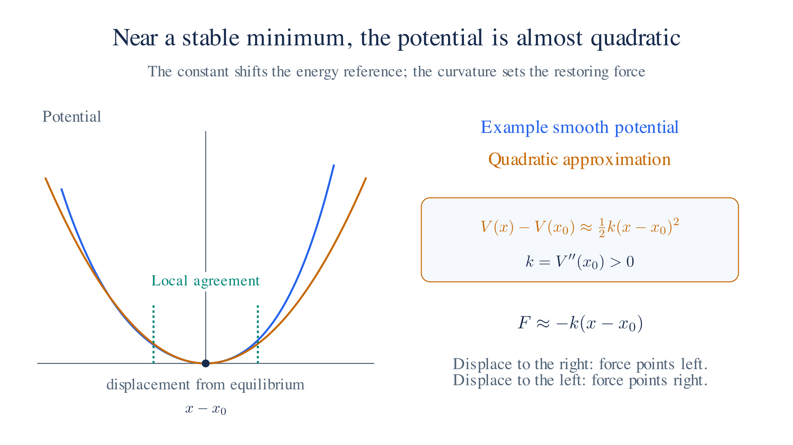
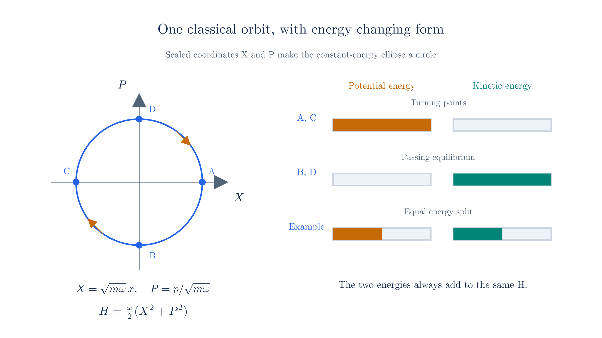
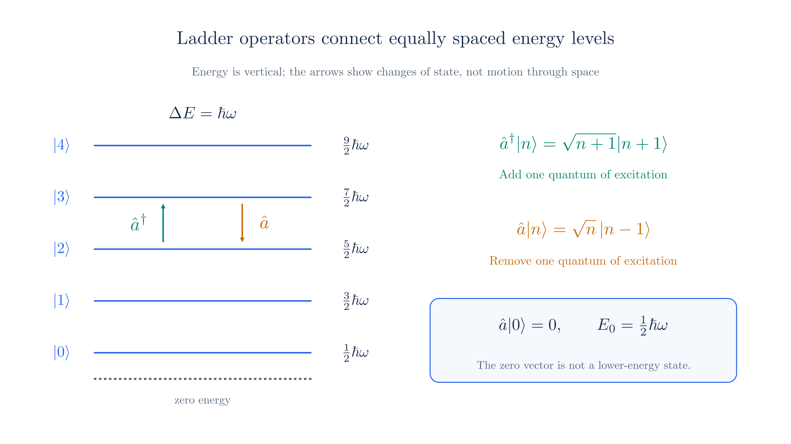
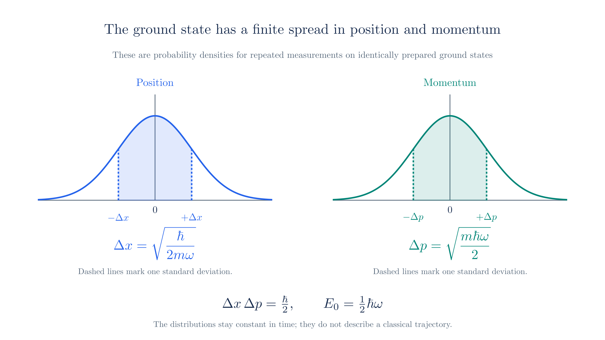

# The Harmonic Oscillator

## 1. Why the harmonic oscillator

A pendulum at small angles, molecular vibrations, and lattice vibrations all approximate the same motion: displacement from equilibrium produces a restoring force proportional to that displacement. We first explain why this approximation is common, then calculate the allowed quantum energies.

Near a stable equilibrium $x_0$, a smooth potential with $V''(x_0)>0$ has a leading quadratic term. The linear term vanishes because $V'(x_0)=0$, so a Taylor expansion gives

$$V(x) \approx V(x_0) + \tfrac12 V''(x_0)\,(x - x_0)^2.$$

The constant $V(x_0)$ only sets the zero of energy. The quadratic term describes a **harmonic oscillator**, whose restoring force is proportional to displacement.

We study the quantum oscillator because the same calculation will apply to each momentum mode of a free field.

*Near equilibrium, a smooth potential agrees with its quadratic approximation. The curvature determines the restoring force.*

## 2. The classical oscillator

For a mass $m$ on a spring of stiffness $k$, add the kinetic and elastic potential energies:

$$H = \frac{p^2}{2m} + \tfrac12 m\omega^2 x^2, \qquad \omega = \sqrt{k/m},$$

Here $\omega$ is the angular frequency. The constants $m$ and $k$ fix it. Increasing the initial displacement or momentum increases the energy and amplitude, while the ideal oscillator's frequency stays the same.

A state is a point $(x,p)$ in phase space. At fixed energy, the equation above describes an ellipse. As the mass oscillates, energy alternates between kinetic and potential forms. The [Field Quantization](field-quantization.md) page applies this description to individual field modes.

*A classical orbit has constant total energy. Potential energy is greatest at the turning points; kinetic energy is greatest at equilibrium.*

## 3. Quantization

Following [First Quantization](first-quantization.md), replace position and momentum with operators satisfying

$$[\hat x, \hat p] = i\hbar,$$

and use the same energy expression to define the Hamiltonian operator:

$$\hat H = \frac{\hat p^2}{2m} + \tfrac12 m\omega^2 \hat x^2.$$

To find the allowed energies, solve $\hat H\psi=E\psi$. In the position representation this is a second-order differential equation. We can instead use the commutator to find the energies without first calculating the wave functions.

## 4. Ladder operators

Classically, the oscillator can have any nonnegative energy. To find what changes after quantization, we seek operators that connect states of different energy. For this quadratic Hamiltonian, the useful combinations are

$$\hat a = \sqrt{\frac{m\omega}{2\hbar}}\,\hat x + \frac{i}{\sqrt{2m\hbar\omega}}\,\hat p, \qquad \hat a^\dagger = \sqrt{\frac{m\omega}{2\hbar}}\,\hat x - \frac{i}{\sqrt{2m\hbar\omega}}\,\hat p.$$

The dagger denotes the adjoint. Substituting $[\hat x,\hat p]=i\hbar$ into the commutator of these two combinations gives

$$[\hat a, \hat a^\dagger] = 1.$$

Next, solve the definitions for $\hat x$ and $\hat p$ and substitute them into the Hamiltonian. Using the new commutator to collect terms gives

$$\hat H = \hbar\omega\left(\hat a^\dagger\hat a + \tfrac12\right).$$

To find the energies, we now need the eigenvalues of $\hat a^\dagger\hat a$. Each unit of this operator contributes energy $\hbar\omega$, in addition to the constant $\tfrac12\hbar\omega$.

Checking the ladder-operator algebra

Write $\hat a=A\hat x+iB\hat p$, where $A=\sqrt{m\omega/(2\hbar)}$ and $B=1/\sqrt{2m\hbar\omega}$. Since $AB=1/(2\hbar)$,

$$[\hat a,\hat a^\dagger]=-2iAB[\hat x,\hat p]=2AB\hbar=1.$$

Multiplication in the stated order gives

$$\hat a^\dagger\hat a=A^2\hat x^2+B^2\hat p^2+iAB[\hat x,\hat p]
=\frac{m\omega}{2\hbar}\hat x^2+\frac{\hat p^2}{2m\hbar\omega}-\frac12.$$

Multiplying by $\hbar\omega$ recovers the Hamiltonian with its extra $\hbar\omega/2$. That constant comes from the noncommuting position and momentum operators.

## 5. The number operator and the spectrum

Define the **number operator** $\hat N=\hat a^\dagger\hat a$. Using $[\hat a,\hat a^\dagger]=1$, we obtain

$$[\hat N, \hat a] = -\hat a, \qquad [\hat N, \hat a^\dagger] = \hat a^\dagger,$$

If a state has number eigenvalue $n$, these relations imply that $\hat a$ lowers it to $n-1$ and $\hat a^\dagger$ raises it to $n+1$, whenever the resulting vector is nonzero.

The allowed energies are $E_n=\hbar\omega(n+\tfrac12)$, with $n=0,1,2,\ldots$. The essential constraint is that $\hat N=\hat a^\dagger\hat a$ cannot have a negative expectation value. This forces the lowering sequence to end at a ground state.

Deriving the lowest state and the energy spectrum

**Find the lowest state.** For any state, $\langle\psi|\hat N|\psi\rangle = \lVert\hat a|\psi\rangle\rVert^2\geq0$, so number eigenvalues cannot be negative. Repeated lowering must therefore end at a state $\lvert0\rangle$ with $\hat a\lvert0\rangle=0$. This state has number eigenvalue zero.

Repeatedly apply $\hat a^\dagger$ to obtain $\lvert n\rangle\propto(\hat a^\dagger)^n\lvert0\rangle$. The lowering cannot stop at a positive noninteger eigenvalue: the squared norm after one more lowering would still be positive, eventually producing a forbidden negative eigenvalue. These states satisfy $\hat N\lvert n\rangle=n\lvert n\rangle$ for nonnegative integers $n$. Substituting into the Hamiltonian gives

$$E_n = \hbar\omega\left(n + \tfrac12\right).$$

Adjacent levels differ by $\hbar\omega$. We call this energy increment a **quantum** of excitation. The creation operator $\hat a^\dagger$ adds one quantum; the annihilation operator $\hat a$ removes one:

$$\hat a\,\lvert n\rangle = \sqrt{n}\;\lvert n-1\rangle, \qquad \hat a^\dagger\,\lvert n\rangle = \sqrt{n+1}\;\lvert n+1\rangle,$$

The factors $\sqrt n$ and $\sqrt{n+1}$ follow from normalizing the states to $\langle n\lvert n\rangle=1$. Equivalently, $\lvert n\rangle=(\hat a^\dagger)^n\lvert0\rangle/\sqrt{n!}$. Acting on the ground state gives $\hat a\lvert0\rangle=0$, so there is no lower energy level.

*Creation and annihilation operators connect neighboring energy states. The lowest state has energy one-half hbar omega, and lowering it gives the zero vector.*

## 6. Zero-point energy

Even the ground state has energy $\tfrac12\hbar\omega$, called **zero-point energy**. Zero total energy would require both position and momentum to be sharply zero. The relation $[\hat x,\hat p]=i\hbar$ forbids that state.

The ground state is stationary, but its position and momentum distributions both have nonzero width. Zero-point energy does not mean that the particle follows a definite classical oscillation.

*The stationary ground state has Gaussian position and momentum distributions. Their finite widths saturate the uncertainty bound.*

## 7. Why it matters later

The oscillator calculation has produced equally spaced excitations and a lowest-energy state. In [Field Quantization](field-quantization.md), we expand a free scalar field in spatial Fourier modes. Each independent mode behaves as an oscillator with frequency $E_p/\hbar$. Its excitation number then counts particles of that momentum.

Before making that field interpretation, we need equations consistent with special relativity. The next chapter establishes how space, time, energy, and momentum transform between observers.

The field-quantization page rescales the oscillator coordinate to absorb the mass, giving $\hat H=\tfrac12\hat p^2+\tfrac12\omega^2\hat q^2$. The ladder operators consequently have no explicit $m$, but their commutator and energy spectrum are the ones derived here.

---

Previous: [First Quantization](./first-quantization.md)

Next: [Special Relativity](./special-relativity.md)
