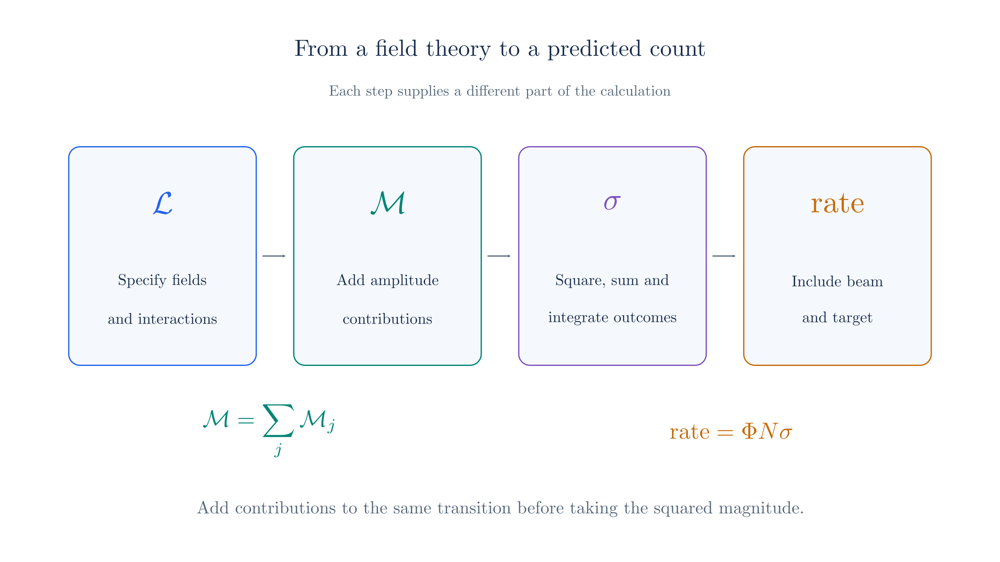
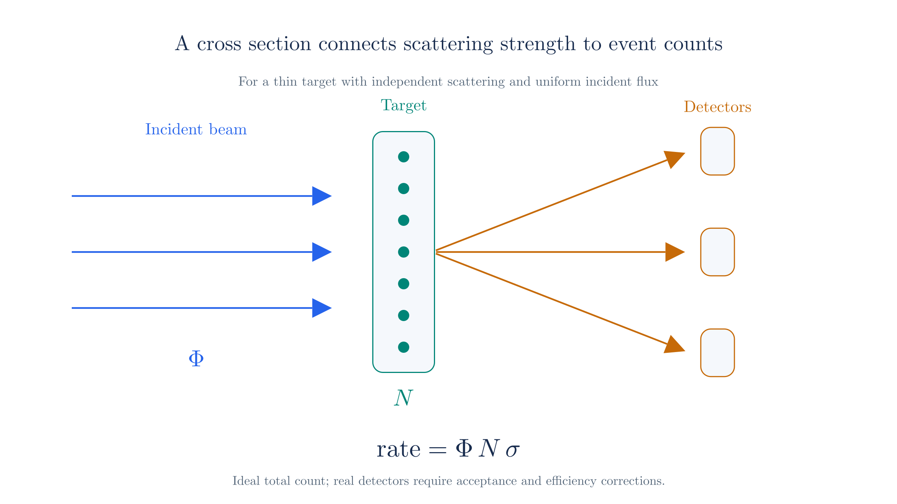
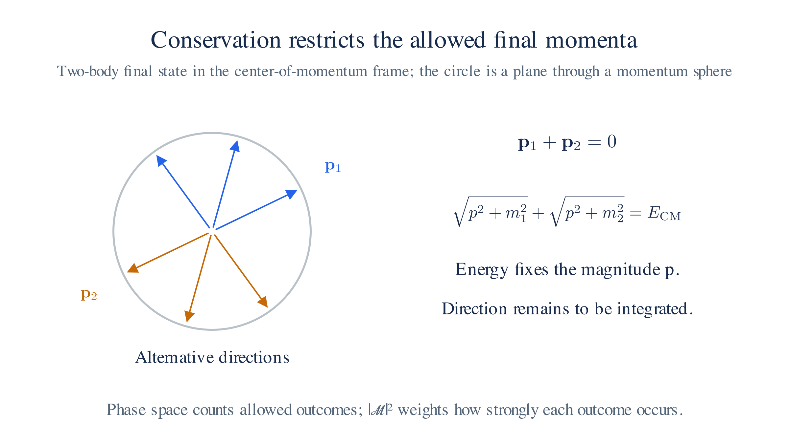

# From Lagrangian to Experiment

We have built Lagrangians for free fields and, in [QED](qed.md), their interaction. A Lagrangian is not itself a measurement: experiments prepare incoming particles and count outgoing ones. This chapter defines the chain of quantities connecting the two, ending with the **scattering cross section**, the number that a calculation predicts and a detector measures. We use natural units, $\hbar=c=1$.

*The Lagrangian determines amplitudes; squared amplitudes and phase space determine cross sections; beam and target properties determine event rates.*

## From trajectories to transition amplitudes

The classical use of a Lagrangian is to compute a trajectory. The [Classical Mechanics](classical-mechanics.md) page introduced stationary action, and [Action and Lagrangians](qft-action.md) derived the Euler–Lagrange equation. Insert $L(q, \dot q)$ into that equation, then solve for the trajectory $q(t)$. Initial conditions specify which trajectory occurs, and differentiating it gives the velocity $\dot q(t)$.

A trajectory is the wrong target in quantum mechanics. We predict probabilities for measurement outcomes: [First Quantization](first-quantization.md) introduced the wave function $\psi$, whose squared magnitude gives a position probability density. [Field Quantization](field-quantization.md) also permits particle creation and annihilation. We therefore calculate an amplitude for each possible final collection of particles. The quantum calculation takes us from the Lagrangian to **transition amplitudes**.

## What a scattering experiment measures

A scattering experiment prepares incoming particles with specified beam properties, such as momenta and polarizations, and counts the outgoing particles. In Compton scattering, an electron and a photon enter. Detectors record the energies and directions of the scattered electron and photon.

The count also depends on beam intensity and the amount of target material. To compare the interaction across experiments, divide out those effects and report a cross section.

## The cross section

The **cross section** $\sigma$ measures the strength of scattering in units of area. Let $\Phi$ be the incident flux, the number of beam particles crossing unit area per unit time, and let $N$ be the number of exposed target particles. For a thin target with independent scattering, the event rate is

$$\text{rate} = \Phi\,N\,\sigma.$$

Experimenters infer $\sigma$ from the event rate, flux, and target count. A standard unit is the barn. For an unstable particle, the corresponding observable is its **decay rate** $\Gamma$, which we also calculate from a transition amplitude.

*For a thin target, the scattering rate scales with incident flux, target count, and cross section.*

## The amplitude and the S-matrix

Write the incoming state as $\lvert i\rangle$ and the outgoing state as $\lvert f\rangle$. Their transition amplitude is the matrix element

$$\langle f | S | i \rangle,$$

A **matrix element** is the number obtained by applying an operator to one state and taking its overlap with another. Here $S$, the **S-matrix**, maps incoming free-particle states to outgoing ones.

The overlap $\langle f|i\rangle$ is the contribution from free passage without scattering. Separate it from the interaction contribution using the convention

$$\langle f | S | i \rangle = \langle f | i \rangle + (2\pi)^4\,\delta^4(P_f - P_i)\;i\mathcal{M}.$$

Here $P_i$ and $P_f$ are the total incoming and outgoing four-momenta. The delta function enforces energy and momentum conservation. After factoring it out, the remaining quantity $\mathcal M$ is the **invariant amplitude**.

The amplitude depends on the interaction and on the external momenta and spin states. Lorentz-invariant combinations of momenta describe its kinematic dependence. Changing the physical collision energy or scattering angle changes the amplitude; describing the same process in another frame preserves the corresponding physical prediction.

## From amplitude to cross section

The cross section combines three ingredients: the squared amplitude supplies the dynamics, the phase-space measure supplies the kinematics, and the incident flux supplies the normalization. Schematically,

$$\sigma = \frac{1}{\Phi}\int |\mathcal{M}|^{2}\; d\Pi,$$

where squaring follows the Born rule introduced in [First Quantization](first-quantization.md).

The **phase-space measure** for a final state of $n$ particles is

$$d\Pi_n = (2\pi)^4\,\delta^4\!\Big(P-\sum_f p_f\Big)\prod_{f=1}^n \frac{d^3p_f}{(2\pi)^3\,2E_f},$$

where $P$ is the total four-momentum. The delta function enforces energy and momentum conservation, and each factor in the product counts the momentum states of one final particle. For a $2\to2$ process in the center-of-momentum frame, the measure reduces to

$$d\Pi = \frac{1}{16\pi^2}\,\frac{\lvert\mathbf p_f\rvert}{\sqrt{s}}\,d\Omega,$$

with $\mathbf p_f$ the outgoing momentum magnitude, $\sqrt{s}$ the total center-of-momentum energy, and $d\Omega$ the outgoing solid angle. Dividing by the flux and integrating over solid angle gives the differential cross section

$$\frac{d\sigma}{d\Omega} = \frac{1}{64\pi^2 s}\,\frac{\lvert\mathbf p_f\rvert}{\lvert\mathbf p_i\rvert}\,\overline{\lvert\mathcal M\rvert^2},$$

where $\mathbf p_i$ is the incoming momentum magnitude and the bar denotes averaging over initial spins and polarizations and summing over final ones. The flux factor is folded into this formula through the relativistic normalization of the external states; it is not the laboratory particle flux used above.

*In the center-of-momentum frame, two outgoing momenta are opposite. Energy fixes their magnitude while their direction remains variable.*

## The missing piece

We can now separate the calculation into two steps:

$$\mathcal{L} \;\longrightarrow\; \mathcal{M} \;\longrightarrow\; \sigma,$$

This page described the second step, from amplitude to cross section. The first step remains: [Perturbation Theory](perturbation-theory.md) derives the amplitude from the interaction Lagrangian, and [Feynman Rules for QED](feynman-rules.md) applies that method to Compton scattering, closing the chain with a number a detector can measure.
