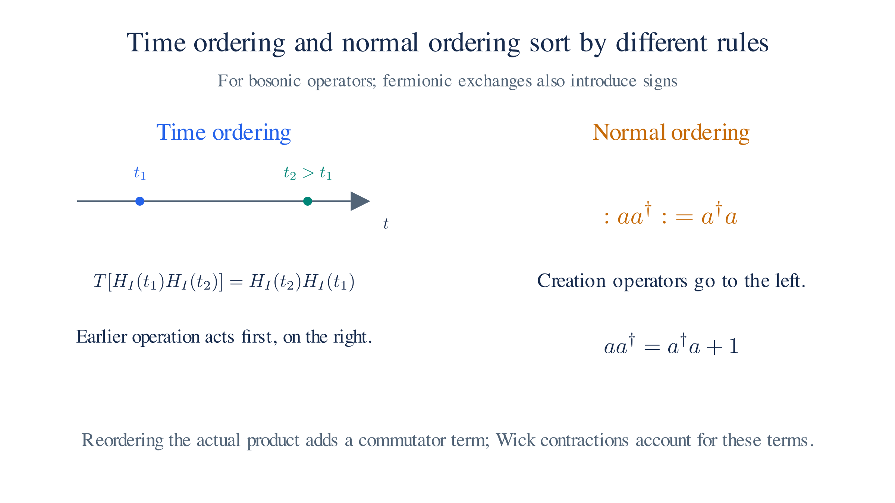
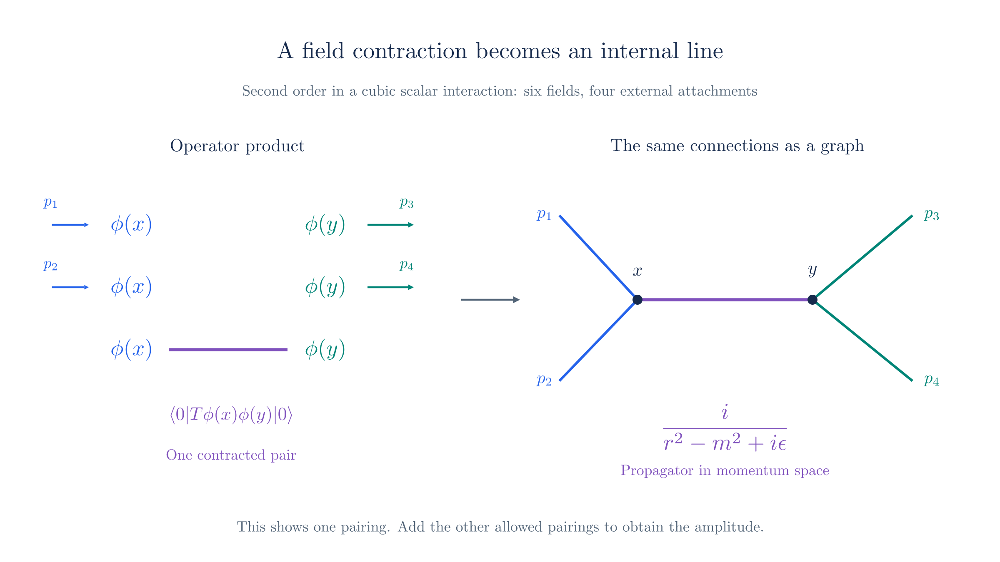
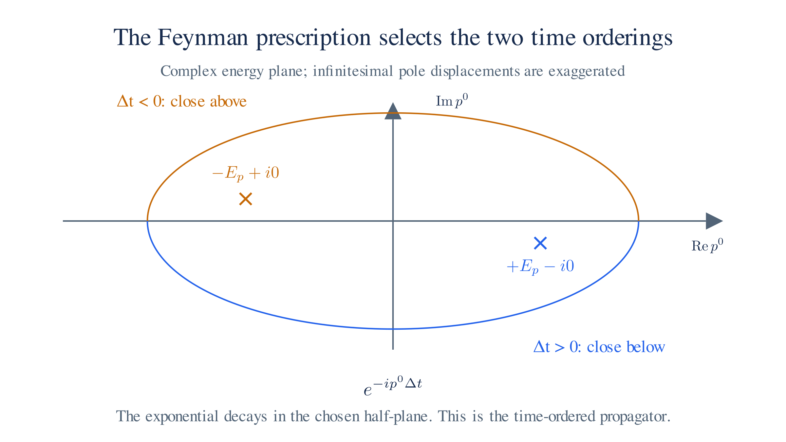

# Perturbation Theory: From the Lagrangian to the Feynman Rules

Adding an interaction to a quantum field theory leaves us with equations we cannot solve exactly. When the interaction is weak, we can approximate: expand the predicted amplitudes in powers of the coupling and keep the lowest nonzero terms. The [Field Quantization page](field-quantization.md) supplied the free fields and their particle states, and [From Lagrangian to Experiment](lagrangian-to-experiment.md) identified the S-matrix element as the quantity to calculate. This chapter expands that S-matrix in powers of the coupling. The **Dyson series** organizes the powers, and **Wick's theorem** organizes the field pairings within each term. The outcome is a short dictionary of factors — the Feynman rules that the [next page](feynman-rules.md) assigns to each vertex and line in a diagram.

We will first use a real scalar field with a cubic interaction. It has no spin indices or gauge freedom, so we can follow the calculation before adding those features in QED. The optional [Path Integrals sequence](path-integrals.md) later gives a complementary derivation: Gaussian field integrals produce the same pairings and diagram rules.

We use natural units, $\hbar=c=1$, and metric $g_{\mu\nu}=\operatorname{diag}(1,-1,-1,-1)$. Setting $\hbar$ and $c$ to $1$ is a choice of units, not an approximation: energy, mass, and momentum share one unit, and distance is measured in units of time, so factors of $\hbar$ and $c$ drop out of the formulas. Thus $p^2=E^2-\mathbf p^2$. A physical free particle of mass $m$ is **on shell**, meaning $p^2=m^2$.

## Outline of the argument

Each section develops one step of the calculation.

1. **Define the interaction.** Add $-g\phi^3/3!$ to the free scalar Lagrangian.
2. **Write the S-matrix.** Solve the interaction-picture evolution equation as a time-ordered exponential, $S=T\exp[i\int d^4x\,\mathcal L_{\mathrm{int}}]$.
3. **Expand in the coupling.** The Dyson series groups contributions by their number of interaction factors.
4. **Reorder the fields.** Wick's theorem replaces time-ordered products with normal-ordered products and pair contractions.
5. **Evaluate each contraction.** The free-field expansion gives the propagator $i/(p^2-m^2+i\epsilon)$.
6. **Assemble the amplitude.** Attach the remaining fields to external particles, integrate over interaction positions, and count equivalent pairings.

We then apply the same method to QED, using its electron and photon fields.

The sums in this expansion arise from quantum evolution. Each term integrates over possible interaction positions and adds all operator pairings that connect the chosen initial and final states. We add amplitudes before calculating probabilities.

Two kinds of ordering enter. Time ordering places later operators on the left, as required by successive evolution. Normal ordering places creation operators on the left, which makes matrix elements easier to evaluate. Moving between these orders produces contractions, ordinary numerical factors associated with pairs of fields.

## The setup: an interacting scalar

Begin with the free real scalar field from [Field Quantization](field-quantization.md):

$$\mathcal{L}_0 = \tfrac12 (\partial_\mu\phi)(\partial^\mu\phi) - \tfrac{m^2}{2}\phi^2.$$

Free quanta propagate without scattering. Add a cubic term to permit interactions:

$$\mathcal{L} = \mathcal{L}_0 - \frac{g}{3!}\,\phi^3.$$

The **coupling** $g$ sets the interaction strength. The factor $3!$ will cancel the number of ways to assign three identical fields to a vertex's three legs.

This theory contains one spin-zero field, so all three legs belong to the same species. QED instead has a spinor $\psi$ and a vector $A_\mu$, with interaction $-q\bar\psi\gamma^\mu\psi A_\mu$. Both interactions contain three fields at one point, but QED has additional spin and polarization factors.

The cubic term makes the field equation nonlinear, as the interaction did in [QED](qed.md). We approximate amplitudes by expanding in small $g$. Here the cubic theory serves as a formal perturbative example; its potential alone has no stable global minimum.

## The S-matrix as a series

In the interaction picture, field operators evolve with the free Hamiltonian, while states evolve with the interaction Hamiltonian. The S-matrix connects asymptotic incoming and outgoing free-particle states.

For this interaction, $H_{\mathrm{int}}=-\int d^3x\,\mathcal L_{\mathrm{int}}$. Solving the evolution equation gives

$$S = T \exp\!\left[i \int d^4x\; \mathcal{L}_{\mathrm{int}}(x)\right],$$

The symbol $T$ means **time ordering**: place later operators to the left[^time]. For two scalar fields, $T[\phi(x)\phi(y)]=\phi(x)\phi(y)$ if $x^0>y^0$, and $\phi(y)\phi(x)$ if $y^0>x^0$.

This ordering matters because field operators at different times generally do not commute. With $\mathcal L_{\mathrm{int}}=-g\phi^3/3!$, expand the exponential as

$$S = \sum_{n=0}^\infty \frac{i^n}{n!} \int d^4x_1 \cdots d^4x_n\; T\big[\mathcal{L}_{\mathrm{int}}(x_1) \cdots \mathcal{L}_{\mathrm{int}}(x_n)\big].$$

The term with $n$ interaction factors has order $g^n$ and integrates over $n$ spacetime positions. This is the **Dyson series**. The diagrams on the [Feynman Rules page](feynman-rules.md) organize its terms.

To evaluate a term between particle states, we next rewrite its time-ordered field product using Wick's theorem.

*Time ordering places later interactions on the left. Normal ordering places creation operators on the left; commutators supply the extra terms.*

## Wick's theorem

The free-field expansion from [Field Quantization](field-quantization.md) has the form $\phi=\phi^++\phi^-$, where $\phi^+$ annihilates and $\phi^-$ creates a particle. Each part includes a plane-wave factor.

A **normal-ordered product** $:\!\phi_1\cdots\phi_n\!:$ places every creation operator to the left of every annihilation operator. This makes matrix elements easier to evaluate. An annihilation operator removes an incoming particle, or gives zero if none is available. A creation operator acting leftward on the vacuum bra also gives zero. The surviving terms contain the plane-wave factors associated with the external particles.

Time ordering sorts by time instead. To put a time-ordered product into normal order, we must sometimes commute an annihilation operator past a creation operator. Their nonzero commutator contributes an extra number. Wick's theorem accounts for all such terms.

For two free scalar fields, **Wick's theorem** states

$$T\big[\phi(x)\phi(y)\big] = \;:\!\phi(x)\phi(y)\!: \;+\; \langle 0\lvert T\big[\phi(x)\phi(y)\big]\rvert 0\rangle.$$

The second term is the **contraction**, a vacuum expectation value and therefore an ordinary number. Contracting two fields means replacing them by that number in the product. For a translation-invariant vacuum it depends only on $x-y$.

The contraction describes free propagation between the two spacetime points. It will become the internal-line factor in a diagram.

For a longer product, sum over every possible choice of disjoint contracted pairs. Leave all remaining fields in normal order, then evaluate them against the external states.

For a connected contribution with $k$ external particles, $k$ fields attach to those particles. At order $n$ in this cubic theory there are $3n$ fields, so the remaining $3n-k$ must contract in pairs. In particular, $3n-k$ must be even.

A three-leg contribution at first order has three fields and no internal contraction. A $2\to2$ contribution at second order has six fields: four attach to the external particles and two contract into one internal line. We will evaluate both patterns below.

*At second order in a cubic scalar interaction, one contracted pair forms an internal propagator and four remaining fields attach to external particles.*

## The propagator from the free field

The contraction can now be evaluated with the known free field. Including both time orderings and writing the result as one four-momentum integral gives

$$\langle 0\lvert T\phi(x)\phi(y)\rvert 0\rangle = \int \frac{d^4p}{(2\pi)^4}\,\frac{i}{p^2 - m^2 + i\epsilon}\,e^{-ip\cdot(x-y)}.$$

The momentum-space factor appearing here is the **propagator**,

$$\frac{i}{p^2 - m^2 + i\epsilon}.$$

This is $i$ times the inverse of the free momentum-space quadratic operator $p^2-m^2$, with a specified boundary prescription: the denominator has poles near the mass-shell energies $p^0=\pm E_p$, and the $+i\epsilon$ shifts the positive-energy pole slightly below the real axis and the negative-energy pole slightly above it, implementing the Feynman time-ordering prescription. That is why the free Lagrangian determines the factor used between interaction vertices. An internal momentum need not be on shell.

Evaluating the contraction and fixing the pole prescription

For $x^0>y^0$, only the annihilation part of $\phi(x)$ followed by the creation part of $\phi(y)$ survives between vacuum states. The two mode-normalization factors multiply to $1/(2E_p)$, with $E_p=\sqrt{\mathbf p^2+m^2}$. Including both time orderings gives

$$\langle 0\lvert T\phi(x)\phi(y)\rvert 0\rangle = \int \frac{d^3p}{(2\pi)^3}\,\frac{1}{2E_p}\left[\theta(x^0-y^0)\,e^{-ip\cdot(x-y)} + \theta(y^0-x^0)\,e^{+ip\cdot(x-y)}\right].$$

The step function $\theta$ selects the appropriate ordering. Both terms combine into the single four-momentum integral stated above.

To see how the pole prescription reproduces the two orderings, integrate over complex $p^0$. The poles lie at $+E_p-i0$ and $-E_p+i0$. For $x^0-y^0>0$, the exponential decays below the real axis, so close the contour in the lower half-plane to recover the first time ordering. For negative time separation, close it above to recover the second[^contour].

*The positive-energy pole lies below the real axis and the negative-energy pole above it. The sign of the time separation determines which half-plane closes the contour.*

## Building amplitudes: the dictionary

Insert the Dyson series between the incoming and outgoing states. Apply Wick's theorem to each term. The surviving factors have three roles.

**External lines.** An uncontracted field annihilates an incoming particle with phase $e^{-ip\cdot x}$ or creates an outgoing particle with phase $e^{+ip\cdot x}$. A scalar has no spin or polarization index. After extracting the conventional external-state normalization, its external-line factor is $1$.

**Internal lines.** Each contracted pair contributes the free propagator, with momentum flowing between the two field positions.

**Vertices.** Each interaction factor contributes three fields and an integral over its position. Let $P$ be the signed sum of momenta entering that vertex. The plane waves give $\int d^4x\,e^{-ix\cdot P}=(2\pi)^4\delta^4(P)$, which enforces energy and momentum conservation there.

At a vertex, the $3!$ assignments of the identical fields cancel the $3!$ in $\mathcal L_{\mathrm{int}}$. The remaining vertex factor is $-ig$. Multiply it by a propagator $i/(p^2-m^2+i\epsilon)$ for each internal line, and integrate over momenta that conservation does not fix. Diagrams with equivalent pairings can also require symmetry factors.

Two low-order checks confirm the dictionary. Attaching three external particles to a single vertex gives the amplitude $i\mathcal M=-ig$. At second order in $2\to2$ scattering, one contracted pair forms an internal line; the three distinct ways to route the external particles give three amplitudes of the same form, which add.

Checking the three-leg vertex and one internal line

Formally attach one incoming scalar of momentum $p$ and two outgoing scalars of momenta $p_1,p_2$ to one vertex. The three fields annihilate the incoming particle and create the outgoing pair, giving

$$i\mathcal{M} = -ig,$$

The position integral also gives $\delta^4(p-p_1-p_2)$. For three on-shell particles of the same positive mass, this conservation law forbids the decay $\phi\to\phi\phi$: one mass-$m$ particle cannot produce two. The expression still establishes the vertex factor used inside allowed scattering processes.

Now include an internal line. In $\phi(p_1)\phi(p_2)\to\phi(p_3)\phi(p_4)$ at second order, two vertices supply six fields. Four attach to external particles, and the remaining pair forms a propagator. For the routing in which both incoming particles attach to the first vertex, momentum conservation gives $q=p_1+p_2$ on the internal line. Its contribution is

$$i\mathcal{M}_s = (-ig)^2\, \frac{i}{q^2 - m^2 + i\epsilon}, \qquad q^2 = (p_1+p_2)^2.$$

The other two pairings give the same form with different internal momentum combinations. Add all three contributions because they connect the same initial and final states[^identical]. Each diagram records one group of terms in the operator expansion.

The resulting scalar rules are:

| Diagram element | Factor |
| --- | --- |
| Vertex | $-ig$ |
| Internal line, momentum $r$ | $\displaystyle \frac{i}{r^2 - m^2 + i\epsilon}$ |
| External line | $1$ |

The product of these factors gives $i\mathcal M$, with any loop integrations and symmetry factors included. Enforce conservation at each vertex, then factor out the overall $\delta^4(P_f-P_i)$ according to [From Lagrangian to Experiment](lagrangian-to-experiment.md)[^lsz].

## QED's rules are the same dictionary

For QED, we keep the method and change the fields: expand in the charge $q$ using $\mathcal L_{\mathrm{int}}=-q\bar\psi\gamma^\mu\psi A_\mu$. The Dyson series, contractions, and position integrals work as above. Fermionic reordering also introduces minus signs.

The free electron and photon fields determine their propagators and external-state factors. The interaction determines which fields meet at a vertex.

The electron propagator is $i(\not r+m)/(r^2-m^2+i\epsilon)$, where $\not r=\gamma^\mu r_\mu$. In Feynman gauge, the photon propagator is $-ig_{\mu\nu}/(r^2+i\epsilon)$. Their matrix and vector indices reflect the fields they connect.

The interaction gives the vertex factor $-iq\gamma^\mu$. External electrons contribute $u(p)$ or $\bar u(p')$, and external photons contribute polarization vectors $\varepsilon_\mu(k)$ or their outgoing conjugates. These are the factors used on the [Feynman Rules page](feynman-rules.md).

The [Field Quantization page](field-quantization.md#the-spinor-field) derives the electron propagator. The [QED page](qed.md#quantizing-the-photon-field) derives the photon propagator and explains its gauge fixing. With those free-field results, the expansion above produces the QED rules.

We set out to derive the diagram factors from the Lagrangian, and the expansion has now produced them: propagators come from the free terms, vertex factors from the interaction, and external factors from the particle states. The [next page](feynman-rules.md) applies them to Compton scattering, then explains loop corrections and renormalization.

[^contour]: Integrate over complex $p^0$. The poles lie at $+E_p-i0$ and $-E_p+i0$. For positive $x^0-y^0$, the exponential decays below the real axis, so closing there selects the positive-energy pole. For negative separation, closing above selects the negative-energy pole. This reproduces the two time-ordered terms; the Feynman propagator is distinct from the retarded Green function.

[^identical]: The other routings are the t- and u-channels, named using the Mandelstam variables discussed on the Feynman Rules page. Identical scalar particles have no distinguishing label that would exclude either pairing, so both contribute to the same amplitude.

[^lsz]: Free-field expansions contain normalization factors $1/\sqrt{2E_p}$. With conventional relativistic normalization of external states, the scalar external-line rule for $\mathcal M$ is $1$. The **LSZ reduction formula** relates scattering amplitudes to correlation functions by removing external propagators and including the appropriate one-particle residues. We do not derive it here.

[^time]: $T$ is the standard symbol for time ordering. The Dyson series takes its name from Dyson's 1949 work. For fermion fields, time ordering includes a factor $-1$ for each exchange of two fermionic operators. The scalar calculation has no such signs; the QED calculation must include them.
