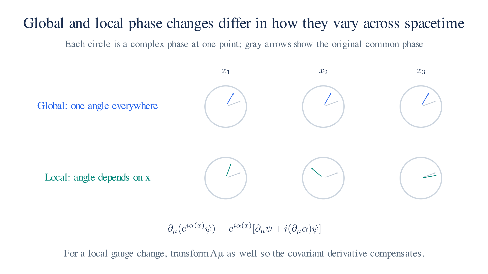
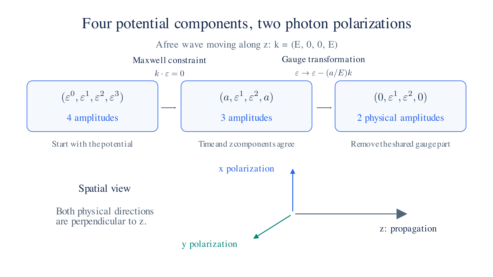
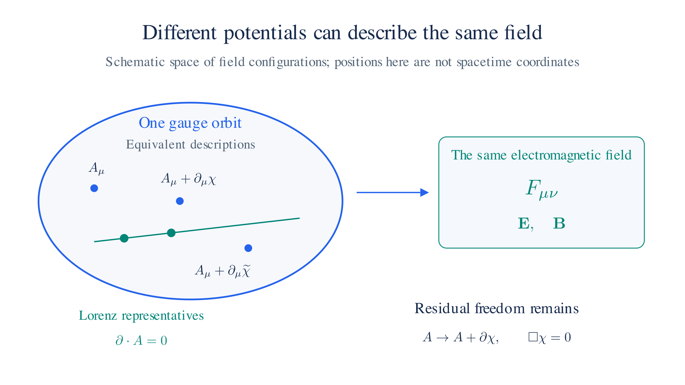
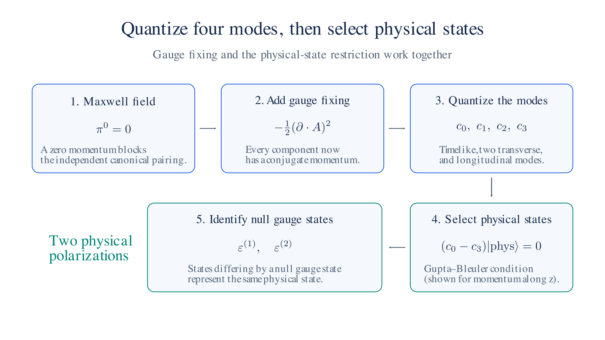

# Quantum Electrodynamics

## Recap of the Lagrangians

Quantum electrodynamics, or **QED**, describes the electron field, the photon field, and their interaction. We begin with the two free Lagrangians from [Action and Lagrangians](qft-action.md), then work out how to couple the fields.

**The Dirac Lagrangian describes a free electron field.** It is

$$\mathcal{L}_\text{Dirac} = \bar\psi\left(i\hbar\gamma^\mu\partial_\mu - m\right)\psi.$$

Here $\psi$ is the electron's spinor field and $\bar\psi=\psi^\dagger\gamma^0$ is its Dirac adjoint. The derivative term describes propagation, and $-m\bar\psi\psi$ is the mass term. Applying the Euler–Lagrange equation gives the Dirac equation.

**The Maxwell Lagrangian describes a free photon field.** The potential $A_\mu$ has four components, and its derivatives form the electromagnetic field strength:

$$\mathcal{L}_\text{Maxwell} = -\tfrac14 F_{\mu\nu}F^{\mu\nu}, \qquad F_{\mu\nu} = \partial_\mu A_\nu - \partial_\nu A_\mu.$$

Varying $A_\mu$ gives Maxwell's equations in free space, $\partial_\mu F^{\mu\nu}=0$.

Adding these two Lagrangians would describe fields that propagate independently. To describe electromagnetic scattering, we also need an interaction between them. The complete expression will be

$$\mathcal{L}_\text{QED} = -\tfrac14 F_{\mu\nu}F^{\mu\nu} \;+\; \bar\psi\left(i\hbar\gamma^\mu\partial_\mu - m\right)\psi \;-\; q\,\bar\psi\gamma^\mu\psi\,A_\mu .$$

The first two terms describe the free fields. The third couples $A_\mu$ to the electron current $j^\mu=q\bar\psi\gamma^\mu\psi$, where $q$ is the signed charge.

**We obtain the interaction by changing the derivative.** Replace

$$\partial_\mu \;\to\; D_\mu = \partial_\mu + \frac{iq}{\hbar}A_\mu .$$

Substituting $D_\mu$ into the Dirac kinetic term produces $-q\bar\psi\gamma^\mu\psi A_\mu$. This is the **minimal coupling** used in [The Dirac Equation §1](dirac-equation.md#_1-spin). The next two sections explain why local phase symmetry leads to this derivative and interaction.

## U(1) Global Symmetry

**Changing a common phase does not change probabilities.** Multiply the electron wave function by $e^{i\alpha}$, with the same constant $\alpha$ everywhere. The probability expression from [First Quantization](first-quantization.md),

$$P = |\psi|^2 = \psi^*\psi,$$

stays unchanged because the phase and its complex conjugate cancel. Relative phases can affect interference; the transformation here changes the overall phase of the entire wave function.

For the Dirac field and its adjoint, the transformation is

$$\psi \to e^{i\alpha}\psi, \qquad \bar\psi \to e^{-i\alpha}\bar\psi .$$

Every term in the free Dirac Lagrangian contains both $\psi$ and $\bar\psi$. In the mass term, $e^{-i\alpha}e^{i\alpha}=1$. In the kinetic term, the constant phase passes through the derivative and cancels in the same way. The Lagrangian therefore remains unchanged.

We call this a **global symmetry** because one value of $\alpha$ applies throughout spacetime. A symmetry here means a transformation that leaves the action unchanged.

**This symmetry gives charge conservation.** Noether's theorem states that each continuous symmetry of the action carries a conserved current. Applying it to the phase transformation gives

$$j^\mu = q\,\bar\psi\gamma^\mu\psi, \qquad \partial_\mu j^\mu = 0.$$

The time component is the charge density, and the spatial components describe charge flow. Integrating the density over space gives the total electric charge. The continuity equation states that charge can move between regions without being created or destroyed.

The phase factors $e^{i\alpha}$ form the group **U(1)**. Each factor is a unitary $1\times1$ matrix, or equivalently a complex number of unit magnitude. As $\alpha$ varies, these numbers trace out the unit circle.

Next we make a stronger demand: allow a different phase at each spacetime point. Global symmetry alone does not require this extension. Imposing it leads to the local gauge symmetry of QED.

## Local Gauge Symmetry U(1)

**Let the phase depend on position and time.** Replace the constant $\alpha$ by a function $\alpha(x)$:

$$\psi(x) \to e^{i\alpha(x)}\psi(x), \qquad \bar\psi(x) \to e^{-i\alpha(x)}\bar\psi(x).$$

We want a Lagrangian that remains invariant under this local transformation. First check what happens to the free Dirac terms.

The mass term remains unchanged. Its two phase factors occur at the same point and cancel:

$$-m\,\bar\psi\psi \;\to\; -m\,e^{-i\alpha(x)}e^{i\alpha(x)}\,\bar\psi\psi = -m\,\bar\psi\psi .$$

**The ordinary derivative produces an extra term.** The product rule gives

$$\partial_\mu\Big(e^{i\alpha(x)}\psi\Big) = e^{i\alpha(x)}\Big(\partial_\mu\psi + i(\partial_\mu\alpha)\,\psi\Big).$$

The derivative now acts on the phase as well as on $\psi$. Substituting into the kinetic term gives

$$\bar\psi\,i\hbar\gamma^\mu\partial_\mu\psi \;\to\; \bar\psi\,i\hbar\gamma^\mu\partial_\mu\psi \;-\; \hbar\,(\partial_\mu\alpha)\,\bar\psi\gamma^\mu\psi .$$

The last term does not vanish for a general $\alpha(x)$, so the free Dirac Lagrangian is not locally invariant.

**Introduce a field whose transformation cancels the extra term.** Give the vector potential the transformation rule

$$A_\mu \;\to\; A_\mu - \frac{\hbar}{q}\,\partial_\mu\alpha,$$

and combine it with the derivative:

$$D_\mu = \partial_\mu + \frac{iq}{\hbar}A_\mu .$$

The shift in $A_\mu$ contributes $-i\partial_\mu\alpha$ inside $D_\mu$. This cancels the $+i\partial_\mu\alpha$ from differentiating the phase. As a result,

$$D_\mu\psi \;\to\; e^{i\alpha(x)}\,D_\mu\psi .$$

We call $D_\mu$ the **covariant derivative** because $D_\mu\psi$ transforms with the same phase as $\psi$. Multiplying by $\bar\psi$ cancels that phase, so the kinetic term with $D_\mu$ is locally invariant.

Expanding it gives

$$\bar\psi\,i\hbar\gamma^\mu D_\mu\psi \;=\; \bar\psi\,i\hbar\gamma^\mu\partial_\mu\psi \;-\; q\,\bar\psi\gamma^\mu\psi\,A_\mu .$$

The second term is the interaction between the electron current and the photon potential. Local U(1) invariance thus fixes the form of the minimal coupling. The charge $q$ sets its strength; symmetry does not determine its numerical value.

We have introduced $A_\mu$ into the electron's dynamics. We now add a kinetic term for $A_\mu$ itself, so that electromagnetic disturbances can propagate.

*A global phase rotation uses one angle everywhere. A local rotation has a position-dependent angle, whose derivative requires a compensating transformation of the gauge potential.*

## QED Lagrangian

**Build the photon kinetic term from a gauge-invariant quantity.** Under the gradient shift of $A_\mu$, the field strength

$$F_{\mu\nu} = \partial_\mu A_\nu - \partial_\nu A_\mu$$

stays unchanged. The extra contribution is proportional to $\partial_\mu\partial_\nu\alpha-\partial_\nu\partial_\mu\alpha$, which vanishes because mixed partial derivatives commute.

The Maxwell term $-\tfrac14F_{\mu\nu}F^{\mu\nu}$ therefore respects the local symmetry. It is the standard Lorentz-invariant kinetic term, quadratic in the field strength, used in QED. Gauge symmetry permits more complicated higher-order terms in an effective theory; it does not by itself uniquely specify every possible Lagrangian.

**Combine the photon term with the covariant Dirac term.** This gives

$$\mathcal{L}_\text{QED} = -\tfrac14 F_{\mu\nu}F^{\mu\nu} \;+\; \bar\psi\left(i\hbar\gamma^\mu D_\mu - m\right)\psi, \qquad D_\mu = \partial_\mu + \frac{iq}{\hbar}A_\mu .$$

Expanding the derivative makes the three contributions explicit:

$$\mathcal{L}_\text{QED} = -\tfrac14 F_{\mu\nu}F^{\mu\nu} \;+\; \bar\psi\left(i\hbar\gamma^\mu\partial_\mu - m\right)\psi \;-\; q\,\bar\psi\gamma^\mu\psi\,A_\mu .$$

They describe photon propagation, free electron propagation, and the electron–photon interaction. These are the terms we will use to derive propagators and scattering rules.

A direct photon mass term proportional to $m_\gamma^2 A_\mu A^\mu$ would change under the gauge transformation. It is therefore incompatible with the unbroken U(1) gauge symmetry in this QED Lagrangian. The photon field we quantize next is massless.

## Quantizing the Photon Field

We need the photon's **propagator** to calculate what an internal photon line contributes to a Feynman diagram. The [Field Quantization page](field-quantization.md) obtained propagators by expanding a free field into modes and quantizing each mode as an oscillator. We will follow that route here, with one extra complication: the four components of $A_\mu$ describe only two physical photon polarizations.

**The strategy is to make all four components easy to quantize, then restrict the quantum states so that only the two physical polarizations remain.** First we will work out where the two polarizations come from. Then we will see why the ordinary canonical construction needs this extra step.

Throughout this section, $c = 1$ and the metric has signature $(+,-,-,-)$, so $k^2 = E_k^2 - |\mathbf k|^2$.

### What a free photon holds

**Start with one plane wave.** Write the potential as

$$A^\mu(x) = \varepsilon^\mu e^{-ik\cdot x/\hbar}.$$

The four-vector $k^\mu = (E_k, \mathbf k)$ specifies the energy and momentum. The polarization vector $\varepsilon^\mu$ specifies the amplitude of each component of the potential. We use a complex wave to simplify the algebra; taking its real part gives a real classical field.

Differentiating the exponential brings down $-ik_\mu/\hbar$, so the field strength is

$$F^{\mu\nu} = -\frac{i}{\hbar}\left(k^\mu\varepsilon^\nu-k^\nu\varepsilon^\mu\right)e^{-ik\cdot x/\hbar}.$$

Now apply the free Maxwell equation, $\partial_\mu F^{\mu\nu}=0$. Another derivative brings down another momentum factor. After removing the common exponential and numerical factors, we get

$$k^2\varepsilon^\nu=k^\nu(k\cdot\varepsilon). \tag{1}$$

This equation tells us which polarizations and momenta can describe a free electromagnetic wave.

**A nonzero electromagnetic wave must have $k^2=0$.** To see why, suppose instead that $k^2\ne0$. Dividing equation (1) by $k^2$ gives

$$\varepsilon^\nu=Ck^\nu, \qquad C=\frac{k\cdot\varepsilon}{k^2}.$$

But a polarization proportional to $k$ makes the field strength vanish:

$$F^{\mu\nu}\propto C\left(k^\mu k^\nu-k^\nu k^\mu\right)=0. \tag{2}$$

The components of $k$ are ordinary numbers, so the two products are equal. The potential can oscillate while producing no $\mathbf E$ or $\mathbf B$. We call such a potential **pure gauge**.

For a wave with a nonzero electromagnetic field, we therefore need

$$k^2=0 \quad\Longrightarrow\quad E_k=|\mathbf k|.$$

This is the massless energy–momentum relation. A zero Minkowski square does not mean zero momentum: $k^\mu=(E_k,0,0,E_k)$ has $k^2=E_k^2-E_k^2=0$ even when $E_k$ is nonzero.

**Maxwell's equation removes one polarization component.** Substituting $k^2=0$ into equation (1) leaves

$$0=k^\nu(k\cdot\varepsilon). \tag{3}$$

For nonzero $k$, this requires $k\cdot\varepsilon=0$. One equation on four components leaves three independent amplitudes.

For a wave travelling along $z$, take $k^\mu=(E_k,0,0,E_k)$. Then

$$k\cdot\varepsilon=E_k(\varepsilon^0-\varepsilon^3)=0,$$

so the polarization has the form

$$\varepsilon^\mu=(a,\varepsilon^1,\varepsilon^2,a).$$

This is four-dimensional **transversality**. At this stage it ties the time and $z$ components together; it does not require them to vanish.

**Gauge freedom removes one more amplitude.** A gauge transformation changes the potential by a gradient,

$$A_\mu\longrightarrow A_\mu+\partial_\mu\chi.$$

It leaves $F_{\mu\nu}$ unchanged because the extra term is $\partial_\mu\partial_\nu\chi-\partial_\nu\partial_\mu\chi=0$. For a gauge function with the same plane-wave dependence, the gradient is proportional to $k_\mu$, so the polarization changes as

$$\varepsilon^\mu\longrightarrow\varepsilon^\mu+\alpha k^\mu. \tag{4}$$

Choose $\alpha=-a/E_k$. This removes the time and $z$ components together:

$$(a,\varepsilon^1,\varepsilon^2,a)\longrightarrow(0,\varepsilon^1,\varepsilon^2,0).$$

The electromagnetic field stays the same. Only the two sideways directions remain as independent physical polarizations:

$$\varepsilon^{(1)}=(0,1,0,0), \qquad \varepsilon^{(2)}=(0,0,1,0).$$

For a free photon, the count is therefore **four potential components, minus one Maxwell constraint, minus one gauge freedom, leaving two physical polarizations**.

*A photon moving along z: the Maxwell constraint ties the time and z components together, and a gauge transformation removes that shared component, leaving two transverse polarizations.*

### Why the canonical construction stalls

**Canonical quantization starts with a field and its conjugate momentum.** For each component of the potential, calculate

$$\pi^\mu=\frac{\partial\mathcal L}{\partial(\partial_0 A_\mu)}.$$

The Maxwell Lagrangian gives

$$\pi^\mu=-F^{0\mu}.$$

The spatial components have momenta, $\pi^i=E^i$. But antisymmetry forces $F^{00}=0$, so

$$\pi^0=0.$$

The same problem appears directly in the Lagrangian: $\dot A_0$ never appears. The time derivatives in $F_{\mu\nu}$ act on the spatial components of the potential.

If we now tried to impose the usual canonical commutator on $A_0$, we would get

$$[\hat A_0(t,\mathbf x),0]=i\hbar\,\delta^3(\mathbf x-\mathbf y).$$

The left side vanishes, so this cannot work.

**The zero tells us that $A_0$ is a constrained variable.** Its Maxwell equation is Gauss's law, $\nabla\cdot\mathbf E=0$. This equation restricts the electric field at each instant; it contains no $\partial_t\mathbf E$ that would evolve it to the next instant. In the Hamiltonian description, $A_0$ enforces that constraint.

We can quantize constrained systems with other methods. Here we will use a method that keeps Lorentz covariance explicit: add a gauge-fixing term to give all four components canonical momenta, then select the physical states afterward.

### Fixing the gauge

**Choose a useful description of each electromagnetic field.** The gauge freedom lets many potentials describe the same $\mathbf E$ and $\mathbf B$. A useful choice is the **Lorenz condition**,[^lorenz]

$$\partial_\mu A^\mu=0.$$

The contraction makes this condition Lorentz covariant: it has the same form in every Lorentz frame.

To see how we can reach it, apply a gauge transformation. The divergence changes as

$$\partial\cdot A\longrightarrow\partial\cdot A+\Box\chi, \qquad \Box=\partial_t^2-\nabla^2.$$

Choosing $\chi$ to solve

$$\Box\chi=-\partial\cdot A$$

therefore gives a potential satisfying the Lorenz condition, with suitable boundary conditions in the flat spacetime setting used here. Some freedom remains: a further transformation with $\Box\chi=0$ preserves the condition. For plane waves, this includes the shift along $k$ that we used to remove the amplitude $a$.

*Equivalent potentials belong to one gauge orbit and produce the same electromagnetic field. The Lorenz condition still permits residual gauge transformations.*

**In the quantum theory, we cannot make this an exact identity between independent canonical field operators.** The divergence contains $\dot{\hat A}^0$, which will be related to the momentum of $\hat A_0$. Setting that divergence identically to zero conflicts with the canonical commutator.[^operator-lorenz] We will instead impose a weaker condition on physical states.

First, to make the canonical construction possible, add

$$\mathcal L_\text{gf}=-\frac12(\partial_\mu A^\mu)^2.$$

Since

$$\partial\cdot A=\dot A^0+\nabla\cdot\mathbf A,$$

the added term contains $-\tfrac12(\dot A^0)^2$. The missing velocity now appears, and the momentum becomes

$$\pi^0=-\partial\cdot A.$$

We have made all four components dynamical. This enlarges the space of solutions we quantize, so **adding the term and selecting physical states must go together**. The fact that the term vanishes on Lorenz-obeying fields is not, by itself, a proof that the quantum predictions stay the same.

**The added term also decouples the components.** Expand the Maxwell term:

$$\mathcal L_\text{Maxwell}=-\frac12(\partial_\mu A_\nu)(\partial^\mu A^\nu)+\frac12(\partial_\mu A_\nu)(\partial^\nu A^\mu).$$

The second term mixes components. Inside the action, integrate it by parts twice:

$$\int d^4x\,(\partial_\mu A_\nu)(\partial^\nu A^\mu)
=-\int d^4x\,A_\nu\partial^\nu(\partial\cdot A)
=\int d^4x\,(\partial\cdot A)^2,$$

where we have dropped boundary terms under the usual boundary assumptions. The gauge-fixing term cancels this contribution, leaving the equivalent Lagrangian

$$\boxed{\mathcal L=-\frac12(\partial_\mu A_\nu)(\partial^\mu A^\nu).}$$

For this form of the Lagrangian, the canonical momenta are

$$\pi^\nu=-\partial^0 A^\nu, \qquad \pi^0=-\dot A^0.$$

The last expression differs from the momentum before integration by parts because changing the boundary terms can change the canonical momenta. Both Lagrangians give the same bulk equations of motion.

Each component now obeys a massless wave equation,

$$\Box A_\nu=0.$$

This choice of gauge-fixing term is **Feynman gauge**. It gives us four decoupled wave equations, which we can quantize using the oscillator construction. We still need to recover the two-polarization physical state space.

### Quantizing the gauge-fixed field

**Expand the field into four families of modes.** For momentum along $z$, choose the polarization basis

$$\varepsilon^{(0)}=(1,0,0,0), \qquad \varepsilon^{(1)}=(0,1,0,0),$$

$$\varepsilon^{(2)}=(0,0,1,0), \qquad \varepsilon^{(3)}=(0,0,0,1).$$

The labels $1$ and $2$ are the transverse directions. The label $0$ is timelike, and $3$ is longitudinal, pointing along the spatial momentum.

To keep the mode normalization and propagator formulas uncluttered, **from here to the end of this section we also set $\hbar=1$**. Promote each mode amplitude to an annihilation operator and its complex conjugate to a creation operator:

$$\hat A_\mu(x)=\int\frac{d^3k}{(2\pi)^3}\frac{1}{\sqrt{2E_k}}\sum_{\lambda=0}^3
\left[\hat c_\lambda(k)\varepsilon_\mu^{(\lambda)}(k)e^{-ik\cdot x}
+\hat c_\lambda^\dagger(k)\varepsilon_\mu^{(\lambda)*}(k)e^{+ik\cdot x}\right], \qquad E_k=|\mathbf k|.$$

This has the same structure as the scalar field expansion. The extra sum accounts for the four polarization directions. Each $\hat c_\lambda$ removes a quantum in its mode, and each $\hat c_\lambda^\dagger$ adds one.

**The timelike mode has a different sign.** The metric makes the kinetic term

$$\mathcal L=-\frac12(\partial_\mu A^0)(\partial^\mu A^0)
+\frac12\sum_{i=1}^3(\partial_\mu A^i)(\partial^\mu A^i).$$

The three spatial components have the usual scalar kinetic sign. The time component has the opposite sign, which carries through into its ladder algebra.

Write $\eta_\lambda=\varepsilon^{(\lambda)*}\cdot\varepsilon^{(\lambda)}$, so $\eta_0=+1$ and $\eta_{1,2,3}=-1$. The canonical commutators give

$$[\hat c_\lambda(k),\hat c_{\lambda'}^\dagger(k')]
=-\eta_\lambda\,\delta_{\lambda\lambda'}(2\pi)^3\delta^3(\mathbf k-\mathbf k').$$

The factor $(2\pi)^3$ matches the integration measure in the expansion. If we suppress the momentum normalization, the spatial modes have $[\hat c_i,\hat c_i^\dagger]=1$, while the timelike mode has $[\hat c_0,\hat c_0^\dagger]=-1$.

That minus sign means a timelike one-quantum state has negative norm. We cannot interpret the entire enlarged state space as physical photon states.

**Select the physical states with the Lorenz condition.** We impose only the annihilation part of the divergence on a physical state:

$$\boxed{\big(\partial_\mu\hat A^\mu\big)^{(+)}\lvert\mathrm{phys}\rangle=0.}$$

The superscript $(+)$ means the positive-frequency terms, those containing $\hat c_\lambda e^{-ik\cdot x}$. This is the **Gupta–Bleuler condition**. It restricts which states we accept while leaving the canonical operator algebra intact.

For momentum along $z$, the transverse modes contribute nothing to the divergence. The timelike and longitudinal modes contribute with opposite signs, giving

$$\big(\hat c_0(k)-\hat c_3(k)\big)\lvert\mathrm{phys}\rangle=0.$$

Thus $\hat c_0$ and $\hat c_3$ act identically on a physical state. We can see one consequence in the Hamiltonian:

$$\hat H=\int\frac{d^3k}{(2\pi)^3}E_k
\left(\hat c_1^\dagger\hat c_1+\hat c_2^\dagger\hat c_2
+\hat c_3^\dagger\hat c_3-\hat c_0^\dagger\hat c_0\right)+\text{const.}$$

On physical states, the last two terms have equal and opposite expectation values. The transverse modes supply the physical excitation energy.

One final identification removes the remaining gauge redundancy: physical states that differ only by a null gauge state represent the same physical state. These null states have zero norm and no effect on physical matrix elements. After this identification, the photon has the two transverse polarizations we found from Maxwell's equation.

An external photon in a scattering calculation therefore carries one of these two polarizations, or a superposition of them such as circular polarization.

*Gauge fixing gives four quantizable modes. The physical-state condition and identification of null gauge states recover the two physical photon polarizations.*

### The propagator

**The propagator comes from contracting two field operators.** As on the scalar field page, we calculate the time-ordered vacuum expectation value

$$D_{\mu\nu}(x-y)=\langle0\rvert T\hat A_\mu(x)\hat A_\nu(y)\lvert0\rangle.$$

The indices $\mu$ and $\nu$ specify the field component at each end. The time-ordering symbol $T$ places the later operator first.

Each mode obeys a massless wave equation, so it contributes the massless scalar momentum-space factor

$$\frac{i}{k^2+i\epsilon}.$$

Its polarization vectors supply the two indices, and its commutator supplies the sign $-\eta_\lambda$. Summing all four modes therefore gives

$$D_{\mu\nu}(k)=\sum_{\lambda=0}^3(-\eta_\lambda)
\varepsilon_\mu^{(\lambda)}\varepsilon_\nu^{(\lambda)*}\frac{i}{k^2+i\epsilon}.$$

**The polarization sum reconstructs the metric.** Our four basis vectors span the four-vector component space, and their completeness relation is

$$\sum_{\lambda=0}^3\eta_\lambda\,
\varepsilon_\mu^{(\lambda)}\varepsilon_\nu^{(\lambda)*}=g_{\mu\nu}.$$

For the explicit basis above, the timelike vector contributes the $+1$ time entry and the three spatial vectors contribute the three $-1$ entries. Applying the extra minus sign from the commutator gives

$$\boxed{D_{\mu\nu}(k)=\frac{-ig_{\mu\nu}}{k^2+i\epsilon}.} \tag{5}$$

This is the **photon propagator in Feynman gauge**, in the $\hbar=c=1$ convention used here.

The denominator has its massless pole at $k^2=0$. The $i\epsilon$ prescription specifies how to pass the poles in the energy integral and implements the time ordering. The numerator carries the vector indices that connect to the vertices at either end of the photon line.

An internal photon can carry off-shell momentum, $k^2\ne0$, so it does not obey the same restrictions as a real, freely propagating photon. We use the full four-component propagator inside diagrams. Gauge constraints and current conservation ensure that the unphysical components do not produce extra observable photon polarizations; the propagator itself is a gauge-dependent intermediate quantity.

The [Feynman Rules page](feynman-rules.md) uses this factor for an internal photon line. Together with the electron propagator and the interaction term $-q\bar\psi\gamma^\mu\psi A_\mu$, it supplies the ingredients for QED scattering calculations. The [next page](lagrangian-to-experiment.md) connects that Lagrangian description to experiments, and [Perturbation Theory](perturbation-theory.md) develops the expansion into diagrams.

[^lorenz]: The Lorenz condition is named for Ludvig Lorenz. The spelling distinguishes his name from Hendrik Lorentz, whose name appears in Lorentz transformations.

[^operator-lorenz]: Using the simplified gauge-fixed Lagrangian, $\hat\pi^0=-\dot{\hat A}^0$, so $\partial\cdot\hat A=-\hat\pi^0+\partial_i\hat A^i$. The equal-time canonical algebra then gives $[\partial\cdot\hat A(t,\mathbf x),\hat A_0(t,\mathbf y)]=i\hbar\delta^3(\mathbf x-\mathbf y)$, since the field components commute with each other at equal times. If the divergence were the zero operator, this commutator would have to vanish. The Gupta–Bleuler condition avoids that contradiction by constraining states with only the annihilation part of the divergence.
