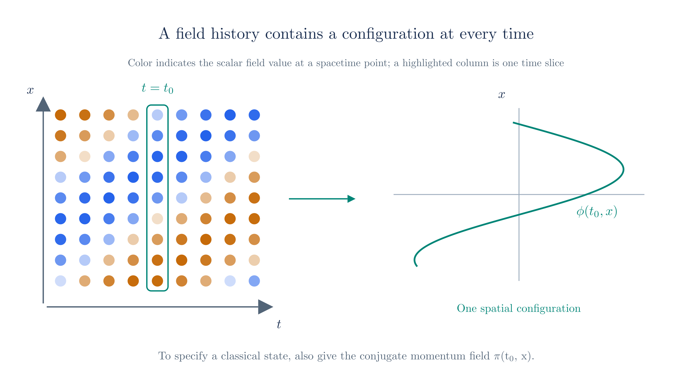
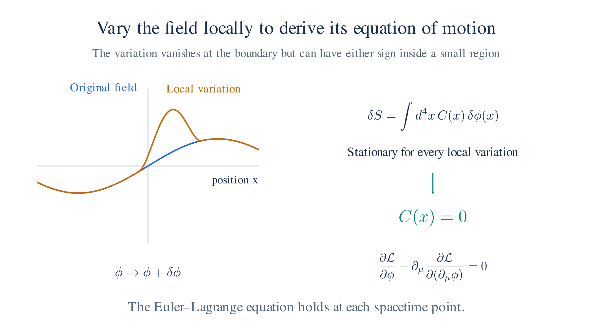

# Quantum Field Theory: Action and Lagrangians

The [Quantum Field Theory page](qft.md) introduced field operators. We now need equations for their evolution and an algebra specifying how they combine.

**Start from a classical action.** Its variation gives the field equations, and its Hamiltonian supplies the generator of time evolution. We will apply this construction to scalar, electromagnetic, and spinor fields, obtaining the Klein–Gordon, Maxwell, and Dirac equations.

## Principle of Least Action

To derive dynamics for the fields introduced on the [previous page](qft.md), begin with the particle construction in [Classical Mechanics §2](classical-mechanics.md#_2-lagrangian-and-the-euler-lagrange-derivation). For a path $q(t)$, define the **action**

$$S[q] = \int_{t_1}^{t_2} L(q, \dot q)\,dt, \qquad L = T - V,$$

The physical path makes $S$ **stationary**: its first-order change vanishes for every small variation with fixed endpoints. Despite the name “least action,” the stationary value need not be a minimum.

Perturb $q(t)$, expand the action to first order, and integrate the velocity term by parts. The endpoint condition removes the boundary term. Setting the remaining variation to zero gives

$$\frac{d}{dt}\,\frac{\partial L}{\partial \dot q} - \frac{\partial L}{\partial q} = 0,$$

For $L=T-V$, this reproduces Newton's equation. The advantage is that we can derive motion from one scalar function instead of specifying force components separately. We can use the same variational method with a relativistic Lagrangian.

The Lagrangian also determines the Hamiltonian. Its quantum version generates time evolution, as in [The Dirac Equation §2](dirac-equation.md#_2-conservation-and-commutators), and its spectrum is central to the negative-energy problem in [Relativistic QM §3](relativistic-qm.md#_3-negative-energy-and-probability).

### From particles to fields

**Replace the particle coordinate with a field configuration.** In mechanics, $q(t)$ is the unknown position. For a field $\phi(t,\mathbf x)$, the unknown is the field value at every spatial point; $\mathbf x$ labels those points.

The Lagrangian becomes a spatial integral of a **Lagrangian density** $\mathcal L(\phi,\partial_\mu\phi)$. Integrating over time gives the spacetime action

$$S[\phi] = \int d^4x\;\mathcal{L}(\phi, \partial_\mu\phi),$$

Stationarity gives one local equation for each independent field component:

$$\partial_\mu\left(\frac{\partial\mathcal L}{\partial(\partial_\mu\phi)}\right)-\frac{\partial\mathcal L}{\partial\phi}=0.$$

The equation relates the field's change in time to its spatial variation. We derive it by varying the field inside the spacetime region while holding its boundary values fixed.

Deriving the field Euler–Lagrange equation

Perturb the field by $\delta\phi(x)$, chosen to vanish on the spacetime boundary. This fixes the initial and final configurations and removes spatial boundary contributions. Expanding to first order gives

$$\delta S = \int d^4x\left[\frac{\partial\mathcal{L}}{\partial\phi}\,\delta\phi + \frac{\partial\mathcal{L}}{\partial(\partial_\mu\phi)}\,\partial_\mu(\delta\phi)\right].$$

**Remove the derivative from the variation.** Integrate the second term by parts in each spacetime direction. The resulting surface term vanishes because $\delta\phi$ is zero on the boundary. We obtain

$$\delta S = \int d^4x\left[\frac{\partial\mathcal{L}}{\partial\phi} - \partial_\mu\left(\frac{\partial\mathcal{L}}{\partial(\partial_\mu\phi)}\right)\right]\delta\phi.$$

We can choose $\delta\phi$ freely inside any small region. For the integral to vanish for every such choice, its coefficient must vanish point by point:

$$\partial_\mu\left(\frac{\partial\mathcal{L}}{\partial(\partial_\mu\phi)}\right) - \frac{\partial\mathcal{L}}{\partial\phi} = 0,$$

This is the **Euler–Lagrange equation for a field**. The particle's time derivative has become a spacetime divergence.

**Build Lorentz invariance into the action.** If $\mathcal L$ is a Lorentz scalar, then $S=\int d^4x\,\mathcal L$ has the same value in every inertial frame. Its stationary configurations therefore satisfy covariant field equations.

For the scalar, vector, and spinor fields in the [Fields section](qft.md#fields), we will use the simplest standard free-field densities: $\tfrac12(\partial_\mu\phi)(\partial^\mu\phi)-\tfrac{m^2}{2\hbar^2}\phi^2$, $-\tfrac14F^{\mu\nu}F_{\mu\nu}$, and $\bar\psi(i\hbar\gamma^\mu\partial_\mu-m)\psi$. Their variations give the Klein–Gordon, source-free Maxwell, and Dirac equations.

To construct the Hamiltonian, follow [Classical Mechanics §3](classical-mechanics.md#_3-hamiltonian-and-state-space). Define the momentum density conjugate to the field, $\pi(t,\mathbf x)=\partial\mathcal L/\partial\dot\phi$, and take the Legendre transform:

$$\mathcal{H} = \pi\,\dot\phi - \mathcal{L}, \qquad H = \int d^3x\;\mathcal{H},$$

The spatial integral is the total Hamiltonian; after quantization it becomes the operator $\hat H$.

**The Hamiltonian uses a chosen time coordinate.** As discussed in the [Fields section](qft.md#fields), a state specifies the whole system at one instant. Defining that instant chooses a slicing of spacetime, and $\pi=\partial\mathcal L/\partial\dot\phi$ uses that frame's time derivative.

A boosted observer uses different time slices and hence different functions $(\phi,\pi)$ to describe the same field history. The covariant action and field equations remain valid. The Hamiltonian formulation expresses their evolution relative to the chosen frame.

*A field history assigns a value to each spacetime point. A time slice gives one configuration; its conjugate momentum is also needed to specify the classical state.*

### The geometry of H

A point in **state space** specifies the system at one instant, as in [Classical Mechanics §3](classical-mechanics.md#_3-hamiltonian-and-state-space). For a particle it is the pair $(q,p)$. For a field it is the pair of functions $(\phi(\mathbf x),\pi(\mathbf x))$, with one conjugate pair at each spatial point. This state space is infinite-dimensional.

The Hamiltonian $H=\int d^3x\,\mathcal H$ assigns an energy to each configuration. Hamilton's equations give its evolution, $\dot\phi=\delta H/\delta\pi$ and $\dot\pi=-\delta H/\delta\phi$. Here a **functional derivative** measures how $H$ changes when we vary the field function locally.

A field history traces a curve through state space. For a well-posed evolution problem, the initial configuration and momentum determine that curve. The image below illustrates this flow for one oscillator mode.

The Hamiltonian has two related roles. It is the **energy**, conserved when there is no explicit time dependence. It also **generates time translations** through Hamilton's equations. Noether's theorem connects these roles: every continuous symmetry of the action carries a conserved quantity, and time-translation symmetry gives the conserved energy. The same theorem later supplies the conserved charge of [QED](qed.md).

After quantization, Heisenberg evolution takes the form $\hat\phi(t)=e^{i\hat Ht/\hbar}\hat\phi(0)e^{-i\hat Ht/\hbar}$ from the [Fields section](qft.md#fields). This is the operator version of classical Hamiltonian evolution.

**Quantization also changes the algebra.** [Classical Mechanics §4](classical-mechanics.md#_4-the-poisson-bracket) expressed evolution through the Poisson bracket, $\dot F=\{F,H\}$ for an observable with no explicit time dependence. [First Quantization](first-quantization.md) introduced its canonical quantum replacement, $\{\cdot,\cdot\}\to[\hat{\cdot},\hat{\cdot}]/(i\hbar)$, giving $[\hat x,\hat p]=i\hbar$.

Apply that prescription to the conjugate fields at equal time. We get $[\hat\phi(t,\mathbf x),\hat\pi(t,\mathbf x')]=i\hbar\delta^3(\mathbf x-\mathbf x')$. The delta function expresses the local pairing of field and momentum. Expanding in oscillator modes then gives $[\hat a(\mathbf k),\hat a^\dagger(\mathbf k')]\propto\delta^3(\mathbf k-\mathbf k')$.

These are the operator relations needed on the [previous page](qft.md). [Field Quantization](field-quantization.md) derives the mode algebra from the canonical field commutator and fixes its normalization. Canonical quantization supplies the starting prescription; it is not itself a consequence of classical mechanics. For half-integer-spin fields, we will use anticommutators and examine their relation to spin and statistics.

*Vary the field inside a small region while keeping boundary data fixed. Stationarity for every such variation gives the local Euler–Lagrange equation.*

## Lagrangians of QFT

### Klein Gordon

Begin with a real scalar field $\phi(x)$ of mass $m$. We want its small disturbances to obey the relativistic energy–momentum relation. Choose a density quadratic in the field and its first derivatives, contracting indices to make it Lorentz invariant:

$$\mathcal{L} = \frac{1}{2}(\partial_\mu\phi)(\partial^\mu\phi) - \frac{m^2}{2\hbar^2}\phi^2,$$

The derivative term is $\tfrac12\dot\phi^2-\tfrac12(\nabla\phi)^2$: time variation contributes kinetic energy, while spatial gradients contribute to the energy cost of a nonuniform configuration. Varying this density gives

$$\left(\Box+\frac{m^2}{\hbar^2}\right)\phi=0.$$

The two derivatives in $\Box$ arise when we integrate the variation of the first-derivative terms by parts.

Varying the scalar density

The derivative term describes variations in spacetime, and the second term contains the mass. To interpret the derivative term, expand its repeated index:

$$(\partial_\mu\phi)(\partial^\mu\phi) = \sum_{\mu=0}^{3} \partial_\mu\phi\,\partial^\mu\phi,$$

Raise an index with the Minkowski metric, $\partial^\mu=g^{\mu\nu}\partial_\nu$, as in [Special Relativity §6](special-relativity.md#_6-metric-tensor-covariance-and-contravariance). With $g^{\mu\nu}=\operatorname{diag}(1,-1,-1,-1)$, $\partial_0=\partial_t$, and $\partial_i=\partial_{x^i}$, the sum is

$$(\partial_\mu\phi)(\partial^\mu\phi) = (\partial_t\phi)(\partial_t\phi) + (\partial_1\phi)(-\partial_1\phi) + (\partial_2\phi)(-\partial_2\phi) + (\partial_3\phi)(-\partial_3\phi) = \dot\phi^2 - (\nabla\phi)^2,$$

Here $(\nabla\phi)^2$ is the sum of the squares of the three spatial derivatives.

**Differentiate the density to find the motion.** Use

$$\partial_\mu\left(\frac{\partial\mathcal{L}}{\partial(\partial_\mu\phi)}\right) - \frac{\partial\mathcal{L}}{\partial\phi} = 0.$$

First differentiate with respect to $\partial_\mu\phi$. Rewrite the kinetic term with the metric so that both factors use lower-index derivatives. The product rule gives two equal terms because $g^{\mu\nu}$ is symmetric:

$$\frac{\partial\mathcal{L}}{\partial(\partial_\mu\phi)} = \frac{1}{2}\,g^{\mu\nu}\partial_\nu\phi + \frac{1}{2}\,g^{\nu\mu}\partial_\nu\phi = g^{\mu\nu}\partial_\nu\phi = \partial^\mu\phi.$$

Both derivative factors contribute. Treating $\partial_\mu\phi$ and $\partial^\mu\phi$ as independent would miss one term, because the metric relates them. Their factor of two cancels the $\tfrac12$ in the density.

The mass term has no field derivatives. Applying the spacetime divergence to the result therefore gives

$$\partial_\mu\left(\frac{\partial\mathcal{L}}{\partial(\partial_\mu\phi)}\right) = \partial_\mu\partial^\mu\phi = \Box\phi = \ddot\phi - \nabla^2\phi,$$

The operator $\Box=\partial_t^2-\nabla^2$ is the **d'Alembertian**[^square-vs-iterate], the Minkowski-space counterpart of the Laplacian.

[^square-vs-iterate]: Distinguish a squared derivative value from a repeated derivative. $(\nabla\phi)^2=\nabla\phi\cdot\nabla\phi$ multiplies first derivatives. By contrast, $\nabla^2\phi=\nabla\cdot(\nabla\phi)$ takes a second derivative. The Lagrangian contains the former; varying it produces the latter.

Now differentiate the mass term with respect to the field value:

$$\frac{\partial\mathcal{L}}{\partial\phi} = -\frac{m^2}{\hbar^2}\phi.$$

Substitute both derivatives into the Euler–Lagrange equation:

$$\Box\phi + \frac{m^2}{\hbar^2}\phi = 0,$$

This is the **Klein–Gordon equation**. [Relativistic QM §2](relativistic-qm.md#_2-klein-gordon) introduced it and explained the difficulty of treating it as a single-particle probability equation. Here it governs a field.

Because it is second order in time, initial data must specify both $\phi$ and $\dot\phi$. With suitable boundary conditions, those data determine the evolution, with disturbances propagating within the light cone.

### Maxwell

For electromagnetism, use the four-potential $A^\mu(x)$. Build its free density from the field tensor introduced in [Special Relativity §8](special-relativity.md#_8-maxwell-equations):

$$\mathcal{L} = -\frac{1}{4}\,F_{\mu\nu}F^{\mu\nu}, \qquad F_{\mu\nu} = \partial_\mu A_\nu - \partial_\nu A_\mu.$$

This density contains derivatives of the potential and no mass term. We will see how that absence enters the field equation.

Variation with respect to the potential gives

$$\partial_\mu F^{\mu\nu}=0.$$

The factor $-1/4$ compensates the repeated antisymmetric components when differentiating the two factors of $F$. A term proportional to $A_\mu A^\mu$ would instead add a massive-vector contribution; we have chosen the massless electromagnetic theory.

Varying the electromagnetic density

Apply the Euler–Lagrange equation to each component $A_\nu$. First differentiate with respect to $\partial_\mu A_\nu$. Both factors of $F$ contribute:

$$\frac{\partial\mathcal{L}}{\partial(\partial_\mu A_\nu)} = -\frac{1}{4}\left[\frac{\partial F_{\rho\sigma}}{\partial(\partial_\mu A_\nu)}\,F^{\rho\sigma} \;+\; F_{\rho\sigma}\,\frac{\partial F^{\rho\sigma}}{\partial(\partial_\mu A_\nu)}\right].$$

**Differentiate one tensor component at a time.** Treat the sixteen entries $\partial_\mu A_\nu$ as independent variables for this partial derivative. The component $F_{\rho\sigma}=\partial_\rho A_\sigma-\partial_\sigma A_\rho$ depends on two entries, with coefficients $+1$ and $-1$.

A Kronecker delta is $1$ when its indices match and $0$ otherwise. The derivative is therefore

$$\frac{\partial F_{\rho\sigma}}{\partial(\partial_\mu A_\nu)} = \delta^\mu_\rho\,\delta^\nu_\sigma - \delta^\mu_\sigma\,\delta^\nu_\rho.$$

For example, $F_{01}=\partial_0 A_1-\partial_1 A_0$ has derivative $+1$ with respect to $\partial_0 A_1$, derivative $-1$ with respect to $\partial_1 A_0$, and zero for all other entries.

Raising the indices with the constant metric gives the second derivative:

$$\frac{\partial F^{\rho\sigma}}{\partial(\partial_\mu A_\nu)} = g^{\rho\mu}\,g^{\sigma\nu} - g^{\rho\nu}\,g^{\sigma\mu}.$$

Contract the first result with $F^{\rho\sigma}$. Antisymmetry, $F^{\nu\mu}=-F^{\mu\nu}$, gives

$$(\delta^\mu_\rho\,\delta^\nu_\sigma - \delta^\mu_\sigma\,\delta^\nu_\rho)\,F^{\rho\sigma} = F^{\mu\nu} - F^{\nu\mu} = 2F^{\mu\nu},$$

The raised-index derivative gives the same result:

$$F_{\rho\sigma}\,(g^{\rho\mu}\,g^{\sigma\nu} - g^{\rho\nu}\,g^{\sigma\mu}) = F^{\mu\nu} - F^{\nu\mu} = 2F^{\mu\nu},$$

Each product contributes $2F^{\mu\nu}$. Substituting both into the density derivative gives

$$\frac{\partial\mathcal{L}}{\partial(\partial_\mu A_\nu)} = -\frac{1}{4}\,\big[2F^{\mu\nu} + 2F^{\mu\nu}\big] = -F^{\mu\nu}.$$

Next differentiate with respect to $A_\nu$ itself. The density depends only on its derivatives, so

$$\frac{\partial\mathcal{L}}{\partial A_\nu} = 0.$$

A mass term proportional to $A_\nu A^\nu$ would contribute here and change the equation to the massive-vector, or Proca, equation. The electromagnetic density has no such term.

**Combine the two derivatives.** The Euler–Lagrange equation becomes

$$\partial_\mu\left(\frac{\partial\mathcal{L}}{\partial(\partial_\mu A_\nu)}\right) - \frac{\partial\mathcal{L}}{\partial A_\nu} \;=\; \partial_\mu\big(-F^{\mu\nu}\big) - 0 \;=\; 0.$$

The derivative with respect to $A_\nu$ is zero. Removing the overall minus sign from the remaining term gives

$$\partial_\mu F^{\mu\nu} = 0,$$

This is the source-free version of $\partial_\mu F^{\mu\nu}=J^\nu$ from [§8](special-relativity.md#_8-maxwell-equations). The component $\nu=0$ gives Gauss's law; the three spatial components give Ampère–Maxwell's law. The other two Maxwell equations follow from the definition of $F_{\mu\nu}$ in terms of $A_\mu$.

### Dirac

The **spinor** $\psi(x)$ has four complex components and transforms between frames by the matrix $S(\Lambda)$ from [§5](dirac-equation.md#_5-spinors). [The Dirac Equation](dirac-equation.md) introduced this field for massive spin-$\tfrac12$ particles; it can also carry charge.

**First find a Lorentz-invariant pairing.** The Lagrangian must be a scalar. A candidate is $\psi^\dagger\psi$, so test whether it has the same value in every frame.

The quantity $\psi^\dagger\psi$ is a density, the time component of a current. A boost mixes it with spatial current components, so we cannot use it as a scalar mass term. Its transformation matrix confirms this distinction.

Why the probability density is not a Lorentz scalar

Using $\psi'(x')=S(\Lambda)\psi(x)$, we obtain

$$\psi'^\dagger\,\psi' = \psi^\dagger\,S^\dagger S\,\psi,$$

For this to equal $\psi^\dagger\psi$, we would need $S^\dagger S=1$, or **unitarity**. Spatial rotations satisfy this: their spinor matrices have the form $S=e^{-i\theta\Sigma/2}$[^op-exp], with a Hermitian generator $\Sigma$. Taking the adjoint reverses the exponent, so $S^\dagger=S^{-1}$.

This is the same exponential construction used for $e^{-i\hat Ht/\hbar}$ in [First Quantization](first-quantization.md). Lorentz boosts, however, do not act unitarily on the finite spinor components. We can check this directly.

The matrix $S$ acts on spinor components, just as $\Lambda^\mu{}_\nu$ acts on vector components. For a boost along the first spatial axis, [§5](dirac-equation.md#_5-spinors) gives

$$S = \cosh\frac{\varphi}{2} - \alpha^1\sinh\frac{\varphi}{2} = e^{-\varphi\alpha^1/2},$$

Here $\alpha^1=\gamma^0\gamma^1$ is Hermitian, and the **rapidity** $\varphi$ satisfies $\tanh\varphi=v$.

This follows from the general expression $S(\Lambda)=\exp(-\tfrac{i}{4}\omega_{\mu\nu}\sigma^{\mu\nu})$ in [§5](dirac-equation.md#_5-spinors), which also derives the hyperbolic-function expansion.

The boost exponent has no factor of $i$. Because $\alpha^1$ is Hermitian, $S$ is Hermitian and $S^\dagger S=S^2=e^{-\varphi\alpha^1}\ne1$ for a nonzero boost. Thus $\psi^\dagger\psi$ is not a Lorentz scalar.

In single-particle Dirac theory, this quantity is a probability density, the time component of a current. A boost mixes that density with the spatial current, so its value can change between frames.

[^op-exp]: Define a matrix or operator exponential by $e^A=1+A+A^2/2!+A^3/3!+\cdots$. The series gives $e^Ae^{-A}=1$ and $(e^A)^\dagger=e^{A^\dagger}$. If $A^\dagger=-A$, then $(e^A)^\dagger=e^{-A}=(e^A)^{-1}$, so the exponential is unitary.

**Insert $\gamma^0$ to obtain an invariant pairing.** Define the **Dirac adjoint** $\bar\psi=\psi^\dagger\gamma^0$. The useful transformation identity is

$$S^\dagger\,\gamma^0 = \gamma^0\,S^{-1}:$$

This identity gives $\bar\psi'=\bar\psi S^{-1}$, so $\bar\psi'\psi'=\bar\psi\psi$. The matrices cancel between the two factors.

Checking the invariant spinor pairing

For rotations, this follows from unitarity and commutation with $\gamma^0$. For the boost above, $\gamma^0$ anticommutes with $\alpha^1$, so $\gamma^0S\gamma^0=S^{-1}$; also $S^\dagger=S$. The adjoint therefore transforms as

$$\bar\psi' = \psi'^\dagger\gamma^0 = \psi^\dagger S^\dagger\gamma^0 = \bar\psi\,S^{-1},$$

The transformation matrices now cancel in the pairing:

$$\bar\psi'\,\psi' = \bar\psi\,S^{-1}S\,\psi = \bar\psi\,\psi.$$

The matrix $\gamma^0$ thus serves as the invariant pairing matrix for spinors. Its role here is analogous to the Minkowski metric in vector contractions: $\bar\psi\psi$ has the same value in every frame.

We can now write the free Dirac density:
$$\mathcal{L} = \bar\psi\,(i\hbar\,\gamma^\mu\partial_\mu - m)\,\psi = i\hbar\,\bar\psi\gamma^\mu\,\partial_\mu\psi - m\,\bar\psi\psi,$$

The first term is kinetic and the second is the mass term. The gamma-matrix transformation identity from [§5](dirac-equation.md#_5-spinors) makes $\gamma^\mu\partial_\mu\psi$ transform as a spinor, so pairing it with $\bar\psi$ gives a scalar.

Expanding the contracted Dirac derivative

Expanding the repeated index gives

$$i\hbar\,\gamma^\mu\partial_\mu\psi = i\hbar\,(\gamma^0\,\partial_t + \gamma^1\,\partial_{x^1} + \gamma^2\,\partial_{x^2} + \gamma^3\,\partial_{x^3})\,\psi,$$

No additional minus sign belongs in the spatial terms: the contraction already uses the upper-index matrices $\gamma^\mu$ and lower-index derivatives $\partial_\mu$.

Both terms now have the form $\bar\psi(\cdots)\psi$ and are Lorentz scalars. We can vary the action to obtain their equations of motion.

**Vary $\psi$ and $\bar\psi$ separately.** For a complex field, varying its real and imaginary parts is equivalent to treating the field and its complex conjugate as independent variables during differentiation. Since $\bar\psi=\psi^\dagger\gamma^0$ differs from the conjugate by an invertible constant matrix, we can use $\psi$ and $\bar\psi$ instead.

This is a choice of variables in the variational calculation. We then apply the Euler–Lagrange method introduced in [Classical Mechanics §2](classical-mechanics.md#_2-lagrangian-and-the-euler-lagrange-derivation) to each component.

Start with $\bar\psi$. There is no derivative of $\bar\psi$ in this density, so its Euler–Lagrange equation reduces to

$$\frac{\partial\mathcal{L}}{\partial\bar\psi} = (i\hbar\,\gamma^\mu\partial_\mu - m)\,\psi = 0,$$

This is the **Dirac equation**. The kinetic term is linear in $\partial_\mu\psi$, so the variation leaves a first-order differential equation.

Next vary $\psi$. Differentiating its derivative term and mass term gives

$$\frac{\partial\mathcal{L}}{\partial(\partial_\mu\psi)} = i\hbar\,\bar\psi\gamma^\mu, \qquad\qquad \frac{\partial\mathcal{L}}{\partial\psi} = -m\,\bar\psi.$$

Insert both expressions into the Euler–Lagrange equation. Since the gamma matrices are constant, the spacetime derivative acts only on $\bar\psi$:

$$i\hbar\,(\partial_\mu\bar\psi)\,\gamma^\mu + m\,\bar\psi = 0,$$

This is the **adjoint Dirac equation**. We could also obtain it by taking the adjoint of the Dirac equation and multiplying by $\gamma^0$. The two variations give mutually conjugate equations.

The Dirac equation is first order in both time and space, as sought in [Relativistic QM §4](relativistic-qm.md#_4-dirac-equation). Initial data specify $\psi$ at one instant; an independent $\dot\psi$ is unnecessary. This Lagrangian therefore reproduces the first-order dynamics constructed by factoring the Klein–Gordon operator in [The Dirac Equation](dirac-equation.md).

We have recovered the three free wave equations from actions and identified the conjugate variables used to quantize them. The next chapter carries out that step for scalar and spinor fields, checking that their excitations have positive energies and the appropriate particle statistics.

Next: [Field Quantization](field-quantization.md)
