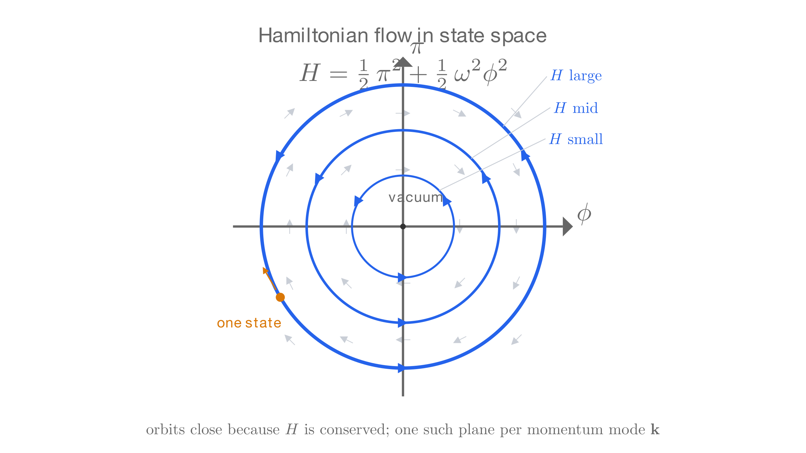

# Quantum Field Theory: Action and Lagrangians

This page continues from [Quantum Field Theory](qft.md). The promoted operators there have their duties assigned, but the theory still needs its dynamics: an algebra for the operators and a Hamiltonian to generate evolution. The classical machinery that supplies both is the principle of least action, taken from particles and extended to fields. The page ends by reading a Lagrangian density off each row of the field table, and the Klein–Gordon equation, Maxwell's equations, and the Dirac equation come out as Euler–Lagrange equations of those densities.

## Principle of Least Action

The [previous page](qft.md) never needed one more piece of classical machinery, but this one does. [Classical Mechanics §2](classical-mechanics.md#_2-lagrangian-and-the-euler-lagrange-derivation) reframed dynamics as optimization: to every path $q(t)$ between fixed endpoints in time it attaches the **action**

$$S[q] = \int_{t_1}^{t_2} L(q, \dot q)\,dt, \qquad L = T - V,$$

and demands that the true path leave $S$ stationary against every variation that leaves the endpoints fixed. The variation itself took two lines. We perturb the path by a small function that vanishes at the endpoints, expand to first order, and integrate the velocity term by parts; the boundary term dies because the perturbation dies at the endpoints. Demanding that the remainder vanish for every perturbation leaves the Euler–Lagrange equation,

$$\frac{d}{dt}\,\frac{\partial L}{\partial \dot q} - \frac{\partial L}{\partial q} = 0,$$

which is Newton's law in disguise, and the disguise matters. The Newtonian formulation names a force and a coordinate, while the Lagrangian formulation names only a scalar $L$, and the equation of motion follows mechanically. Nothing in the input refers to vectors, forces, or geometry. A formulation that thin transfers to relativity unchanged, and that is exactly what this page needs it for: the promoted theory requires a Hamiltonian, the generator whose commutators defined conservation back in [The Dirac Equation §2](dirac-equation.md#_2-conservation-and-commutators) and the thing the negative-energy crisis of [Relativistic QM §3](relativistic-qm.md#_3-negative-energy-and-probability) is about. The Hamiltonian comes from $L$.

### From particles to fields

The upgrade to a field changes the integration variable, and that is all it changes. Mechanics solved for $q(t)$, a function of time only, the position of the one unknown. A field solves for the value at every point: in $\phi(t, \mathbf x)$ the $\mathbf x$ is not an unknown but a fixed address, one degree of freedom per point of space. The configuration at one instant is the whole function. What gets integrated is therefore not a function of time but a **Lagrangian density** $\mathcal{L}(\phi, \partial_\mu\phi)$ over all of spacetime,

$$S[\phi] = \int d^4x\;\mathcal{L}(\phi, \partial_\mu\phi),$$

Run the variation in full once, because the field version adds one structural step. Perturb the field by a small function $\delta\phi(x)$ that vanishes on the boundary of the spacetime region: the fixed endpoints of mechanics become a fixed initial configuration, a fixed final configuration, and decay far enough away in space. To first order in the perturbation, the chain rule gives

$$\delta S = \int d^4x\left[\frac{\partial\mathcal{L}}{\partial\phi}\,\delta\phi + \frac{\partial\mathcal{L}}{\partial(\partial_\mu\phi)}\,\partial_\mu(\delta\phi)\right].$$

The second term still differentiates the perturbation, and the derivative must come off it. Integrate that term by parts in each of the four directions; every pass leaves a total divergence $\partial_\mu(\,\cdot\,\delta\phi)$, which integrates to a surface term over the boundary, and the surface term dies because $\delta\phi$ dies there. What remains is

$$\delta S = \int d^4x\left[\frac{\partial\mathcal{L}}{\partial\phi} - \partial_\mu\left(\frac{\partial\mathcal{L}}{\partial(\partial_\mu\phi)}\right)\right]\delta\phi.$$

For the particle, the bracket had to vanish at each time, because $\delta q(t)$ was arbitrary at each time. The same demand now runs point by point through space: $\delta\phi$ may perturb one address of the field while leaving all its neighbors fixed, so the bracket must vanish at every point of spacetime,

$$\partial_\mu\left(\frac{\partial\mathcal{L}}{\partial(\partial_\mu\phi)}\right) - \frac{\partial\mathcal{L}}{\partial\phi} = 0,$$

the Euler–Lagrange equation for a field: the particle's equation with the time derivative grown into a four-dimensional divergence.

The gain from the principle is exactly what the field classification needed: Lorentz invariance built into the derivation rather than checked afterward. Let $\mathcal{L}$ be a Lorentz scalar built from the field and its derivatives. The action is then a single number that every observer agrees on, the stationary configuration cannot depend on a frame, and the equation that comes out is automatically covariant. Each row of the table's wave equations is the Euler–Lagrange equation of the simplest invariant density its field admits: the scalar's $\mathcal{L} = \tfrac{1}{2}\,(\partial_\mu\phi)(\partial^\mu\phi) - \tfrac{m^2}{2\hbar^2}\,\phi^2$ gives the Klein–Gordon equation, the vector's $\mathcal{L} = -\tfrac{1}{4}F^{\mu\nu}F_{\mu\nu}$ gives Maxwell with the massless term, and the spinor's $\mathcal{L} = \bar\psi\,(i\hbar\gamma^\mu\partial_\mu - m)\,\psi$ gives the Dirac equation. The "essentially unique" of the [Fields section](qft.md#fields) becomes a computation here: write down the simplest scalar density the representation allows, and the wave equation of that row falls out.

The Hamiltonian is extracted the same way as in [Classical Mechanics §3](classical-mechanics.md#_3-hamiltonian-and-state-space), with one conjugate momentum per field, $\pi(t, \mathbf x) = \partial\mathcal{L}/\partial\dot\phi$, and the density

$$\mathcal{H} = \pi\,\dot\phi - \mathcal{L}, \qquad \hat H = \int d^3x\;\mathcal{H},$$

which is the total energy that the quantum theory will inherit as its operator. Here the tension that the [Fields section](qft.md#fields) exposed comes to a head, and it needs an honest statement: the asymmetry between $t$ and $\mathbf x$ is real, and the Hamiltonian framework is built on it by design. A state is "the condition of the whole system at an instant," and an initial-value problem needs a *now*. No Lorentz-invariant object supplies one, because a boost tilts every slicing of spacetime into a different one. The covariant statement of the theory survives intact: the field equation stays symmetric in $t$ and $\mathbf x$, with one operator $\Box$ and no distinguished time, and the action is a Lorentz scalar with $t$ and $\mathbf x$ living inside a single $d^4x$. The Hamiltonian is what that statement yields after one slicing is chosen; the definition $\pi = \partial\mathcal{L}/\partial\dot\phi$ already picks out a frame's time derivative. Each inertial observer slices the same solution differently and reads off a different pair $(\phi, \pi)$. A change of frame is a rotation of axes in spacetime, like viewing one scene from different photographs, and covariance means the physics lives in the scene rather than in any photograph. The split is bookkeeping, exactly as with the two pictures, and both readings come from the same $\mathcal{L}$.

### The geometry of H

[Classical Mechanics §3](classical-mechanics.md#_3-hamiltonian-and-state-space) named the arena **state space**: a system's entire condition at one instant is one point of it, and dynamics is the path that point traces. For a field the point is heavier. The mechanical pair $(q, p)$ becomes the pair of functions $(\phi, \pi)$, one $q$ and one $p$ per point of space, with $\pi = \partial\mathcal{L}/\partial\dot\phi$ the field version of $p = \partial L/\partial\dot q$. Freeze $t$ and both become functions of $\mathbf x$ alone; that pair $(\phi(\mathbf x), \pi(\mathbf x))$ is one state, the whole configuration at that instant. The space of all such pairs is infinite-dimensional, and a classical history of the field is a curve in it. What moves the point along the curve is $H$, a single scalar on state space, $H = \int d^3x\,\mathcal{H}$: a number attached to every state, the energy. At every point it assigns a direction, the direction the state must next flow. Hamilton's equations state that direction coordinate by coordinate, $\dot\phi = \delta H/\delta\pi$ and $\dot\pi = -\delta H/\delta\phi$, with functional derivatives in place of partial ones and the mechanical equations unchanged in form. Nothing else enters the theory: there is no force and no law beyond the flow that $H$ assigns. The physical histories of the field are the flow lines, so determinism here is geometric: one point determines one arrow, and one arrow determines one curve.

Two readings of $H$ fall out of the flow, and the quantum theory will inherit both. $H$ is the **energy**: a density with no explicit time dependence keeps $H$ constant along its own flow, because the curve never changes the value of the function that steers it. Conservation is thereby stated as geometry. $H$ is also the **generator of time translations**: flowing along the arrows is what moving forward in time means on state space, which is the Noether statement that the symmetry "shift $t$" is carried by the charge $\int d^3x\,\mathcal{H}$. The operator version of the second reading is already on the page: $\hat\phi(t) = e^{i\hat H t/\hbar}\,\hat\phi(0)\,e^{-i\hat H t/\hbar}$, the Heisenberg formula of the [Fields section](qft.md#fields), is conjugation by the generator, the quantum version of flowing along the classical arrows.

The flow has an algebra, and the algebra is the hinge to the quantum theory. [Classical Mechanics §4](classical-mechanics.md#_4-the-poisson-bracket) paired any two observables on state space with a bracket $\{\cdot, \cdot\}$, which measures how the flow generated by one displaces the other, and compressed the dynamics to a single line, $\dot F = \{F, H\}$. [First Quantization](first-quantization.md) then fixed the bracket's quantum replacement, $\{\cdot, \cdot\} \to \tfrac{1}{i\hbar}[\hat{\cdot}, \hat{\cdot}]$, a rule whose one known case was $\{x, p\} = 1 \to [\hat x, \hat p] = i\hbar$. Running the rule on the field, where $\phi$ and $\pi$ are conjugate at every point of space, answers the algebra question that the [previous page](qft.md) opened with: $[\hat\phi(t, \mathbf x), \hat\pi(t, \mathbf x')] = i\hbar\,\delta^3(\mathbf x - \mathbf x')$, and mode by mode, with each momentum $\mathbf k$ of the free field an oscillator on its own, the oscillator algebra $[\hat a(\mathbf k), \hat a^\dagger(\mathbf k')] \propto \delta^3(\mathbf k - \mathbf k')$. These are the commutators that the promotion's operators will turn out to obey, so the construction to come does not choose this algebra; it confirms it. The half-integer rows will rerun the passage with the bracket's graded replacement, which is where the choice reopens and the spin-statistics question of the previous page is settled.

## Lagrangians of QFT

### Klein Gordon

The simplest relativistic field is a scalar field $\phi(x)$, uncharged and massive. Its Lagrangian density is

$$\mathcal{L} = \frac{1}{2}(\partial_\mu\phi)(\partial^\mu\phi) - \frac{m^2}{2\hbar^2}\phi^2,$$

where the first term is the kinetic density and the second the mass term. The notation is compact, so expand it with indices,

$$(\partial_\mu\phi)(\partial^\mu\phi) = \sum_{\mu=0}^{3} \partial_\mu\phi\,\partial^\mu\phi,$$

then recall from [Special Relativity §6](special-relativity.md#_6-metric-tensor-covariance-and-contravariance) that $\partial^\mu = g^{\mu\nu}\partial_\nu$ where $g^{\mu\nu} = \text{diag}(1, -1, -1, -1)$ is the Minkowski metric. Write out the sum explicitly: with $\partial_0 = \partial_t$ and $\partial_i = \partial_{x^i}$ for $i=1,2,3$,

$$(\partial_\mu\phi)(\partial^\mu\phi) = (\partial_t\phi)(\partial_t\phi) + (\partial_1\phi)(-\partial_1\phi) + (\partial_2\phi)(-\partial_2\phi) + (\partial_3\phi)(-\partial_3\phi) = \dot\phi^2 - (\nabla\phi)^2,$$

combining the spatial derivatives into the squared gradient.

To find the equation of motion, apply the Euler–Lagrange formula,

$$\partial_\mu\left(\frac{\partial\mathcal{L}}{\partial(\partial_\mu\phi)}\right) - \frac{\partial\mathcal{L}}{\partial\phi} = 0.$$

For the gradient derivative, expand $(\partial^\mu\phi) = g^{\mu\nu}\partial_\nu\phi$ so that the kinetic term is built from one kind of object, then differentiate by the product rule. The rule gives two terms, and they are equal because $g^{\mu\nu}$ is symmetric:

$$\frac{\partial\mathcal{L}}{\partial(\partial_\mu\phi)} = \frac{1}{2}\,g^{\mu\nu}\partial_\nu\phi + \frac{1}{2}\,g^{\nu\mu}\partial_\nu\phi = g^{\mu\nu}\partial_\nu\phi = \partial^\mu\phi.$$

The tempting shortcut treats $\partial_\mu\phi$ and $\partial^\mu\phi$ as independent variables, so that only one product term survives. It fails, because the metric ties them together and both terms count. The factor of two is what the kinetic term's $\tfrac{1}{2}$ is there to cancel.

The mass term carries no derivatives, so this is the whole gradient derivative. Now apply $\partial_\mu$, the divergence in spacetime:

$$\partial_\mu\left(\frac{\partial\mathcal{L}}{\partial(\partial_\mu\phi)}\right) = \partial_\mu\partial^\mu\phi = \Box\phi = \ddot\phi - \nabla^2\phi,$$

with $\Box = \partial_\mu\partial^\mu = \partial_t^2 - \nabla^2$ the **d'Alembertian**[^square-vs-iterate], the four-dimensional Laplacian of Minkowski space.

[^square-vs-iterate]: $\ddot\phi - \nabla^2\phi$ here is not the kinetic density $\dot\phi^2 - (\nabla\phi)^2$ above, though the notation rhymes. A superscript $2$ on a value squares it: $(\nabla\phi)^2 = \nabla\phi\cdot\nabla\phi$, first derivatives multiplied together; on an operator it iterates: $\nabla^2\phi = \nabla\cdot(\nabla\phi)$, a second derivative applied once. The kinetic density is the input to the Euler–Lagrange step, and $\Box\phi$ is what comes out.

Next, the derivative with respect to $\phi$ itself,

$$\frac{\partial\mathcal{L}}{\partial\phi} = -\frac{m^2}{\hbar^2}\phi.$$

Substituting into the Euler–Lagrange equation,

$$\Box\phi + \frac{m^2}{\hbar^2}\phi = 0,$$

which is the **Klein–Gordon equation**, the simplest relativistic wave equation for a scalar field. [Relativistic QM §2](relativistic-qm.md#_2-klein-gordon) met it already and rejected it as a single-particle wave equation. The equation is second order in time and space alike, because both derivatives are squared inside the d'Alembertian $\Box$, so initial data for $\phi$ and $\dot\phi$ at one time determines the solution everywhere, and disturbances propagate within the light cone.

### Maxwell

The table's second row is the vector, the four-potential $A^\mu(x)$, which is massless. Its density is built from the field tensor of [Special Relativity §8](special-relativity.md#_8-maxwell-equations) rather than from $A^\mu$ directly:

$$\mathcal{L} = -\frac{1}{4}\,F_{\mu\nu}F^{\mu\nu}, \qquad F_{\mu\nu} = \partial_\mu A_\nu - \partial_\nu A_\mu.$$

The density has one term, which is purely kinetic. The scalar's mass term has no counterpart here, and the computation below will show the gap as the exact slot where one would sit.

The Euler–Lagrange formula runs on the four components $A_\nu$ of the potential. Its first input is the derivative with respect to $\partial_\mu A_\nu$, and the chain rule makes each of the two $F$ factors contribute:

$$\frac{\partial\mathcal{L}}{\partial(\partial_\mu A_\nu)} = -\frac{1}{4}\left[\frac{\partial F_{\rho\sigma}}{\partial(\partial_\mu A_\nu)}\,F^{\rho\sigma} \;+\; F_{\rho\sigma}\,\frac{\partial F^{\rho\sigma}}{\partial(\partial_\mu A_\nu)}\right].$$

Both component derivatives are built from deltas, and the first deserves its mechanics spelled out, since differentiating through an index structure is new. The variable is the collection $\partial_\mu A_\nu$ of sixteen independent numbers, and $F_{\rho\sigma} = \partial_\rho A_\sigma - \partial_\sigma A_\rho$ contains exactly two of them: its own $(\rho, \sigma)$ entry with coefficient $+1$ and its transposed $(\sigma, \rho)$ entry with coefficient $-1$. Asking how $F_{\rho\sigma}$ responds to a change in the one entry $\partial_\mu A_\nu$ therefore has a three-way answer: $+1$ when $(\mu, \nu) = (\rho, \sigma)$, $-1$ when $(\mu, \nu) = (\sigma, \rho)$, and $0$ otherwise. Kronecker deltas pack the three cases into one formula, because $\delta^\mu_\rho\,\delta^\nu_\sigma$ equals $1$ only when both indices match, which happens only in the first case, and $\delta^\mu_\sigma\,\delta^\nu_\rho$ only in the second:

$$\frac{\partial F_{\rho\sigma}}{\partial(\partial_\mu A_\nu)} = \delta^\mu_\rho\,\delta^\nu_\sigma - \delta^\mu_\sigma\,\delta^\nu_\rho.$$

A concrete check: with $(\rho, \sigma) = (0, 1)$, the component $F_{01} = \partial_0 A_1 - \partial_1 A_0$ responds to $\partial_0 A_1$ with $+1$, to $\partial_1 A_0$ with $-1$, and to every other entry with $0$, which is exactly what the delta combination returns. Differentiating the raised-index copy gives the same deltas with indices raised, because the constant metric does nothing but raise indices,

$$\frac{\partial F^{\rho\sigma}}{\partial(\partial_\mu A_\nu)} = g^{\rho\mu}\,g^{\sigma\nu} - g^{\rho\nu}\,g^{\sigma\mu}.$$

Each delta combination contracts one antisymmetric pair against another. The first gives

$$(\delta^\mu_\rho\,\delta^\nu_\sigma - \delta^\mu_\sigma\,\delta^\nu_\rho)\,F^{\rho\sigma} = F^{\mu\nu} - F^{\nu\mu} = 2F^{\mu\nu},$$

and the second acts identically on the lowered copy,

$$F_{\rho\sigma}\,(g^{\rho\mu}\,g^{\sigma\nu} - g^{\rho\nu}\,g^{\sigma\mu}) = F^{\mu\nu} - F^{\nu\mu} = 2F^{\mu\nu},$$

the antisymmetry turning each difference into a double. Substituting both,

$$\frac{\partial\mathcal{L}}{\partial(\partial_\mu A_\nu)} = -\frac{1}{4}\,\big[2F^{\mu\nu} + 2F^{\mu\nu}\big] = -F^{\mu\nu}.$$

The formula's second input is the derivative with respect to $A_\nu$ itself. Every factor of the density is built from derivatives of the potential, so this derivative vanishes:

$$\frac{\partial\mathcal{L}}{\partial A_\nu} = 0.$$

The vanishing is the empty slot promised above: a mass term, the vector analogue of the scalar's $-\tfrac{m^2}{2\hbar^2}\phi^2$, would contribute exactly here, and the density has none.

Recall the formula and substitute both inputs,

$$\partial_\mu\left(\frac{\partial\mathcal{L}}{\partial(\partial_\mu A_\nu)}\right) - \frac{\partial\mathcal{L}}{\partial A_\nu} \;=\; \partial_\mu\big(-F^{\mu\nu}\big) - 0 \;=\; 0.$$

The second term is the empty slot, zero by the vanishing shown above. The first carries only a constant overall sign, and the linearity of $\partial_\mu$ lets it pass through:

$$\partial_\mu F^{\mu\nu} = 0,$$

which is [§8](special-relativity.md#_8-maxwell-equations)'s $\partial_\mu F^{\mu\nu} = J^\nu$ with the current set to zero: the $\nu = 0$ component is Gauss's law, and the $\nu = 1, 2, 3$ components are the three space components of Ampère's law.

### Dirac

The table's third row is the **spinor**, a field $\psi(x)$ that transforms by $S(\Lambda)$ ([§5](dirac-equation.md#_5-spinors-transformations)). It is massive and charged, and its four complex components carry over from [The Dirac Equation](dirac-equation.md). The word needs an introduction: *scalar* and *vector* belong to school mathematics, but *spinor* was invented for exactly this object, as *spin* plus the *-or* of vector and tensor. Ehrenfest coined the word in 1928, and van der Waerden's spinor analysis (1929) made it standard. In the table, spin is the output: one transformation law gives one spin. The actual order of discovery was the reverse: spin came first, in the spectroscopy of 1925, and the transformation law was built to carry it.

A Lagrangian density pairs the field with itself, and the pairing must be a Lorentz scalar for the action to be frame-independent. The plain dagger contraction $\psi^\dagger\psi$ is the natural candidate, so the first task is to test it against a change of frame.

The spinor transforms as $\psi'(x') = S(\Lambda)\,\psi(x)$, so the plain contraction transforms as

$$\psi'^\dagger\,\psi' = \psi^\dagger\,S^\dagger S\,\psi,$$

and for this to equal $\psi^\dagger\psi$ in every frame, $S$ would have to be unitary. The spinor representation of the Lorentz group is not. Rotations are represented unitarily because the rotation parameter is an angle, and angles are periodic: compose enough copies of a rotation and you return to the identity. The matrix is $S = e^{-i\theta\Sigma/2}$[^op-exp], the same construction as the time-evolution operator $e^{-i\hat Ht/\hbar}$ of [First Quantization](first-quantization.md): the exponential of $i$ times a Hermitian generator. An exponential of that form is unitary, because daggering flips the sign of the $i$, so the dagger of the matrix carries the opposite exponent, which is its inverse: $(e^{-i\theta\Sigma/2})^\dagger = e^{+i\theta\Sigma/2} = (e^{-i\theta\Sigma/2})^{-1}$, and $S^\dagger S = 1$. Boost parameters are not periodic: composing two boosts adds their rapidities, and no finite rapidity reproduces the identity, so the periodicity argument does not carry over.

Since [§5](dirac-equation.md#_5-spinors-transformations) sits several sections back, recall what $S$ is: the matrix of numbers that carries the spinor's four components between frames, $\psi'(x') = S(\Lambda)\,\psi(x)$, which is the spinor's counterpart of the matrix $\Lambda^\mu{}_\nu$ acting on vectors. The rotation above was its matrix for a rotated frame; along one axis, a boosted frame acts on the spinor as

$$S = \cosh\frac{\varphi}{2} - \alpha^1\sinh\frac{\varphi}{2} = e^{-\varphi\alpha^1/2},$$

with $\alpha^1 = \gamma^0\gamma^1$ and $\tanh\varphi = v$.

Both pieces of the display come out of [§5](dirac-equation.md#_5-spinors-transformations)'s general formula, $S(\Lambda) = \exp(-\frac{i}{4}\omega_{\mu\nu}\sigma^{\mu\nu})$; that page's extra subsection runs the collapse from $\omega_{01}$ and $\sigma^{01}$ to the exponential and unpacks the power series, so this section quotes the result.

The exponential is the rotation's with the $i$ missing: the exponent is Hermitian, not anti-Hermitian, with the real eigenvalues $\pm\varphi/2$ in place of imaginary ones, so $S$ is Hermitian rather than unitary, $S^\dagger S = S^2 = e^{-\varphi\alpha^1} \neq 1$, and $\psi^\dagger\psi$ takes different values in different frames. In the single-particle theory it was the probability density, and densities are not invariants: a boost dilates them.

[^op-exp]: The exponential of an operator is defined by the same power series as the number: $e^A = 1 + A + A^2/2! + A^3/3! + \cdots$. Two properties follow from the series, and both use the fact that $A$ commutes with every power of itself. Multiplying the two series term by term gives $e^A e^{-A} = 1$, so $e^{-A}$ is the inverse of $e^A$. Daggering term by term gives $(e^A)^\dagger = e^{A^\dagger}$, so for $A = -i\theta\Sigma/2$ with $\Sigma$ Hermitian, $A^\dagger = -A$ and $(e^A)^\dagger = e^{-A} = (e^A)^{-1}$, which is the unitarity used in the text.

The pairing is repaired by inserting $\gamma^0$ between the two factors, which defines the **adjoint** $\bar\psi = \psi^\dagger\gamma^0$. The transformed adjoint follows from one identity,

$$S^\dagger\,\gamma^0 = \gamma^0\,S^{-1}:$$

rotations satisfy it because they are unitary and commute with $\gamma^0$, and boosts satisfy it because $\gamma^0$ anticommutes with $\alpha^1$, so conjugation flips the sign of the exponent, $\gamma^0 S \gamma^0 = S^{-1}$, while Hermiticity makes the dagger redundant, $S^\dagger = S$. The adjoint therefore transforms as

$$\bar\psi' = \psi'^\dagger\gamma^0 = \psi^\dagger S^\dagger\gamma^0 = \bar\psi\,S^{-1},$$

and the contraction comes out invariant,

$$\bar\psi'\,\psi' = \bar\psi\,S^{-1}S\,\psi = \bar\psi\,\psi.$$

The inserted $\gamma^0$ is the spinor's metric: as $g^{\mu\nu}$ pairs $\partial_\mu\phi$ with $\partial^\mu\phi$ into a scalar, $\gamma^0$ converts $\psi^\dagger$ into the object $\bar\psi$ whose pairing with $\psi$ gives the same number in every frame.

With the invariant pairing in hand, the density is
$$\mathcal{L} = \bar\psi\,(i\hbar\,\gamma^\mu\partial_\mu - m)\,\psi = i\hbar\,\bar\psi\gamma^\mu\,\partial_\mu\psi - m\,\bar\psi\psi,$$

with the kinetic density first and the mass term second. The kinetic contraction carries no metric to expand, unlike the scalar's $(\partial_\mu\phi)(\partial^\mu\phi)$: the $\gamma^\mu$ themselves transform as a vector ([§5](dirac-equation.md#_5-spinors-transformations)), so $\gamma^\mu\partial_\mu$ is a direct vector-on-covector contraction with the metric pre-absorbed in the matrices,

$$i\hbar\,\gamma^\mu\partial_\mu\psi = i\hbar\,(\gamma^0\,\partial_t + \gamma^1\,\partial_{x^1} + \gamma^2\,\partial_{x^2} + \gamma^3\,\partial_{x^3})\,\psi,$$

and no sign flip appears on the spatial terms.

Every term of the density is of the form $\bar\psi(\cdots)\psi$: the kinetic term pairs $\bar\psi$ with $\gamma^\mu\partial_\mu\psi$, and the mass term pairs it with $\psi$ itself. Only $\bar\psi$-pairings give Lorentz scalars, and the action must be a scalar for the least-action principle to be frame-independent, so the invariant pairing is what makes both terms admissible. That is the adjoint's whole job, finished before the variation starts; what follows is pure mechanics.

The Euler–Lagrange formula applies to each component of each input, and the density has two inputs, $\psi$ and $\bar\psi$. Varying them independently looks illegal, because one is built from the other, but it is the variational principle's standing bookkeeping. [Classical Mechanics §2](classical-mechanics.md#_2-lagrangian-and-the-euler-lagrange-derivation) already treated $q$ and $\dot q$ as separate coordinates of $\mathcal{L}(q, \dot q)$ even though a derivative ties them together. For a complex field the same freedom appears as independence of value and conjugate, since the real and imaginary parts are the true independent data.

Vary $\bar\psi$ first. No term of $\mathcal{L}$ contains a derivative of $\bar\psi$, so the $\partial_\mu(\cdot)$ piece of the formula is empty before it starts, and the equation reduces to the algebraic statement

$$\frac{\partial\mathcal{L}}{\partial\bar\psi} = (i\hbar\,\gamma^\mu\partial_\mu - m)\,\psi = 0,$$

which is the **Dirac equation**, obtained with none of the previous sections' work: no metric expansion and no product rule. The reason is that the equation is first order in the derivatives. The kinetic density is linear in $\partial_\mu\psi$, so the variation takes a coefficient rather than opening a square.

Now vary $\psi$, which is where the derivatives live. The kinetic term's derivative is its coefficient; the dependence is linear again, so no factor of two appears and there is no $\tfrac12$ to cancel:

$$\frac{\partial\mathcal{L}}{\partial(\partial_\mu\psi)} = i\hbar\,\bar\psi\gamma^\mu, \qquad\qquad \frac{\partial\mathcal{L}}{\partial\psi} = -m\,\bar\psi.$$

Feed both derivatives into the formula and apply $\partial_\mu$. The $\gamma^\mu$ are constant matrices, so the product rule passes through them:

$$i\hbar\,(\partial_\mu\bar\psi)\,\gamma^\mu + m\,\bar\psi = 0,$$

which is the **adjoint equation**. It is not new physics but the Dirac equation's conjugate, which we could obtain by daggering the equation and multiplying by $\gamma^0$; here it arrives on its own, as the second variation's output, mirroring the first's.

The equation is first order in time and space alike, which was the demand of [Relativistic QM §4](relativistic-qm.md#_4-dirac-equation): covariance forces space to enter at the same order as time. The initial data is therefore $\psi$ at one instant alone, with no $\dot\psi$ beside it. This is the factoring of the Klein–Gordon operator that [The Dirac Equation](dirac-equation.md) performed, recovered as the shape of the density.
