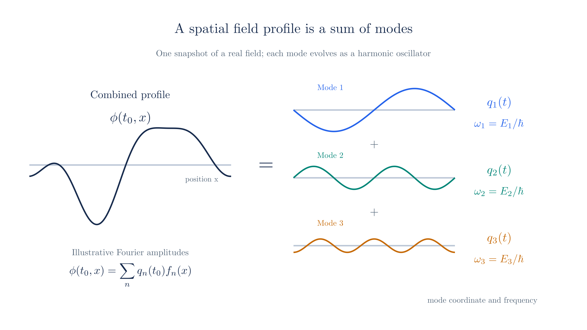
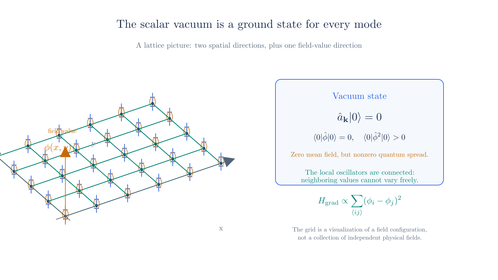
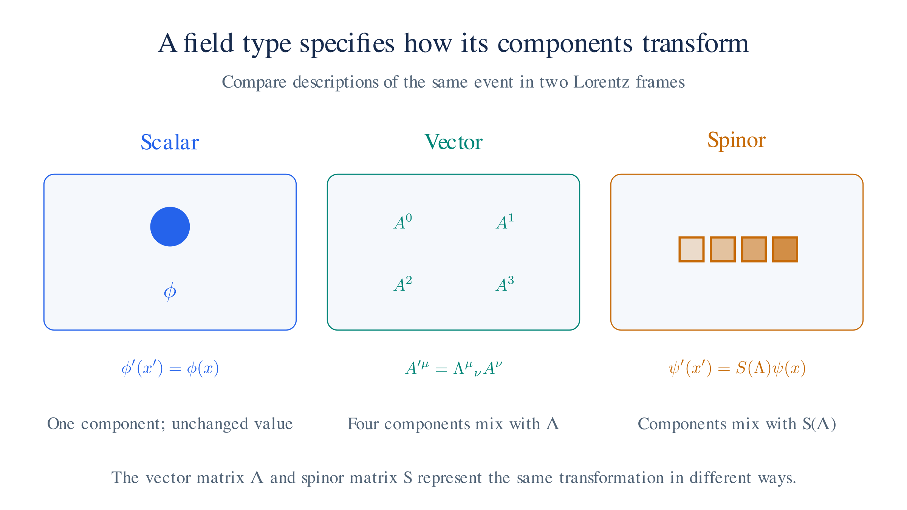
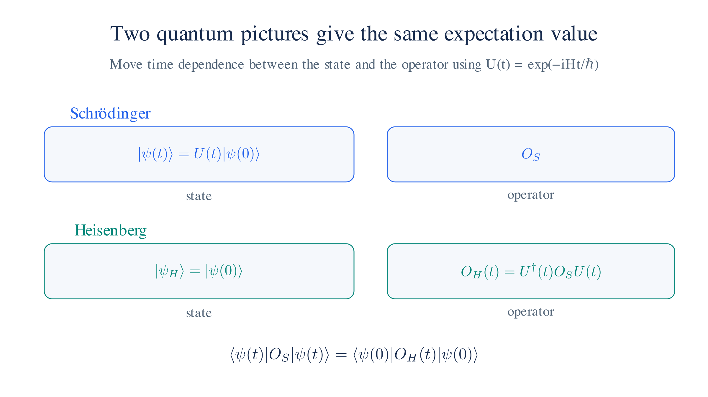
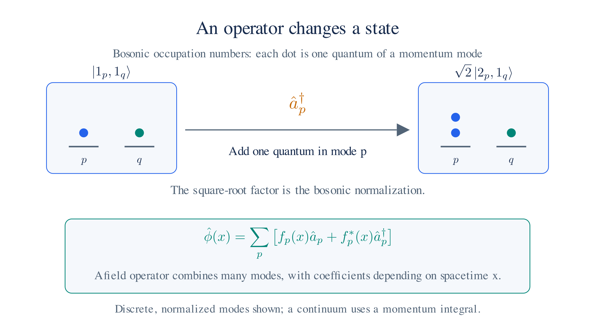

# Quantum Field Theory: Fields and Quanta

A single-particle wave function cannot describe pair creation or annihilation. To continue from [The Dirac Equation](dirac-equation.md), we therefore introduce **field operators**: operators assigned to spacetime points that act on states with different particle numbers.

For the electron field, these operators remove electrons and create positrons. This gives the negative-frequency solutions a precise role without a filled sea of negative-energy electrons.

## Spacetime, components, and value spaces

Expand the notation

Before discussing particular fields, it is useful to distinguish the point at
which a field is evaluated from the kind of object the field returns. A
spacetime point is

$$x=(x^0,x^1,x^2,x^3)=(t,\mathbf x)\in\mathbb R^{1,3}.$$

The superscripts on $x^\mu$ label spacetime components; they are not powers.
A classical field is a function of $x$ whose values transform in some
representation of the Lorentz group:

| Field | Mathematical type before quantization | Components at each $x$ | Spin |
| --- | --- | --- | --- |
| real scalar $\phi(x)$ | $\mathbb R^{1,3}\to\mathbb R$ | one real number | $0$ |
| complex scalar $\phi(x)$ | $\mathbb R^{1,3}\to\mathbb C$ | one complex number, or two real numbers | $0$ |
| vector $A^\mu(x)$ | $\mathbb R^{1,3}\to\mathbb R^{1,3}$ | four-vector | $1$ |
| Dirac spinor $\psi(x)$ | $\mathbb R^{1,3}\to\mathbb C^4$ | four spinor components | $\tfrac12$ |

In this text, $\phi$ and $\varphi$ denote scalar fields or scalar field configurations, while $\psi$ denotes a fermion (spinor) field. The change from $\phi$ to $\varphi$ is notation, not a change of field type; $\varphi(\mathbf x)$ specifically denotes a spatial configuration at fixed time in the canonical discussion below.

The four components of $\psi$ belong to **spinor space** $\mathbb C^4$;
they are not the four spacetime components labelled by $\mu=0,1,2,3$.
The matrices $\gamma^\mu$ act on those spinor components and carry a
spacetime index so that $\gamma^\mu\partial_\mu\psi$ transforms as a
spinor. Likewise, a vector's four entries are spacetime components, and
raising or lowering its index uses the Minkowski metric.

A **field value** is the value of a field at one point, such as $\phi(x)$.
A **field configuration** is an entire assignment of field values over a
region. In the canonical picture, a configuration on the time slice $t$ is
often written

$$\varphi(\mathbf x)=\phi(t,\mathbf x),$$

so $\varphi$ is one point in an infinite-dimensional configuration space:
each possible function $\mathbf x\mapsto\varphi(\mathbf x)$ is a different
configuration. A wave functional $\Psi[\varphi]$ assigns an amplitude to
such a whole configuration, just as an ordinary wave function assigns an
amplitude to a particle position. In a path integral, one instead sums over
whole spacetime configurations $x\mapsto\phi(x)$.

After quantization, the fields acquire hats when useful in the notation:
$\hat\phi(x)$, $\hat A^\mu(x)$, and $\hat\psi(x)$ are operator-valued
distributions acting on a Hilbert (usually Fock) space of states. Their
spacetime labels and component spaces remain the same, but their values are
operators rather than ordinary numbers. Quantum fields are formally written
at spacetime points, but mathematically they are operator-valued
distributions. To obtain well-defined operators, we average them over a
finite region using a smooth test function. For example,

$$\hat\phi(f)=\int d^4x\,f(x)\hat\phi(x).$$

Real detectors likewise have finite spatial and temporal resolution, so this
smearing reflects physical measurement rather than a limitation of the
theory.

## Recap of Dirac Equation

The free Dirac solution is a sum of plane waves. At each momentum and spin, $a_s(p)$ multiplies a positive-frequency $u$ solution and $b_s^*(p)$ a negative-frequency $v$ solution. These coefficients are still numbers: they specify a classical field and cannot yet remove or add a particle.

The classical mode expansion

Start with the general free solution from [The Dirac Equation §6](dirac-equation.md#_6-general-solution):

$$\psi(x) = \sum_{s=1}^{2} \int \frac{d^3p}{(2\pi\hbar)^3}\,\frac{1}{\sqrt{2E_p}}\left[a_s(p)\,u_s(p)\,e^{-ip\cdot x/\hbar} + b_s^*(p)\,v_s(p)\,e^{+ip\cdot x/\hbar}\right],$$

Here $p\cdot x = E_p t - \mathbf p\cdot\mathbf x$ and $E_p = \sqrt{\mathbf p^2 + m^2}$. The index $s$ labels the two spin states. The coefficients $a_s(p)$ and $b_s^*(p)$ are complex amplitudes fixed by the initial field.

The $u$-terms have positive frequency; the $v$-terms have negative frequency. [§3](dirac-equation.md#_3-antiparticles) related the second family to antiparticles, and [§4](dirac-equation.md#_4-negative-energy-solutions) introduced the historical hole interpretation. We will now describe both families with operators.

### The promotion

To describe changing particle numbers, replace the numerical amplitudes by operators. This implements the step discussed in [§4](dirac-equation.md#_4-negative-energy-solutions) and proposed after the general solution in [§6](dirac-equation.md#_6-general-solution):

$$a_s(p) \to \hat a_s(p), \qquad b_s^*(p) \to \hat b_s^\dagger(p),$$

The operator $\hat a_s(p)$ removes an electron of momentum $\mathbf p$ and spin label $s$. The operator $\hat b_s^\dagger(p)$ creates a positron with those labels.

For operators, the counterpart of complex conjugation is the **adjoint**, denoted by $\dagger$. This explains the notation $b_s^*$ in [§6](dirac-equation.md#_6-general-solution): after quantization it becomes $\hat b_s^\dagger$. The expansion is now

$$\hat\psi(x) = \sum_{s=1}^{2} \int \frac{d^3p}{(2\pi\hbar)^3}\,\frac{1}{\sqrt{2E_p}}\left[\hat a_s(p)\,u_s(p)\,e^{-ip\cdot x/\hbar} + \hat b_s^\dagger(p)\,v_s(p)\,e^{+ip\cdot x/\hbar}\right],$$

This is the **electron field operator**. Split it into its positive- and negative-frequency parts, $\hat\psi = \hat\psi^{(+)} + \hat\psi^{(-)}$. Taking the adjoint reverses the phases and exchanges creation with annihilation:

| field term | operator | plane wave | action |
| --- | --- | --- | --- |
| $\hat\psi^{(+)}$ (positive frequency) | $\hat a_s(p)$ | $e^{-ip\cdot x/\hbar}$ | annihilates an electron |
| $\hat\psi^{(-)}$ (negative frequency) | $\hat b_s^\dagger(p)$ | $e^{+ip\cdot x/\hbar}$ | creates a positron |
| $\hat\psi^{(+)\dagger}$ | $\hat a_s^\dagger(p)$ | $e^{+ip\cdot x/\hbar}$ | creates an electron |
| $\hat\psi^{(-)\dagger}$ | $\hat b_s(p)$ | $e^{-ip\cdot x/\hbar}$ | annihilates a positron |

**The phase determines the energy change.** A **matrix element** $\langle f|\hat\psi|i\rangle$ is the component of $\hat\psi|i\rangle$ along a chosen final state $|f\rangle$. It measures how the field connects the two states.

The factor $e^{-iE_pt/\hbar}$ accompanies a decrease in energy by $E_p$; the opposite factor accompanies an increase. Negative frequency therefore does not imply that the created particle has negative energy.

Relating the phase to the energy change

For energy eigenstates, Heisenberg evolution gives this matrix element a time factor $e^{i(E_f-E_i)t/\hbar}$. Compare that with the factor $e^{-iE_p t/\hbar}$ multiplying $\hat a_s(p)$. A nonzero contribution requires $E_f-E_i=-E_p$, so this operator lowers the energy by $E_p$. Matching the spatial phases likewise shows that it removes momentum $\mathbf p$.

The opposite phase, $e^{+ip\cdot x/\hbar}$, corresponds to adding energy $E_p$ and momentum $\mathbf p$. This is why its coefficient is a creation operator. To identify each added quantum as a particle, we still have to construct the Hamiltonian and its spectrum.

The phases determine whether an operator creates or annihilates. The species labels follow the convention in [The Dirac Equation](dirac-equation.md): the $u$-family describes electrons and the $v$-family describes positrons.

Both the field and its adjoint contain creation and annihilation terms. We retain the negative-frequency solutions, but use them to create positive-energy antiparticles.

### Particles as field excitations

For a free field, decompose a spatial configuration into independent wave
modes. A mode is one wave pattern, labeled by momentum $\mathbf p$ in free
space. Each mode evolves like a harmonic oscillator. Quantization promotes the
mode amplitudes to operators, and the creation operator produces one quantum
of that mode:

$$|1_{\mathbf p}\rangle=\hat a^\dagger(\mathbf p)|0\rangle.$$

Here $|0\rangle$ is the vacuum, $\hat a^\dagger(\mathbf p)$ creates one
excitation with momentum $\mathbf p$, and $|1_{\mathbf p}\rangle$ is the
corresponding one-particle state. A particle is therefore not a term in the
Lagrangian or a field value at one point; it is a quantized excitation of a
field. The quadratic part of the Lagrangian determines the free modes and
their masses, while higher-order terms describe interactions among their
excitations.

### What the promotion does not yet have

Replacing the coefficients gives a useful candidate field operator. To make it a complete quantum description, we still have to specify three ingredients:

- **States with arbitrary particle number.** Start from a vacuum $|0\rangle$ that every $\hat a$ and $\hat b$ annihilates. This replaces the sea in [§4](dirac-equation.md#_4-negative-energy-solutions). Schematically, pair annihilation becomes $\hat a\,\hat b\,|e^-\,e^+\rangle = |0\rangle$, up to the ordering convention for fermion states.
- **An operator algebra.** Commutators or anticommutators determine how multiparticle states behave under exchange, addressing the statistics assumption in [§4](dirac-equation.md#_4-negative-energy-solutions).
- **A Hamiltonian bounded below.** A lowest-energy vacuum must exist despite the negative-frequency solutions of [Relativistic QM §3](relativistic-qm.md#_3-negative-energy-and-probability).

Before constructing these, we need to distinguish the field types and the quantum pictures.

## Fields

A classical field assigns a value to each spacetime point. We classify fields by how those values change under Lorentz transformations, as in [The Dirac Equation §5](dirac-equation.md#_5-spinors). This transformation law also determines the spin content of the quantized field:

| field | transformation law | spin | quanta |
| --- | --- | --- | --- |
| scalar $\phi(x)$ | $\phi'(x') = \phi(x)$ — invariant | $0$ | Higgs, pion |
| vector $A^\mu(x)$ | $A'^\mu(x') = \Lambda^\mu{}_{\nu}\,A^\nu(x)$ | $1$ | photon |
| spinor $\psi(x)$ | $\psi'(x') = S(\Lambda)\,\psi(x)$ | $\tfrac{1}{2}$ | electron |

To write a relativistic equation, combine fields and derivatives so that every term transforms consistently ([Special Relativity §6](special-relativity.md#_6-metric-tensor-covariance-and-contravariance)). The familiar free equations follow from the simplest choices for these field types.

For the free fields considered here, we use Klein–Gordon for scalars, Dirac for spinors, and Maxwell for the electromagnetic field. These equations determine how the modes evolve; quantization will determine how many particles occupy them.

The free equations for the three field types

**Scalar field.** A derivative combination that transforms as a scalar is $\Box = \partial_\mu\partial^\mu = \partial_t^2 - \nabla^2$. Combining it with a mass term gives

$$\left(\Box + \frac{m^2}{\hbar^2}\right)\phi = 0,$$

This is the Klein–Gordon equation from [Relativistic QM §2](relativistic-qm.md#_2-klein-gordon), with dispersion relation $E^2 = \mathbf p^2 + m^2$.

Its earlier difficulty concerned interpreting the conserved density as a single-particle probability density. A classical field $\phi$ is not a probability amplitude, so that interpretation is unnecessary here.

**Spinor field.** The spinor transformation $S(\Lambda)$ and the gamma matrices from [The Dirac Equation](dirac-equation.md) satisfy a compatibility relation. As a result, the derivative term $\gamma^\mu\partial_\mu\psi$ transforms as a spinor, just like $\psi$. We can combine them as

$$(i\hbar\,\gamma^\mu\partial_\mu - m)\psi = 0,$$

The Dirac equation is first order in both time and space. [Relativistic QM §4](relativistic-qm.md#_4-dirac-equation) introduced it to obtain a positive single-particle density. We now use the same equation for a field with spin and antiparticle modes.

**Vector field.** The electromagnetic potential $A^\mu$ enters the field tensor $F^{\mu\nu} = \partial^\mu A^\nu - \partial^\nu A^\mu$ from [Special Relativity §8](special-relativity.md#_8-maxwell-equations). In empty space,

$$\partial_\mu F^{\mu\nu} = 0 \quad\Longleftrightarrow\quad \Box A^\nu - \partial^\nu(\partial_\mu A^\mu) = 0,$$

These are the source-free Maxwell equations. Their physical waves propagate at $c$, corresponding to massless photons. A massive vector field instead satisfies $\partial_\mu F^{\mu\nu} + \tfrac{m^2}{\hbar^2}A^\nu = 0$. The transformation law alone does not fix the mass.

### Free scalar modes and the vacuum

The harmonic-oscillator picture gives a concrete way to quantize a free
scalar field. Fourier-expand one spatial snapshot as

$$\phi(t,\mathbf x)=\int\frac{d^3k}{(2\pi)^3}\,q_{\mathbf k}(t)e^{i\mathbf k\cdot\mathbf x}.$$

The quadratic free-field Hamiltonian becomes a sum of oscillator Hamiltonians,
one for each independent Fourier mode:

$$H=\sum_{\mathbf k}\hbar\omega_{\mathbf k}
\left(\hat a^\dagger_{\mathbf k}\hat a_{\mathbf k}+\tfrac12\right),
\qquad \omega_{\mathbf k}=\sqrt{|\mathbf k|^2+m^2}/\hbar.$$

The vacuum is the state in which every mode occupies its oscillator ground
state:

$$\hat a_{\mathbf k}|0\rangle=0\qquad\text{for every }\mathbf k.$$

The modes are **independent oscillators only for a free quadratic theory**,
and “independent” refers to the diagonalization of the Hamiltonian, not to
separate physical fields. A real field also obeys
$q_{-\mathbf k}=q_{\mathbf k}^*$, so the $\mathbf k$ and $-\mathbf k$ terms
are not two independent real modes. Interactions couple modes together. For
example, a $\lambda\phi^4$ term produces products of four Fourier amplitudes
whose momenta satisfy an overall conservation condition.

Each oscillator has a formal zero-point contribution
$\tfrac12\hbar\omega_{\mathbf k}$. In nongravitational QFT we normally
normal-order the Hamiltonian and measure energy relative to the vacuum, so
the vacuum energy is set to zero. Its absolute value becomes important when
gravity is included.

*A spatial field profile is built from Fourier modes. The oscillator picture
applies to the modes of a free field; interactions can couple them.*

The same idea can be pictured in position space by putting one local field
coordinate at each point of a spatial lattice. This is a useful visualization
of a configuration, but the local oscillators are not independent: the
gradient term in the Hamiltonian couples neighboring values. The independent
oscillators of the free theory appear after changing to Fourier modes.

This also separates the classical and quantum meanings of “vacuum.” A
classical field might have the lowest-energy configuration
$\phi_{\mathrm{cl}}(x,y)=0$ everywhere. The quantum vacuum is instead a
state $|0\rangle$. It has zero mean field,
$\langle0|\hat\phi(x)|0\rangle=0$, but nonzero fluctuations,
$\langle0|\hat\phi(x)^2|0\rangle>0$. Thus it is not the statement that the
field has the definite value zero everywhere; it is the ground state of all
the coupled degrees of freedom, or equivalently of the independent Fourier
modes.

*Each lattice site carries a local field coordinate. The connecting lines
show why these local oscillators are coupled; Fourier transformation finds the
independent normal modes in the free theory.*

We have met these equations before: Klein–Gordon in [Relativistic QM §2](relativistic-qm.md#_2-klein-gordon), Dirac in [The Dirac Equation](dirac-equation.md), and Maxwell in classical electromagnetism. Here all three describe fields whose quantized excitations are particles.

The relation between transformation law and spin is the one developed in [§5](dirac-equation.md#_5-spinors). The Higgs is another scalar example; its full description involves interactions beyond the free equations considered here.

*Scalar, vector, and spinor fields use different component transformation laws for the same Lorentz change of frame.*

### What the table does not cover

The table is not exhaustive. Higher-spin representations exist, and composite particles can have higher spins: the $\Delta$ baryon has spin $\tfrac32$, for example.

The pion is itself composite. Its scalar field is an effective description of a quark bound state, but it still transforms as a scalar under Lorentz transformations. A field's transformation law and whether its particle is elementary are separate questions.

### Second quantization

[First Quantization](first-quantization.md) promoted a particle's position and momentum to operators. **Second quantization** instead quantizes a classical field, replacing its mode amplitudes by operators. Despite the name, we do not quantize the same object twice.

The resulting fields $\hat\phi(x)$, $\hat A^\mu(x)$, and $\hat\psi(x)$ act on a space containing different particle numbers. For example, $\hat a_s^\dagger(\mathbf p)|0\rangle$ contains one electron of momentum $\mathbf p$ and spin $s$. The electron field also has positron operators; the electromagnetic field has photon operators.

Strictly, quantum fields are **operator-valued distributions**. To obtain well-defined operators and normalizable states, we integrate them against suitable smooth functions rather than evaluate them at an exact point.

### Choosing a picture

We can place time dependence in the states or in the operators. These are two equivalent descriptions of the same predictions. [The Dirac Equation §2](dirac-equation.md#_2-conservation-and-commutators) already used the second description to derive $d\hat A/dt = \tfrac{i}{\hbar}[\hat H,\hat A]$.

In the **Schrödinger picture**, states evolve. Operators without explicit time dependence stay fixed:

$$|\Psi_S(t)\rangle = e^{-i\hat H t/\hbar}\,|\Psi_S(0)\rangle, \qquad \hat O_S \;\text{ fixed};$$

In the **Heisenberg picture**, states stay fixed in time and operators evolve:

$$|\Psi_H\rangle \;\text{ fixed}, \qquad \hat\phi(t, \mathbf x) = e^{i\hat H t/\hbar}\,\hat\phi(0, \mathbf x)\,e^{-i\hat H t/\hbar}.$$

Checking that the two pictures give the same expectation values

The plus sign on the left comes from taking the adjoint of the time-evolution operator in [First Quantization](first-quantization.md). The ket evolves with $e^{-i\hat Ht/\hbar}$, while the bra evolves with $e^{+i\hat Ht/\hbar}$.

Moving both factors onto the operator gives the Heisenberg expression differentiated in [The Dirac Equation §2](dirac-equation.md#_2-conservation-and-commutators). The expectation values agree:

$$\langle\Psi_S(t)|\,\hat O_S\,|\Psi_S(t)\rangle = \langle\Psi_H|\,\hat O_H(t)\,|\Psi_H\rangle,$$

The pictures differ in where we write the time dependence. Heisenberg fields make Lorentz covariance easier to display, as discussed below.

*Schrödinger and Heisenberg pictures place the time dependence in different objects while preserving all expectation values.*

### State versus field

In wave mechanics, $\psi(\mathbf x)$ is the position-space representation of a state. In field theory, $\hat\psi(x)$ is an operator acting on a state $|\Psi\rangle$; it is not that state's wave function.

The state can describe a vacuum, a momentum eigenstate, or a localized wave packet with many particles. It still contains spatial information, although we need not represent it as a function of a fixed list of particle positions. The coordinate $x$ on a field operator labels where the operator acts. Particle position is therefore no longer a universal canonical coordinate for the whole theory.

*A creation operator adds a quantum to a particular mode. A field operator combines creation and annihilation operators for many modes.*

### Building one-particle states

Apply $\hat\psi^\dagger(x)$ to the vacuum. Its positron-annihilation terms vanish because $\hat b_s(p)|0\rangle=0$. The electron-creation terms remain:

$$\hat\psi^\dagger(x)\,|0\rangle \;=\; \sum_s\int \frac{d^3p}{(2\pi\hbar)^3}\,\frac{1}{\sqrt{2E_p}}\;u_s^\dagger(p)\,e^{+ip\cdot x/\hbar}\,\hat a_s^\dagger(p)\,|0\rangle.$$

Each surviving term contains one electron creation operator. Thus the result is a superposition of one-electron momentum states. Applying $\hat\psi(x)$ instead leaves the $\hat b_s^\dagger$ terms and creates a positron superposition.

The point label $x$ fixes the relative phases of the momentum components. A field at an exact point gives a formal distributional state; integrating it with a suitable spatial profile produces a wave packet. This is the precise sense in which fields build one-particle states.

### Why Heisenberg

The Schrödinger picture remains valid in relativistic field theory, but its covariance is less explicit. The equation $i\hbar\partial_t|\Psi_S(t)\rangle=\hat H|\Psi_S(t)\rangle$ refers to a chosen time coordinate and a spatial slice at that time.

The state representation also becomes more elaborate as we move from one particle to many particles and then to a field:

$$\psi(\mathbf x) \;\longrightarrow\; \psi(\mathbf x_1, \ldots, \mathbf x_N) \;\longrightarrow\; \Psi[\varphi(\mathbf x)],$$

The **wave functional** $\Psi[\varphi(\mathbf x)]$ assigns an amplitude to each whole field configuration on a spatial slice. A Lorentz boost changes that slice: events simultaneous in one frame are generally not simultaneous in another.

This does not invalidate Schrödinger evolution. It means that covariance involves transforming the slice as well as the state. The first-order Dirac equation from [Relativistic QM §4](relativistic-qm.md#_4-dirac-equation) does not remove this distinction.

In the Heisenberg picture, the field already carries a spacetime label. With a consistent convention, a scalar transforms as $\hat U(\Lambda)\hat\phi(x)\hat U^{-1}(\Lambda)=\hat\phi(\Lambda x)$; vector and spinor fields also acquire their component matrices. We can therefore express covariance directly through local field transformations. States remain fixed under time evolution in this picture, though they still transform when we change reference frame.

The free field operators obey the same wave equations as the classical fields: Klein–Gordon for $\hat\phi(x)$ ([Relativistic QM §2](relativistic-qm.md#_2-klein-gordon)) and Dirac for $\hat\psi(x)$ ([The Dirac Equation](dirac-equation.md)). Quantization changes the amplitudes into operators; it preserves these free equations.

The field types differ in their operator algebra. Integer-spin fields use commutators, while half-integer-spin fields use anticommutators. The constructions ahead illustrate this spin–statistics connection; we give the general result without proof because its derivation requires a longer treatment of relativistic locality and positive-norm states.

We can now construct the operator algebra, the state space, and the Hamiltonian. In particular, we must check that energy has a lower bound, resolving the problem in [Relativistic QM §3](relativistic-qm.md#_3-negative-energy-and-probability).

The [next page](qft-action.md) starts with the scalar field and its action. The [Field Quantization page](field-quantization.md#the-spinor-field) develops the spinor algebra. The photon also has gauge redundancy, which we handle on the [QED page](qed.md#quantizing-the-gauge-fixed-field).
