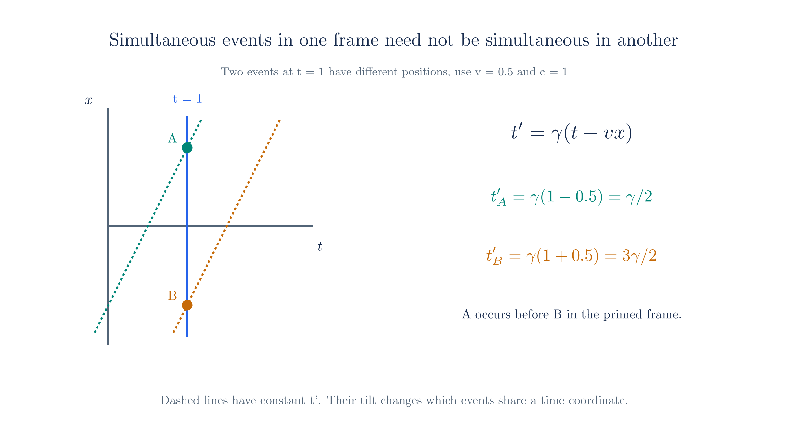
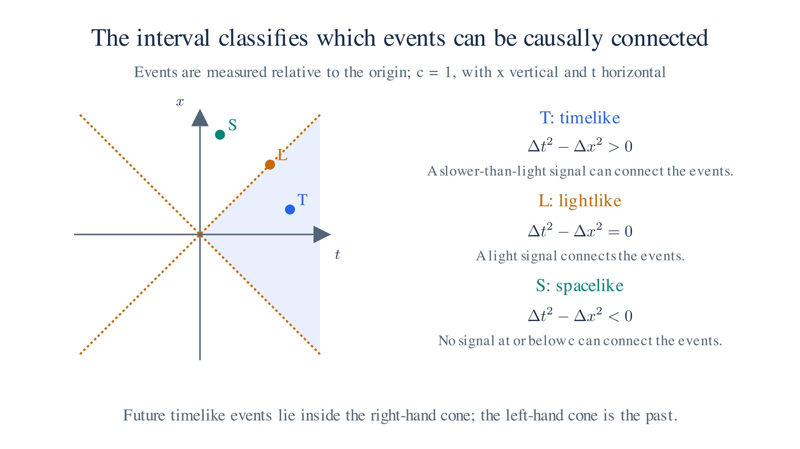

# Special Relativity

## 1. The Two Postulates

An **inertial frame** is a reference frame in which a force-free object moves at constant velocity. The first postulate, the **principle of relativity**, states that the laws of physics have the same form in every inertial frame. No experiment inside a uniformly moving laboratory can identify an absolute state of rest.

Newtonian mechanics already has this property under Galilean transformations. Special relativity extends it to all physical laws, including electromagnetism.

The second postulate is the **invariance of the speed of light**. Every inertial observer measures the same vacuum light speed, $c\approx3\times10^8\ \text{m/s}$, regardless of the motion of the source.

Ordinary velocity addition would give a different answer to a moving observer. To satisfy both postulates, we must change how space and time coordinates transform between frames.

## 2. Galilean Transformation

The Galilean transformation relates frames moving at relative velocity $v$ along $x$: $t'=t$ and $x'=x-vt$, with $y$ and $z$ unchanged. All observers share the same time.

Differentiating gives ordinary velocity addition. A passenger walking at $u$ relative to a train moving at $v$ has platform-frame velocity $u+v$. Applied to light, this rule would give different speeds in different frames.

We can see the difference on a spacetime diagram. Put $t$ horizontally and $x$ vertically, using $c=1$. A light ray through the origin follows $x=t$, a 45° line.

The moving frame's time axis is the set $x'=0$, so $x=vt$; it tilts away from the original time axis. Under a Galilean transformation, its spatial axis is the set $t'=0$, so $t=0$; that axis stays vertical. The light line no longer bisects the two axes.

Under a Lorentz transformation, both axes tilt toward the light line. The time axis still satisfies $x=vt$, but the spatial axis satisfies $t=vx$ in units $c=1$. With equally scaled original axes, the light line bisects them. This is the diagrammatic form of light-speed invariance.

*Figure: Galilean and Lorentz boosts. Interpret each coordinate axis as the line on which the other coordinate vanishes. Galilean boosts retain absolute simultaneity; Lorentz boosts change both time and space coordinates while preserving the light cone.*

## 3. Lorentz Transformations

Let frame $S'$ move at velocity $v$ along the $x$-axis of frame $S$, with coincident origins at $t=t'=0$. The coordinate change that preserves light speed is

$$t' = \gamma\!\left(t - \frac{vx}{c^2}\right), \qquad x' = \gamma(x - vt), \qquad y' = y, \qquad z' = z$$

The **Lorentz factor** is $\gamma=1/\sqrt{1-v^2/c^2}$. It is at least one and grows without bound as $v$ approaches $c$. At speeds much smaller than $c$, the leading non-relativistic approximation recovers the Galilean transformation.

**Time depends on position as well as time in the other frame.** If two events have $t_1=t_2$ but different positions, they generally have different values of $t'$. Observers in relative motion therefore disagree about which spatially separated events are simultaneous.

Differentiating the transformed position with respect to the transformed time gives the velocity rule. For motion along $x$, an object with velocity $u$ in $S$ has

$$u' = \frac{u - v}{1 - uv/c^2}$$

Substituting $u=c$ gives $u'=c$. The extra denominator is what keeps light speed unchanged.

*Events at the same unprimed time can have different primed times because the Lorentz time transformation includes position.*

## 4. Spacetime and the Invariant Interval

A Lorentz boost mixes time and space while preserving a particular combination of their differences. For two events, define the **spacetime interval**

$$s^2 = c^2\Delta t^2 - \Delta x^2 - \Delta y^2 - \Delta z^2$$

Every inertial observer obtains the same $s^2$. Its sign determines how the events can be connected:

- $s^2>0$: **timelike**. A slower-than-light signal can connect the events. There is a frame in which they occur at the same place at different times.
- $s^2=0$: **lightlike**, or null. For distinct events, a light signal can connect them.
- $s^2<0$: **spacelike**. No signal traveling at or below $c$ can connect the events. There is a frame in which they are simultaneous.

A spatial rotation preserves $x^2+y^2$. A Lorentz boost instead preserves $c^2t^2-x^2$ along the boost direction. The minus sign distinguishes spacetime geometry from Euclidean geometry; boosts are hyperbolic rotations.

*The sign of the spacetime interval separates timelike, lightlike, and spacelike events relative to the origin.*

## 5. Four-Vectors and Covariant Notation

To express this geometry compactly, group time and position into a **four-vector**. Its four components transform together under a Lorentz transformation:

$$x^\mu = (ct,\, x,\, y,\, z), \qquad \mu = 0, 1, 2, 3$$

To form the invariant interval from these components, use the **Minkowski metric** $\eta_{\mu\nu}=\text{diag}(+1,-1,-1,-1)$:

$$x^\mu x_\mu = \eta_{\mu\nu}x^\mu x^\nu = c^2t^2 - x^2 - y^2 - z^2 = s^2$$

Repeated upper and lower indices mean that we sum over the four components. Here $s^2$ is the interval from the origin to $x^\mu$. Fully contracting four-vectors with the metric gives a **Lorentz scalar**, a quantity with the same value in every inertial frame.

For a massive particle, **proper time** $\tau$ is the time measured by a clock traveling with it. Its **four-velocity** is $u^\mu=dx^\mu/d\tau$, with $u^\mu u_\mu=c^2$. In the rest frame it is $(c,0,0,0)$.

Multiplying by the rest mass gives the **four-momentum**, $p^\mu=mu^\mu$:

$$p^\mu = \left(\frac{E}{c},\, p_x,\, p_y,\, p_z\right)$$

The time component contains energy $E$, while the spatial components form the ordinary three-momentum $\mathbf p=\gamma m\mathbf v$.

## 6. Metric Tensor, Covariance, and Contravariance

Upper and lower indices distinguish two transformation rules. We must keep track of them so that equations remain valid when we change frames.

The rule used throughout this sequence, including [QFT](qft.md), is: **sum a paired upper and lower index**. If no free indices remain, the result is a Lorentz scalar. With free indices remaining, the result is a tensor of lower rank.

A **contravariant** vector has an upper index, $A^\mu$. Its components transform like the coordinate displacement $dx^\mu$. Writing the Lorentz transformation as $\Lambda^\mu{}_\nu$, we have

$$A'^\mu = \Lambda^\mu{}_\nu\, A^\nu$$

A **covariant** vector has a lower index, $A_\mu$. Its components transform with the inverse matrix arranged as

$$A'_\mu = (\Lambda^{-1})^\nu{}_\mu\, A_\nu$$

These inverse transformation rules make the changes cancel in $A^\mu B_\mu$. Coordinate increments $dx^\mu$ have upper indices, while derivatives $\partial/\partial x^\mu$ have lower indices. The derivative rule follows from the chain rule.

We convert between upper and lower components with the **Minkowski metric** $\eta_{\mu\nu}=\text{diag}(+1,-1,-1,-1)$:

$$A_\mu = \eta_{\mu\nu} A^\nu, \qquad A^\mu = \eta^{\mu\nu} A_\nu$$

The inverse metric $\eta^{\mu\nu}$ has the same diagonal entries in these coordinates. For example, lowering the four-position index gives $x_\mu=(ct,-x,-y,-z)$. From here, expressions that omit $c$ use $c=1$, so this becomes $(t,-x,-y,-z)$. Lowering leaves the time component unchanged and reverses the spatial signs.

A **contraction** sums a matched upper and lower index. Contracting two four-vectors gives

$$A^\mu B_\mu = A^0 B_0 + A^1 B_1 + A^2 B_2 + A^3 B_3 = A^0 B_0 - \mathbf{A}\cdot\mathbf{B}$$

This is **Einstein summation notation**. Each summed index occurs once up and once down. An index that remains unsummed is a free index.

A fully contracted expression is a Lorentz scalar. Examples include the interval $s^2=x^\mu x_\mu$, the squared rest mass $m^2=p^\mu p_\mu$ in units $c=1$, and the plane-wave phase $\phi=k^\mu x_\mu$.

A **tensor** with $r$ upper and $s$ lower indices has type $(r,s)$. Transform each upper index with $\Lambda$ and each lower index with its inverse:

$$T'^{\mu_1\cdots\mu_r}{}_{\nu_1\cdots\nu_s} = \Lambda^{\mu_1}{}_{\alpha_1}\cdots\Lambda^{\mu_r}{}_{\alpha_r}\,(\Lambda^{-1})^{\beta_1}{}_{\nu_1}\cdots(\Lambda^{-1})^{\beta_s}{}_{\nu_s}\; T^{\alpha_1\cdots\alpha_r}{}_{\beta_1\cdots\beta_s}$$

For example, the metric is a $(0,2)$ tensor. To write a covariant equation, give both sides the same free indices and contract every summed index correctly. Each side then transforms in the same way, so equality holds in every Lorentz frame.

Most of the following pages use only four-vectors and contractions. The general tensor rule becomes useful again when we study field transformations in [QFT](qft.md).

## 7. Mass, Energy

Restoring $c$, contract the four-momentum with itself to obtain the **energy–momentum relation**:

$$p^\mu p_\mu = \frac{E^2}{c^2} - \lvert\mathbf{p}\rvert^2 = m^2 c^2$$

Multiplying by $c^2$ and rearranging gives

$$E^2 = (mc^2)^2 + (pc)^2$$

At rest, $\mathbf p=0$, and the positive-energy solution is $E=mc^2$. For a massless particle such as a photon, $m=0$ and $E=pc$. Its speed follows from $dE/dp=c$. A massless particle has no rest frame or proper-time four-velocity.

For a massive particle, $E=\gamma mc^2$. Subtracting the rest energy leaves kinetic energy $(\gamma-1)mc^2$. At low speed, $\gamma-1\approx v^2/(2c^2)$, giving the familiar $\tfrac12mv^2$.

To obtain a relativistic quantum wave equation, replace $E\to i\hbar\,\partial/\partial t$ and $\mathbf p\to-i\hbar\nabla$ in the squared energy relation. This gives the Klein–Gordon equation. Its interpretation will lead us to the Dirac equation and quantum field theory.

## 8. Maxwell Equations

We can now check that Maxwell's equations satisfy the first postulate. Write them using four-vectors and tensors, then verify that both sides transform alike. Their wave solutions also have the same vacuum speed $c$ in every inertial frame.

In rationalized units with $c=1$ and vacuum electromagnetic constants absorbed, the four equations are

$$\nabla \cdot \mathbf{E} = \rho, \qquad \nabla \cdot \mathbf{B} = 0, \qquad \nabla \times \mathbf{E} = -\frac{\partial \mathbf{B}}{\partial t}, \qquad \nabla \times \mathbf{B} = \frac{\partial \mathbf{E}}{\partial t} + \mathbf{j}.$$

Here $\rho$ is charge density and $\mathbf j$ is current density. Gauss's electric law and Ampère's law contain these sources. Faraday's law and the vanishing magnetic divergence involve only the fields.

**Combine the sources and fields.** The four-current is $J^\mu=(\rho,\mathbf j)$. Charge conservation is its vanishing divergence, $\partial_\mu J^\mu=0$.

Write the scalar and vector potentials as $A^\mu=(\varphi,\mathbf A)$. Their antisymmetric derivative gives the **electromagnetic field tensor**:

$$F^{\mu\nu} = \partial^\mu A^\nu - \partial^\nu A^\mu = \begin{pmatrix} 0 & -E_x & -E_y & -E_z \\ E_x & 0 & -B_z & B_y \\ E_y & B_z & 0 & -B_x \\ E_z & -B_y & B_x & 0 \end{pmatrix}.$$

The components of this tensor contain both electric and magnetic fields. Under a boost, the components mix; $F^{\mu\nu}$ transforms as a tensor and is not itself a scalar invariant. Maxwell's equations take the compact form

$$\partial_\mu F^{\mu\nu} = J^\nu, \qquad \partial_\lambda F_{\mu\nu} + \partial_\mu F_{\nu\lambda} + \partial_\nu F_{\lambda\mu} = 0.$$

The split into $\mathbf E$ and $\mathbf B$ depends on the observer. For a boost along $\hat{\mathbf x}$, the components parallel and perpendicular to the boost transform as follows, with $c=1$:

$$\mathbf{E}'_\parallel = \mathbf{E}_\parallel, \quad \mathbf{E}'_\perp = \gamma(\mathbf{E}_\perp + \mathbf{v}\times\mathbf{B}), \qquad \mathbf{B}'_\parallel = \mathbf{B}_\parallel, \quad \mathbf{B}'_\perp = \gamma(\mathbf{B}_\perp - \mathbf{v}\times\mathbf{E}).$$

A charge at rest produces an electric field and no magnetic field in its rest frame. An observer moving relative to the charge generally measures both. Both descriptions refer to the same electromagnetic field, expressed in different frames.

**Recover the familiar equations.** In $\partial_\mu F^{\mu\nu}=J^\nu$, setting $\nu=0$ gives Gauss's law. Setting $\nu=1,2,3$ gives the three components of Ampère's law.

In the cyclic identity, choosing $(\lambda\mu\nu)=(123)$ gives $\nabla\cdot\mathbf B=0$. Choices with one time index give Faraday's law. These homogeneous equations follow automatically when we substitute $F^{\mu\nu}=\partial^\mu A^\nu-\partial^\nu A^\mu$, because partial derivatives commute.

Both tensor equations retain their form under Lorentz transformations. In vacuum, their wave equations imply propagation at $c$ for every inertial observer. Maxwell's equations therefore fit both postulates without modification.

## 9. Schrödinger Equation

The free Schrödinger equation starts from the non-relativistic kinetic energy. To see why its relativistic behavior differs from Maxwell's equations, follow the same operator substitution.

Keep $c=1$ and write $\hbar$ explicitly. Starting with $E=\mathbf p^2/2m$, substitute $E\to i\hbar\,\partial/\partial t$ and $\mathbf p\to-i\hbar\nabla$. Acting on a wave function gives

$$i\hbar \frac{\partial \psi}{\partial t} = -\frac{\hbar^2}{2m}\nabla^2 \psi,$$

For a particle in a potential, add $V(\mathbf x)\psi$ on the right. The free equation already has a first derivative in time and second derivatives in space.

A Lorentz boost mixes time and space derivatives. The second-order scalar combination is the **d'Alembertian**, $\partial_\mu\partial^\mu=\partial_t^2-\nabla^2$. The Schrödinger operator $i\hbar\partial_t+\tfrac{\hbar^2}{2m}\nabla^2$ does not retain its form under that mixing.

We can also check a plane wave, $\psi\propto e^{i(\mathbf p\cdot\mathbf x-Et)/\hbar}$. The Schrödinger equation gives the **dispersion relation**, the relation between energy and momentum, $E=\mathbf p^2/2m$. This approximates the kinetic energy from $E^2=m^2+\mathbf p^2$ when $|\mathbf p|\ll m$, after subtracting the rest energy.

Using the exact squared relation gives the Klein–Gordon equation. Its negative-energy solutions and probability interpretation motivate the next developments, including Dirac's equation and antiparticles. The Schrödinger equation remains useful in the low-speed regime described in [First Quantization](first-quantization.md).
