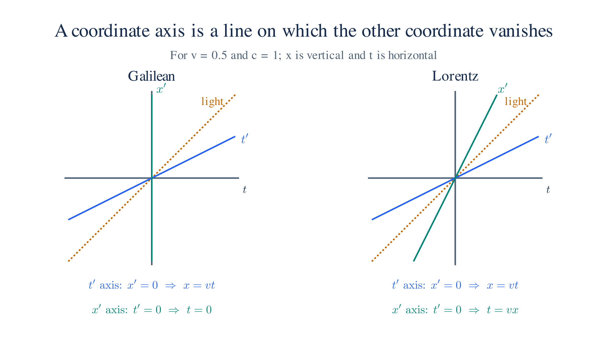

# Special Relativity

## 1. The Two Postulates

Special relativity rests on exactly two assumptions. The first is the **principle of relativity**: the laws of physics are the same in every inertial frame. No experiment performed entirely within a uniformly moving laboratory can detect that motion — there is no preferred rest frame. This was already implicit in Newtonian mechanics, where Newton's laws take the same form after a Galilean boost, but Einstein elevated it to a universal principle covering electromagnetism as well.

The second postulate is the one that breaks with Newtonian intuition: the **invariance of the speed of light**. The speed of light in vacuum, $c \approx 3 \times 10^8\ \text{m/s}$, is the same for all inertial observers regardless of the motion of the source or the observer. This is not obvious — it contradicts the Galilean addition of velocities — but it is what Maxwell's equations require, and every precision experiment since Michelson–Morley has confirmed it. Taken together, the two postulates force a revision of how time and space relate across different frames.

## 2. Natural Coordinates

Setting $c = 1$ — measuring time in the same units as distance, so one second equals $3 \times 10^8$ metres — strips the factors of $c$ from every formula and makes the underlying geometry legible. The Lorentz transformation becomes $t' = \gamma(t - vx)$, $x' = \gamma(x - vt)$; the invariant interval becomes $s^2 = \Delta t^2 - \Delta x^2$; the energy–momentum relation becomes $E^2 = m^2 + p^2$. Velocities are dimensionless numbers between 0 and 1. Mass, energy, and momentum all share the same unit. The only price is that restoring SI units at the end requires inserting factors of $c$ by dimensional analysis, which is straightforward once the physics is clear. Natural units are used throughout the rest of this page.

## 3. Galilean Transformation

Before Einstein, frames in relative motion were related by the Galilean transformation: $t' = t$ and $x' = x - vt$, with $y$ and $z$ unchanged. Time is universal, and velocities add without limit — if a train moves at $v$ and a passenger walks at $u$ relative to the train, a platform observer sees them at $u + v$, with no ceiling. There is nothing in the Galilean rules that forbids speeds larger than $c$; light has no special status.

The geometric picture makes the problem vivid. Draw a spacetime diagram with $x$ on the vertical axis and $t$ on the horizontal (with $c = 1$, a light ray travels one unit of distance per unit of time). A light ray therefore traces a 45° line — it bisects the angle between the $t$- and $x$-axes. Under a Galilean boost the time axis stays horizontal ($t' = t$) while the $x'$-axis tilts upward toward it, so in the new frame the light ray no longer sits at 45° between $t'$ and $x'$: different observers assign different speeds to light.

The Lorentz transformation fixes this by tilting *both* axes symmetrically toward the 45° light ray — the $x'$-axis rotates up toward the light ray and the $t'$-axis rotates up toward the $x$-axis, both by the same hyperbolic angle — so the light ray always bisects them regardless of $v$. Keeping that bisector fixed at 45° is exactly what it means to preserve the speed of light in every frame.

*Figure: the same boost in both frameworks — Galilean (left): $t' = t$ stays horizontal and only $x'$ tilts up, so light no longer bisects the axes; Lorentz (right): both axes tilt symmetrically, so light always bisects $t'$ and $x'$.*

## 4. Lorentz Transformations

If two inertial frames $S$ and $S'$ are aligned along the $x$-axis with $S'$ moving at velocity $v$ relative to $S$, the Lorentz transformation relating their coordinates is

$$t' = \gamma\!\left(t - \frac{vx}{c^2}\right), \qquad x' = \gamma(x - vt), \qquad y' = y, \qquad z' = z$$

where $\gamma = 1/\sqrt{1 - v^2/c^2}$ is the **Lorentz factor**, always $\geq 1$ and diverging as $v \to c$. In the limit $v \ll c$, $\gamma \to 1$ and these reduce to the Galilean transformation $t' = t$, $x' = x - vt$ — Newton's kinematics is recovered as a low-velocity approximation.

The crucial novelty is the mixing of $t$ and $x$: time is no longer universal. What one observer calls "simultaneous" ($t_1 = t_2$ at different $x$) another observer in relative motion generally does not. Simultaneity is frame-dependent, and this is not a failure of perception but a structural feature of spacetime.

Velocity addition is also modified. If an object moves at speed $u$ in $S$, its speed in $S'$ is

$$u' = \frac{u - v}{1 - uv/c^2}$$

Setting $u = c$ gives $u' = c$ for any $v$ — light speed is the same in every frame, as required.

## 5. Spacetime and the Invariant Interval

Minkowski's insight was that the Lorentz transformations are rotations in a four-dimensional spacetime, but with a metric that mixes a spatial sign with a temporal one. Define the **spacetime interval** between two events as

$$s^2 = c^2\Delta t^2 - \Delta x^2 - \Delta y^2 - \Delta z^2$$

This quantity is the same in every inertial frame — it is the Lorentz-invariant analog of distance. Depending on its sign, the separation is classified:

- $s^2 > 0$: **timelike** — a signal traveling slower than $c$ can connect the events; one can always find a frame where they occur at the same place at different times
- $s^2 = 0$: **lightlike** (null) — only light connects them
- $s^2 < 0$: **spacelike** — no causal influence can connect them; one can find a frame where they are simultaneous

The invariant interval replaces the Euclidean notion of absolute distance. Just as a rotation in space changes $x$ and $y$ individually while preserving $x^2 + y^2$, a Lorentz boost changes $t$ and $x$ individually while preserving $c^2 t^2 - x^2$.

## 6. Four-Vectors and Covariant Notation

The natural objects in special relativity are **four-vectors**, which transform under Lorentz boosts the same way $(ct, x, y, z)$ does. The prototype is the spacetime four-position:

$$x^\mu = (ct,\, x,\, y,\, z), \qquad \mu = 0, 1, 2, 3$$

The Minkowski metric $\eta_{\mu\nu} = \text{diag}(+1,-1,-1,-1)$ defines the inner product:

$$x^\mu x_\mu = \eta_{\mu\nu}x^\mu x^\nu = c^2t^2 - x^2 - y^2 - z^2 = s^2$$

Any combination of four-vectors contracted with $\eta_{\mu\nu}$ is a Lorentz scalar — frame-independent by construction. This is the systematic way to write physical laws that are automatically consistent with special relativity: build them out of four-vector contractions, and they hold in every inertial frame.

The **four-velocity** $u^\mu = dx^\mu/d\tau$ (derivative with respect to proper time) satisfies $u^\mu u_\mu = c^2$ identically, and in the rest frame reduces to $(c, 0, 0, 0)$. The **four-momentum** $p^\mu = m u^\mu$ has components

$$p^\mu = \left(\frac{E}{c},\, p_x,\, p_y,\, p_z\right)$$

where $E$ is the relativistic energy and $\mathbf{p} = \gamma m \mathbf{v}$ is the relativistic three-momentum.

## 7. Metric Tensor, Covariance, and Contravariance

Four-vectors come in two flavors distinguished by where their index sits. A **contravariant** vector $A^\mu$ (index up) transforms the same way the coordinate displacement $dx^\mu$ does under a Lorentz transformation $\Lambda^\mu{}_\nu$:

$$A'^\mu = \Lambda^\mu{}_\nu\, A^\nu$$

A **covariant** vector $A_\mu$ (index down) transforms by the inverse transpose, which for Lorentz transformations is $(\Lambda^{-1})^\nu{}_\mu$:

$$A'_\mu = (\Lambda^{-1})^\nu{}_\mu\, A_\nu$$

The names come from how each type behaves under a change of coordinates: contravariant components transform inversely to the basis vectors (they "go against" the basis), covariant components transform the same way as the basis (they "go with" it). Derivatives $\partial/\partial x^\mu$ are the prototype covariant object; coordinate increments $dx^\mu$ are the prototype contravariant one.

The **Minkowski metric** $\eta_{\mu\nu} = \text{diag}(+1,-1,-1,-1)$ is the machine that converts between them:

$$A_\mu = \eta_{\mu\nu} A^\nu, \qquad A^\mu = \eta^{\mu\nu} A_\nu$$

where $\eta^{\mu\nu} = \text{diag}(+1,-1,-1,-1)$ is the inverse metric (numerically identical here, though that is special to flat spacetime). Lowering the index on the four-position gives $x_\mu = (t, -x, -y, -z)$: the time component is unchanged, the spatial components flip sign.

A **contraction** pairs one upper index with one lower index and sums over it, producing an object with two fewer indices:

$$A^\mu B_\mu = A^0 B_0 + A^1 B_1 + A^2 B_2 + A^3 B_3 = A^0 B_0 - \mathbf{A}\cdot\mathbf{B}$$

This Einstein summation convention — repeated index up/down means sum — is in force throughout. A fully contracted object has no free indices and is a **Lorentz scalar**: it takes the same numerical value in every inertial frame. The invariant interval $s^2 = x^\mu x_\mu$, the rest mass $m^2 = p^\mu p_\mu$, and the phase of a plane wave $\phi = k^\mu x_\mu$ are all scalars.

A **tensor** of type $(r, s)$ carries $r$ contravariant and $s$ covariant indices, each transforming with its own $\Lambda$ or $\Lambda^{-1}$:

$$T'^{\mu_1\cdots\mu_r}{}_{\nu_1\cdots\nu_s} = \Lambda^{\mu_1}{}_{\alpha_1}\cdots\Lambda^{\mu_r}{}_{\alpha_r}\,(\Lambda^{-1})^{\beta_1}{}_{\nu_1}\cdots(\Lambda^{-1})^{\beta_s}{}_{\nu_s}\; T^{\alpha_1\cdots\alpha_r}{}_{\beta_1\cdots\beta_s}$$

The metric itself is a $(0,2)$ tensor. Any equation written as a tensor equality — same index structure on both sides, all free indices consistent — is automatically valid in every Lorentz frame. This is the practical content of covariance: write physics as tensor equations and relativistic invariance is built in.

## 8. Mass, Energy

The Lorentz-invariant norm of the four-momentum gives the **energy–momentum relation**:

$$p^\mu p_\mu = \frac{E^2}{c^2} - \lvert\mathbf{p}\rvert^2 = m^2 c^2$$

Rearranged:

$$E^2 = (mc^2)^2 + (pc)^2$$

For a particle at rest ($\mathbf{p} = 0$) this collapses to $E = mc^2$ — rest mass is a form of energy. For a massless particle ($m = 0$, e.g. a photon) it gives $E = pc$, and from the four-velocity construction one can show such a particle must always travel at exactly $c$.

The total relativistic energy $E = \gamma mc^2$ splits into rest energy $mc^2$ and kinetic energy $(\gamma - 1)mc^2$. In the limit $v \ll c$, $\gamma - 1 \approx v^2/2c^2$, so kinetic energy $\to \tfrac{1}{2}mv^2$ — again, Newtonian mechanics is recovered as the low-velocity limit.

The energy–momentum relation is the starting point for relativistic quantum mechanics: replacing $E \to i\hbar\,\partial/\partial t$ and $\mathbf{p} \to -i\hbar\nabla$ in $E^2 = (mc^2)^2 + (pc)^2$ gives the Klein–Gordon equation, the first attempt at a relativistic wave equation, and the road that eventually leads to the Dirac equation and quantum field theory.

## 9. Maxwell Equations

Section 1 left a claim dangling: the two postulates are "what Maxwell's equations require." The reason is that Maxwell's equations are already Lorentz-covariant — they assemble out of four-vector and tensor objects exactly as §7 prescribes, so they keep the same form in every inertial frame. Special relativity did not fix Maxwell; it was built to accommodate it.

In natural units ($c = 1$), the four equations are

$$\nabla \cdot \mathbf{E} = \rho, \qquad \nabla \cdot \mathbf{B} = 0, \qquad \nabla \times \mathbf{E} = -\frac{\partial \mathbf{B}}{\partial t}, \qquad \nabla \times \mathbf{B} = \frac{\partial \mathbf{E}}{\partial t} + \mathbf{j}.$$

Gauss and Ampère involve the sources; Faraday and "no magnetic monopoles" involve only the fields.

The covariant form packages charge density and current into the **four-current** $J^\mu = (\rho, \mathbf{j})$, a four-vector whose divergence vanishes, $\partial_\mu J^\mu = 0$ — the continuity equation. The fields assemble into the **electromagnetic field tensor**, the antisymmetric derivative of the four-potential $A^\mu = (\varphi, \mathbf{A})$:

$$F^{\mu\nu} = \partial^\mu A^\nu - \partial^\nu A^\mu = \begin{pmatrix} 0 & -E_x & -E_y & -E_z \\ E_x & 0 & -B_z & B_y \\ E_y & B_z & 0 & -B_x \\ E_z & -B_y & B_x & 0 \end{pmatrix}.$$

The electric and magnetic fields are not separate invariant objects — under a boost they mix into each other; $F^{\mu\nu}$ is the invariant. Maxwell's equations are then two tensor equations:

$$\partial_\mu F^{\mu\nu} = J^\nu, \qquad \partial_\lambda F_{\mu\nu} + \partial_\mu F_{\nu\lambda} + \partial_\nu F_{\lambda\mu} = 0.$$

$\mathbf{E}$ and $\mathbf{B}$ are therefore not distinct physical quantities but frame-dependent *manifestations* of the single object $F^{\mu\nu}$ — different observers slice the same antisymmetric tensor into different electric and magnetic parts. For a boost along $\hat{\mathbf{x}}$ (with $c = 1$),

$$\mathbf{E}'_\parallel = \mathbf{E}_\parallel, \quad \mathbf{E}'_\perp = \gamma(\mathbf{E}_\perp + \mathbf{v}\times\mathbf{B}), \qquad \mathbf{B}'_\parallel = \mathbf{B}_\parallel, \quad \mathbf{B}'_\perp = \gamma(\mathbf{B}_\perp - \mathbf{v}\times\mathbf{E}).$$

The classic illustration: a point charge at rest produces a purely electric field; an observer moving past it sees the same $F^{\mu\nu}$ sliced differently and reports a magnetic field as well — which is why moving charges experience magnetic forces in the first place. There is no "real" versus "apparent" field; the frame-invariant reality is the field tensor.

Conversely, the four familiar equations are the **component expansion of the two tensor equations**. In $\partial_\mu F^{\mu\nu} = J^\nu$, the $\nu = 0$ component is Gauss's law $\nabla\cdot\mathbf{E} = \rho$ and the $\nu = 1, 2, 3$ components are the three space components of Ampère's law; in the cyclic identity, the purely spatial index choice $(\lambda\mu\nu) = (123)$ is $\nabla\cdot\mathbf{B} = 0$ and the choices with one temporal index give Faraday's law. Maxwell's equations are not four independent postulates — they are the components of two tensor equations, unpacked in a chosen frame. That is why a boost merely rotates the components into one another (the mixing above) while the equations themselves never change form. The homogeneous pair is automatic: it is an identity once $F^{\mu\nu} = \partial^\mu A^\nu - \partial^\nu A^\mu$ is substituted — the field tensor is the exterior derivative of the four-potential.

Both tensor equations are contractions of four-vector/tensor objects, hence **manifestly Lorentz-covariant**: by §7 they hold unchanged in every inertial frame, and in particular the wave equation they imply propagates disturbances at exactly $c$ for every observer. That is the precise sense in which Maxwell is compatible with the Lorentz transformation — the equations are *the same* in every frame, not merely similar.

## 10. Schrödinger Equation

The Schrödinger equation is what you get by quantizing the *non-relativistic* energy–momentum relation, and it is not Lorentz-covariant: time and space enter at different orders, so the equation singles out one frame.

Restoring $\hbar$ (still $c = 1$), the non-relativistic energy is $E = \mathbf{p}^2/2m$. Applying the quantization prescription of §8, $E \to i\hbar\,\partial/\partial t$ and $\mathbf{p} \to -i\hbar\nabla$, gives the free Schrödinger equation

$$i\hbar \frac{\partial \psi}{\partial t} = -\frac{\hbar^2}{2m}\nabla^2 \psi,$$

with a potential term $V(\mathbf{x})\psi$ added by hand for interacting particles. The equation is first order in time but second order in space.

That asymmetry is exactly why it cannot be Lorentz-invariant. The Lorentz scalar built from two derivatives is the d'Alembertian $\partial_\mu\partial^\mu = \partial_t^2 - \nabla^2$, which treats time and space democratically; the Schrödinger operator $i\hbar\partial_t + \tfrac{\hbar^2}{2m}\nabla^2$ has no such four-vector form, so a Lorentz boost does not preserve the equation — observers in relative motion would not agree that it holds.

Equivalently, look at plane waves $\psi \propto e^{i(\mathbf{p}\cdot\mathbf{x} - Et)/\hbar}$. The equation enforces the dispersion relation $E = \mathbf{p}^2/2m$, which is only approximate: it is the low-velocity limit of the exact relation $E^2 = m^2 + \mathbf{p}^2$ (§8), valid when $|\mathbf{p}| \ll m$. Special relativity demands the second-order Klein–Gordon equation instead — at the price of negative-energy solutions, which point the way to the Dirac equation and antiparticles. The Schrödinger equation is the $v \ll c$ limit of that story, and the starting point of [First Quantization](/first-quantization.html).
