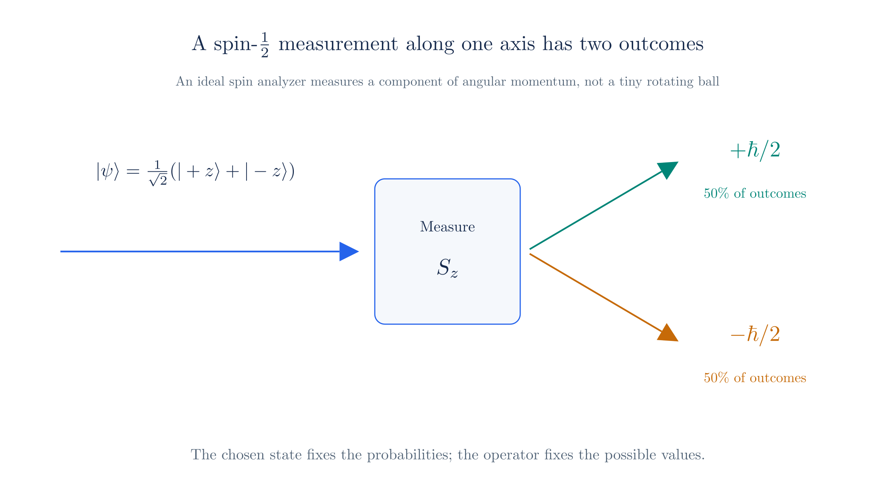

# Symmetries

Physics often begins by asking what can change without changing the experiment. A **symmetry** is a transformation of the description that leaves the physical predictions unchanged. Rotating an isolated experiment does not change its outcome; neither does changing the overall phase convention of a quantum field. These statements look different, but both restrict the terms that may appear in a theory.

This chapter develops the symmetry language needed for the weak interaction and for the spinors used in relativistic quantum mechanics. We will keep separate two spaces that are easy to confuse:

- **physical space**, whose coordinates can be rotated;
- **state space**, whose vectors describe quantum states.

The route is:

| Stage | What it describes |
| --- | --- |
| $SO(3)$ | Rotations of physical three-dimensional space |
| $SU(2)$ | Transformations of two-component state vectors |
| $SO^+(1,3)$ | Rotations and boosts preserving the time direction |
| $SL(2,\mathbb C)$ | The corresponding two-component Lorentz transformations |
| Weyl spinors | Two-component Lorentz representations |
| Dirac spinors | A combination of the two Weyl representations |
| Chirality | The $\gamma^5$ classification of Dirac spinors |

## 1. What a symmetry is

Suppose a field configuration is written as $\phi(x)$. A transformation gives another description, $\phi(x)\mapsto\phi'(x)$. It is a symmetry when the action is unchanged:

$$S[\phi']=S[\phi].$$

The Lagrangian may change by a total derivative without changing the equations of motion. The transformation can act on spacetime coordinates or on internal components of a field at the same spacetime point.

Continuous symmetries act linearly on a representation space. A finite one-parameter transformation is written

$$\phi\mapsto U(\alpha)\phi,\qquad U(\alpha)=e^{i\alpha T}.$$

The generator $T$ is identified by expanding this exact transformation near the identity:

$$e^{i\alpha T}=1+i\alpha T+O(\alpha^2).$$

Therefore, for a small parameter,

$$\phi\mapsto(1+i\alpha T)\phi,$$

and $T\phi$ gives the first-order change. For several independent directions, the exponent contains a linear combination such as $\alpha_aT_a$. A **representation** is a concrete way for the abstract transformations to act on a vector space. If $\rho(g)$ is the matrix assigned to $g$, it must preserve composition:

$$\rho(g_1g_2)=\rho(g_1)\rho(g_2),\qquad \rho(e)=I.$$

## 2. Spacetime symmetries and $SO(3)$

Translations are the simplest spacetime example: $x^\mu\mapsto x^\mu+a^\mu$. They shift the coordinate origin rather than changing the observer's velocity or orientation, and form an Abelian group under addition. Rotations change the orientation of the spatial frame, so they provide a more useful example here. Their non-commuting generators will give us a concrete model for the group structures that later appear in internal gauge symmetries. Those gauge transformations act on internal field components, not on physical space.

A rotation of Euclidean three-space acts on a vector by

$$\mathbf x\mapsto R\mathbf x,$$

where

$$R^{\mathsf T}R=I,\qquad\det R=1.$$

The set of all such matrices is $SO(3)$. It is a group: $I$ is the identity, $R^{-1}=R^{\mathsf T}$ undoes a rotation, products of rotations are rotations, and matrix multiplication is associative.

Rotations about different axes do not generally commute, so $SO(3)$ is non-Abelian. An infinitesimal rotation is generated by three matrices $J_i$:

$$R(\delta\boldsymbol\theta)\simeq I-i\,\delta\theta_iJ_i,$$

with

$$J_1=\begin{pmatrix}0&0&0\\0&0&-i\\0&i&0\end{pmatrix},\quad
J_2=\begin{pmatrix}0&0&i\\0&0&0\\-i&0&0\end{pmatrix},\quad
J_3=\begin{pmatrix}0&-i&0\\i&0&0\\0&0&0\end{pmatrix}.$$

For example,

$$R_z(\theta)=e^{-i\theta J_3}=\begin{pmatrix}\cos\theta&-\sin\theta&0\\\sin\theta&\cos\theta&0\\0&0&1\end{pmatrix}.$$

The generators satisfy

$$[J_i,J_j]=i\epsilon_{ijk}J_k.$$

These are commutation relations, not anticommutation relations. They describe the infinitesimal structure of the rotation group. The collection of generators and their commutators is called the Lie algebra of the group; here we use that language only as a compact description of the matrices.

## 3. Stern–Gerlach: space and state are different

The Stern–Gerlach experiment makes the distinction between physical space and quantum state space visible. An inhomogeneous magnetic field splits a beam into two spatial paths. The two paths are opposite deflections, often called the upper and lower beams.

*A Stern–Gerlach-style measurement. The upper and lower paths are spatial outcomes; the labels $S_z=+\hbar/2$ and $S_z=-\hbar/2$ identify the corresponding internal states.*

The corresponding internal states are eigenstates of a spin component, for example

$$S_z\chi_\uparrow=+\frac\hbar2\chi_\uparrow,\qquad
S_z\chi_\downarrow=-\frac\hbar2\chi_\downarrow.$$

They can be represented by

$$\chi_\uparrow=\begin{pmatrix}1\\0\end{pmatrix},\qquad
\chi_\downarrow=\begin{pmatrix}0\\1\end{pmatrix},$$

and are orthogonal in state space:

$$\langle\chi_\uparrow|\chi_\downarrow\rangle=0.$$

The word “up” is therefore overloaded. The upper and lower detector paths are locations in physical space; $S_z$-up and $S_z$-down are orthogonal vectors in Hilbert space. The apparatus correlates them, but a state is not itself a position. Orthogonality is the state-space analogue of perpendicularity, but it is defined by the Hilbert-space inner product.

A general two-state quantum state is a **Pauli spinor**,

$$\chi=\begin{pmatrix}a\\b\end{pmatrix},\qquad |a|^2+|b|^2=1.$$

The Pauli matrices represent spin observables, $S_i=\hbar\sigma_i/2$.

## 4. From $SO(3)$ to $SU(2)$

$SO(3)$ acts on three-component vectors in physical space. A Pauli spinor is a two-component vector in state space. The matrices that act on it are

$$T_i=\frac{\sigma_i}{2},$$

where

$$\sigma_1=\begin{pmatrix}0&1\\1&0\end{pmatrix},\quad
\sigma_2=\begin{pmatrix}0&-i\\i&0\end{pmatrix},\quad
\sigma_3=\begin{pmatrix}1&0\\0&-1\end{pmatrix}.$$

They satisfy the same commutation algebra as the rotation generators:

$$[T_i,T_j]=i\epsilon_{ijk}T_k.$$

Exponentiating them gives

$$U(\boldsymbol\theta)=\exp\!\left(-\frac i2\boldsymbol\theta\cdot\boldsymbol\sigma\right),\qquad\chi\mapsto U\chi.$$

The set of these unitary determinant-one matrices is $SU(2)$. It is not another kind of physical-space rotation: $SO(3)$ acts on spatial vectors, while $SU(2)$ acts on two-component states. Their transformation groups are related by the following construction.

$$X\mapsto UXU^\dagger,$$

There is no direct identification between the objects in these two spaces. A spatial vector transforms as

$$\mathbf x\mapsto R\mathbf x,\qquad R\in SO(3),$$

while a state spinor transforms as

$$\chi\mapsto U\chi,\qquad U\in SU(2).$$

The relationship is between the **transformation actions**, not between $\mathbf x$ and $\chi$: a spatial vector is not a spinor, and a spinor is not a spatial vector.

This sends an $SU(2)$ matrix to the corresponding $SO(3)$ rotation of the encoded vector. For a rotation around $z$,

$$U_z(\theta)=e^{-i\theta\sigma_3/2}=\begin{pmatrix}e^{-i\theta/2}&0\\0&e^{i\theta/2}\end{pmatrix}.$$

Using the encoding below, $X=x_i\sigma_i$, direct multiplication gives

$$U_z(\theta)XU_z(\theta)^\dagger
=(x_1\cos\theta-x_2\sin\theta)\sigma_1
+(x_1\sin\theta+x_2\cos\theta)\sigma_2+x_3\sigma_3.$$

The coefficients are exactly the ordinary $SO(3)$ rotation of $(x_1,x_2,x_3)$ around the $z$-axis. Both $U$ and $-U$ give the same spatial rotation, because

$$(-U)X(-U)^\dagger=UXU^\dagger.$$

Thus two elements of $SU(2)$ correspond to each element of $SO(3)$: $SU(2)$ is a **double cover** of $SO(3)$. In the example, a $2\pi$ spatial rotation gives $U_z(2\pi)=-I$. It acts trivially on the encoded matrix because $(-I)X(-I)^\dagger=X$, but it changes a spinor's sign: $\chi\mapsto-\chi$. A $4\pi$ rotation gives $U_z(4\pi)=+I$ and returns the spinor exactly to its original state. This is why $SU(2)$ is the appropriate state-space representation of spin-$\tfrac12$ rotations.

The same connection can be written as an encoding. Encode a three-vector as a Hermitian matrix,

$$\mathbf x=(x_1,x_2,x_3)\longmapsto X=\mathbf x\cdot\boldsymbol\sigma=\begin{pmatrix}x_3&x_1-ix_2\\x_1+ix_2&-x_3\end{pmatrix}.$$

Then

$$X\mapsto UXU^\dagger$$

reproduces the ordinary $SO(3)$ rotation of $\mathbf x$.

## 5. Minkowski geometry and $SO^+(1,3)$

To describe relativistic physics, replace Euclidean space by flat Minkowski spacetime. Its interval is

$$ds^2=dt^2-dx^2-dy^2-dz^2.$$

The Lorentz group preserves this interval:

$$\Lambda^{\mathsf T}\eta\Lambda=\eta,\qquad\eta=\operatorname{diag}(1,-1,-1,-1).$$

The subgroup $SO^+(1,3)$ has $\det\Lambda=+1$ and preserves the direction of time: a future-directed timelike vector remains future-directed. The $+$ means **orthochronous**, or time-direction conserving. It contains continuous spatial rotations and boosts, but not parity or time reversal.

There are six generators: three rotations $J_i$ and three boosts $K_i$:

$$[J_i,J_j]=i\epsilon_{ijk}J_k,\qquad
[J_i,K_j]=i\epsilon_{ijk}K_k,\qquad
[K_i,K_j]=-i\epsilon_{ijk}J_k.$$

The last minus sign is characteristic of Minkowski geometry. These commutators define the Lorentz Lie algebra $\mathfrak{so}(1,3)$. They are a compact generalization of calculating rotations and boosts by hand: exponentiating the generators gives finite transformations.

## 6. Encoding Lorentz transformations with $SL(2,\mathbb C)$

Encode a Minkowski four-vector $x^\mu=(t,x,y,z)$ as

$$X=x^\mu\sigma_\mu=\begin{pmatrix}t+z&x-iy\\x+iy&t-z\end{pmatrix},\qquad
\sigma_\mu=(I,\sigma_1,\sigma_2,\sigma_3).$$

Its determinant is the Minkowski interval:

$$\det X=t^2-x^2-y^2-z^2.$$

Now take $A\in SL(2,\mathbb C)$, meaning $A$ is a complex $2\times2$ matrix with $\det A=1$, and transform

$$X\mapsto X'=AXA^\dagger.$$

Then

$$\det X'=\det(A)\det(X)\det(A^\dagger)=\det X,$$

so the Minkowski interval is preserved. This gives the spinor-level description of $SO^+(1,3)$, just as $SU(2)$ gives the spinor-level description of $SO(3)$.

## 7. Weyl spinors and representations

A representation is a concrete action of a group on a vector space. The rule

$$\psi\mapsto A\psi,\qquad A\in SL(2,\mathbb C)$$

is a valid two-component representation because products of matrices reproduce composition. The two entries of $\psi$ are independent complex amplitudes; they are not spatial coordinates.

There is a second valid, inequivalent two-component representation. It is valid in the sense of Section 1: it preserves composition, maps the identity to the identity, and maps inverses to inverses:

$$\widetilde\psi\mapsto(A^\dagger)^{-1}\widetilde\psi.$$

The dagger means complex conjugate transpose. For a pure rotation, $A$ is unitary and the two rules agree. For a boost, $A$ is not unitary and the rules differ. “Inequivalent” means that no single change of basis turns one rule into the other for every Lorentz transformation. These are the two Weyl representations.

We do not have to use both in every theory. One Weyl spinor is enough for a massless chiral theory. But why does a Dirac field use one of each? The Dirac equation describes a four-component relativistic wavefunction, and its ordinary mass term must be a Lorentz scalar. The simplest local scalar pairs the two inequivalent representations:

$$\mathcal L_m=-m\left(\psi_L^\dagger\psi_R+\psi_R^\dagger\psi_L\right).$$

Therefore the Dirac spinor combines one Weyl spinor of each type:

$$\Psi_D=\begin{pmatrix}\psi_L\\\psi_R\end{pmatrix}.$$

The two transformation laws make each bilinear invariant.

## 8. Dirac spinors and chirality

The Dirac spinor was first encountered through the Dirac equation: making a relativistic wave equation first order in time and space requires matrix coefficients and therefore a multi-component wavefunction. The symmetry viewpoint explains the resulting four components: they combine the two inequivalent Weyl representations.

The placement of components depends on the basis. In the chiral basis the two two-component blocks are the Weyl components. In the Dirac basis, write

$$\Psi=\begin{pmatrix}\phi\\\chi\end{pmatrix}.$$

The upper and lower blocks are not automatically chiral. For a positive-energy plane wave, the Dirac equation relates them by

$$\chi=\frac{\boldsymbol\sigma\cdot\mathbf p}{E+m}\phi.$$

Thus $\chi$ is literally suppressed when $|\mathbf p|\ll m$, and vanishes for a positive-energy particle at rest; it is not absent in general.

For example, consider an electron moving at $v=0.01c$. In natural units, $|\mathbf p|\simeq mv$, so

$$\frac{|\chi|}{|\phi|}\sim\frac{|\mathbf p|}{2m}\simeq\frac{v}{2}=0.005.$$

The lower two-component amplitude is therefore about half a percent of the upper amplitude, and its probability contribution is of order $(0.005)^2\simeq2.5\times10^{-5}$. This is what “small” means: the lower components are suppressed, not identically zero.

Chirality is defined basis-independently using

$$\gamma^5=i\gamma^0\gamma^1\gamma^2\gamma^3,$$

and

$$P_L=\frac{1-\gamma^5}{2},\qquad P_R=\frac{1+\gamma^5}{2},\qquad
\Psi_L=P_L\Psi,\quad\Psi_R=P_R\Psi.$$

In the chiral basis these projections select the two Weyl blocks, but in the Dirac basis they are not simply the upper and lower halves. Chirality is also distinct from helicity, although the two coincide for massless particles.

For a positive-energy massive electron at low speed, the two chiral projections are approximately equal in magnitude. In the rest frame the state is an equal mixture of left and right chirality, with small momentum producing only small corrections. This does not contradict the suppression of the lower block $\chi$ in the Dirac basis: upper/lower components and left/right chiral components are different decompositions.

At high speed, the balance depends on helicity. For a definite-helicity state, with $h=+1$ for positive helicity and $h=-1$ for negative helicity, the approximate chiral probabilities are

$$P_R\simeq\frac{1+hv}{2},\qquad P_L\simeq\frac{1-hv}{2}.$$

Thus a positive-helicity electron becomes increasingly right-chiral as $v\to1$, while a negative-helicity electron becomes increasingly left-chiral. In the massless limit, chirality and helicity coincide exactly.

This distinction matters for the weak interaction. The **charged weak interaction** couples to the left-chiral parts of fermion fields; there is no corresponding right-chiral charged current. This is why weak decays violate parity. The neutral electroweak interaction is more nuanced: the $Z$ couples to both chiralities, but with different strengths. The [Weak Interaction](weak-interaction.md) chapter develops the charged-current construction in detail.

## Summary

The same pattern will reappear for internal symmetries:

$$\text{group of transformations}\;\longrightarrow\;\text{representation space}\;\longrightarrow\;\text{generators}\;\longrightarrow\;\text{invariants}.$$

For this chapter, the path is the table given at the beginning: from spatial rotations, through state-space and Lorentz transformations, to Weyl and Dirac spinors and finally chirality.

The weak interaction will use $SU(2)$ on an internal doublet of particle fields, not on spatial directions. $SU(3)$ will be introduced later, directly as the internal colour symmetry of QCD.

---

Previous: [Feynman Rules for QED](feynman-rules.md)
Next: [Weak Interaction](weak-interaction.md)
